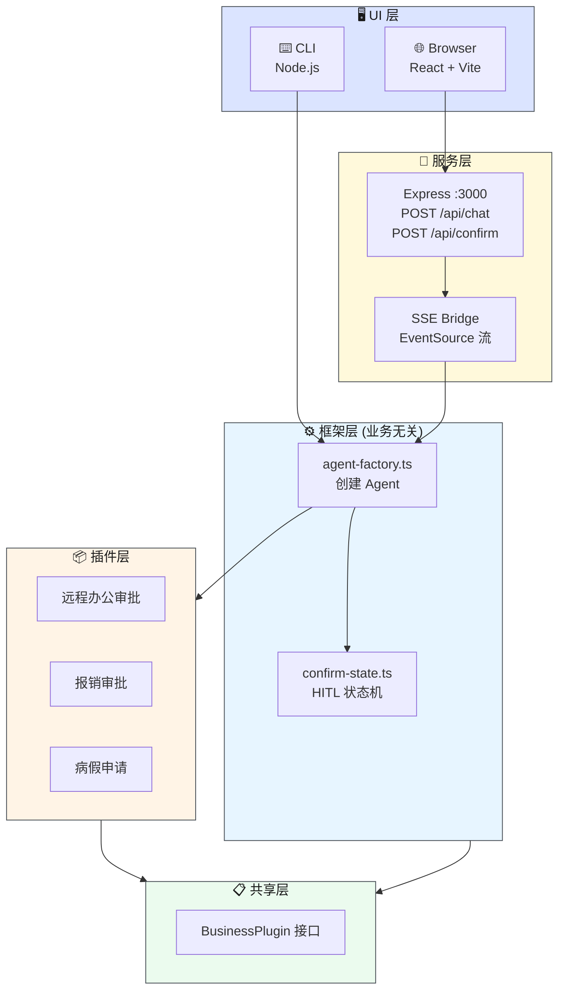
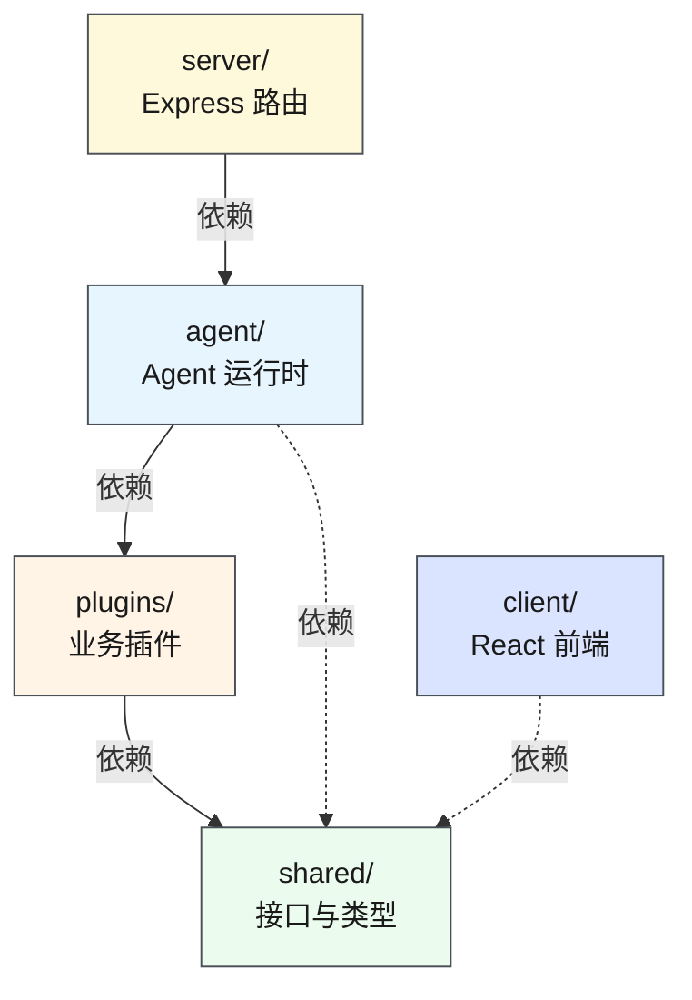
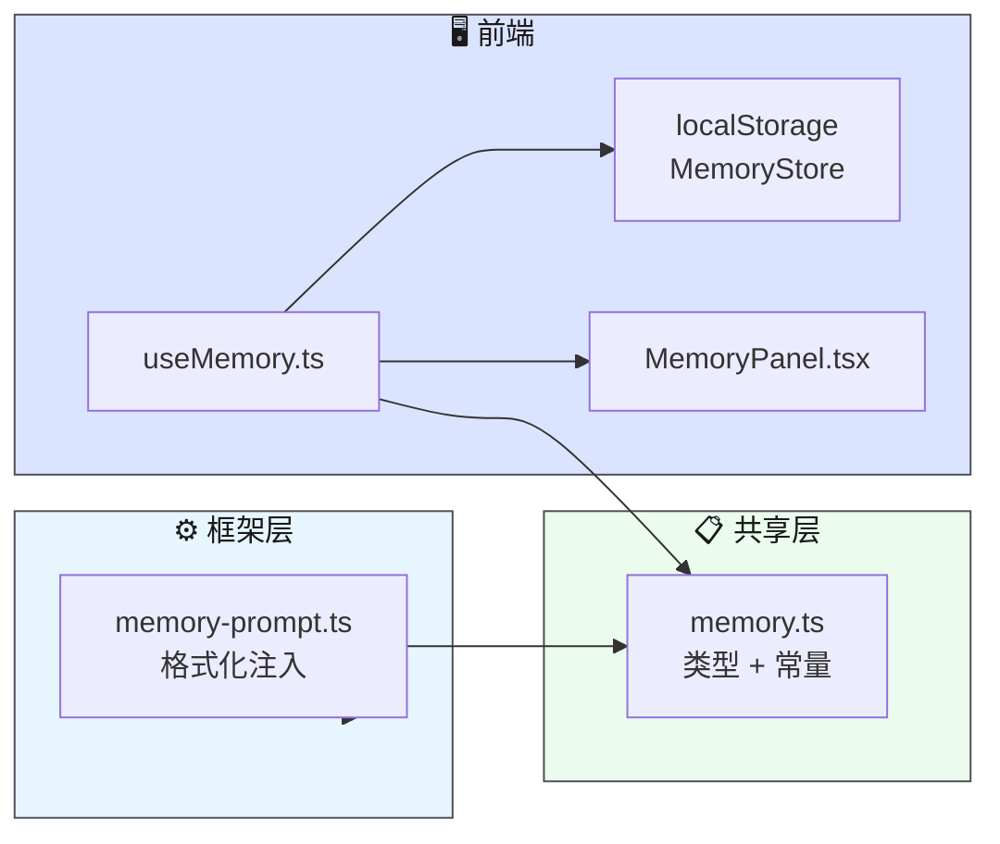
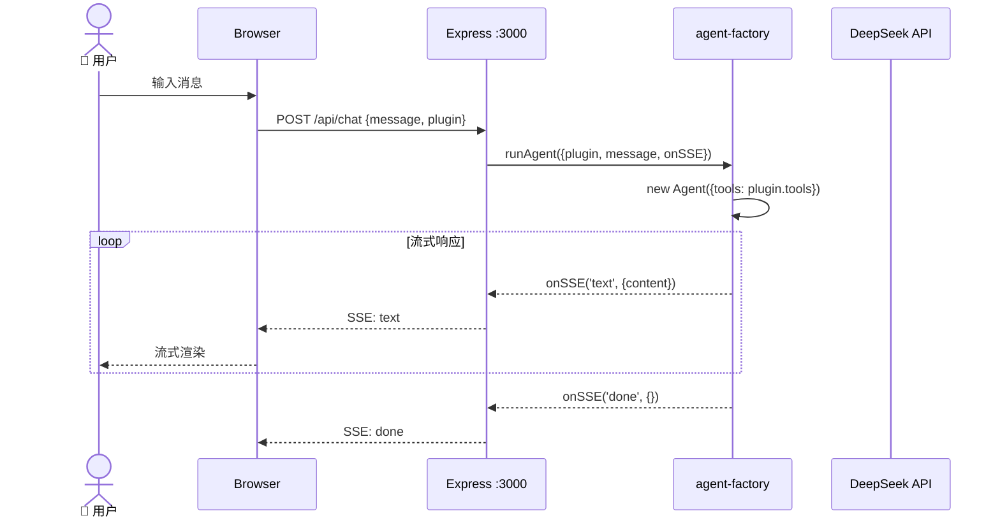
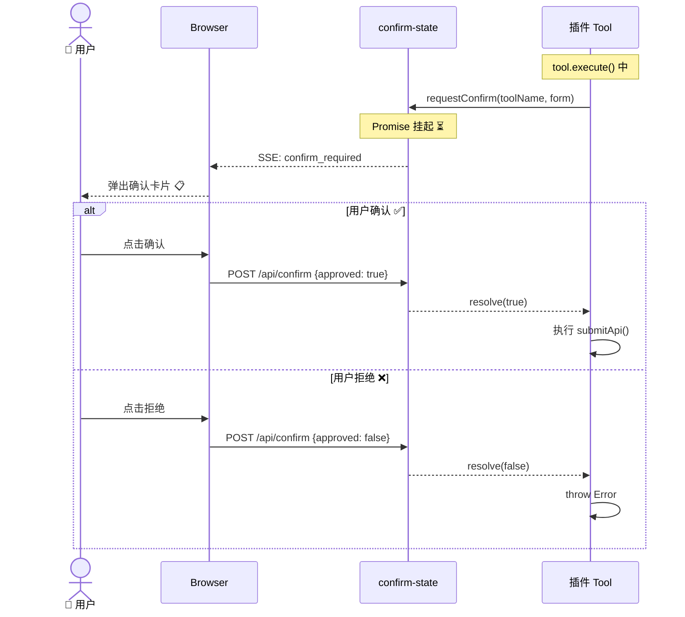

# 项目规范 — Leave Approval Agent

> **⬇️ 子目录文档导航**
>
> | 层 | 目录 | 文档 | 说明 |
> |---|------|------|------|
> | 🎨 | `src/client/` | [AGENTS.md](src/client/AGENTS.md) | 前端 UI 壳层 |
> | 🔧 | `src/server/` | [AGENTS.md](src/server/AGENTS.md) | Express 服务端 |
> | ⚙️ | `src/agent/` | [AGENTS.md](src/agent/AGENTS.md) | Agent 框架层 (业务无关) |
> | 📦 | `src/plugins/` | [AGENTS.md](src/plugins/AGENTS.md) | 业务插件层 |
> | 📋 | `src/shared/` | [AGENTS.md](src/shared/AGENTS.md) | 共享类型和接口 |
>
> **延伸阅读:** 各子目录 [AGENTS.md](src/client/AGENTS.md) 包含层内详细文档

---

## 系统架构图



## 三层依赖方向图



## 记忆系统



**设计原则**: 服务端无状态，前端 localStorage 持久化。

| 记忆类型 | 作用域 | 说明 |
|---------|--------|------|
| user | 跨插件共享 | 用户画像/偏好 |
| feedback | 跨插件共享 | 用户纠正/确认 |
| project | 按插件隔离 | 业务上下文 |
| reference | 按插件隔离 | 外部资源指针 |

## 聊天请求时序图



## HITL 确认流程时序图



## 核心原则

1. **框架不知道 tool** — `agent/` 不定义任何 tool，tool 由插件完全自主提供
2. **插件完全自主** — 每个插件自带 prompt + tools + api + validator
3. **HITL 是可选能力** — 框架提供 `confirm-state`，插件按需 import
4. **前端零改动** — 新增插件不需要修改前端代码

## 目录职责

| 目录 | 职责 | 详细文档 |
|------|------|---------|
| `src/agent/` | Agent 框架层（业务无关） | [AGENTS.md](src/agent/AGENTS.md) |
| `src/plugins/` | 业务插件层（完全自主） | [AGENTS.md](src/plugins/AGENTS.md) |
| `src/client/` | 前端 UI 壳 | [AGENTS.md](src/client/AGENTS.md) |
| `src/server/` | Express 服务端 | [AGENTS.md](src/server/AGENTS.md) |
| `src/shared/` | 共享类型和接口 | [AGENTS.md](src/shared/AGENTS.md) |

## 编码规范

- 所有方法、类、重要步骤必须有中文注释
- 文件编码: UTF-8 (无 BOM)
- 命名: TypeScript camelCase，文件 kebab-case
- 组件: React 函数式组件 + Hooks
- 样式: 墨韵设计系统，CSS Variables token，禁止蓝紫渐变
- 字体: Crimson Pro + Noto Serif SC + IBM Plex Mono + Noto Sans SC
- 主题: 墨韵 (warm paper + ink-dark + vermillion accent)，dark/light/system
- 依赖注入: 通过 `BusinessPlugin` 接口，禁止直接 import 具体业务

## 构建和运行

```bash
npm run dev:all       # Express :3000 + Vite :5173
npm run dev:server    # 仅后端
npm run dev           # 仅前端
npm run build         # 生产构建
npm run cli           # CLI 模式
npm run cli -- --plugin=xxx  # 指定插件
```

## Git 规范

- 分支: `feature/pi-framework`
- 提交格式: `type: 描述` (feat/fix/refactor/docs/chore)
- 提交描述使用中文

## 端口

- Express: `3000` / Vite dev: `5173` / 代理 `/api` → `:3000`

---

> **延伸阅读:** 各子目录 [AGENTS.md](src/client/AGENTS.md) 包含层内详细文档