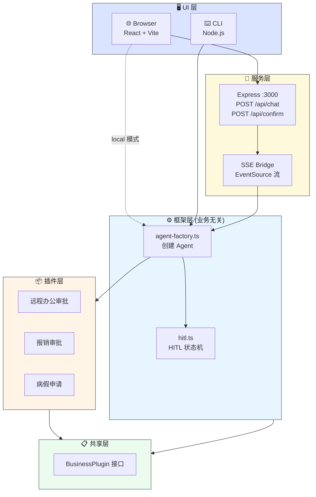
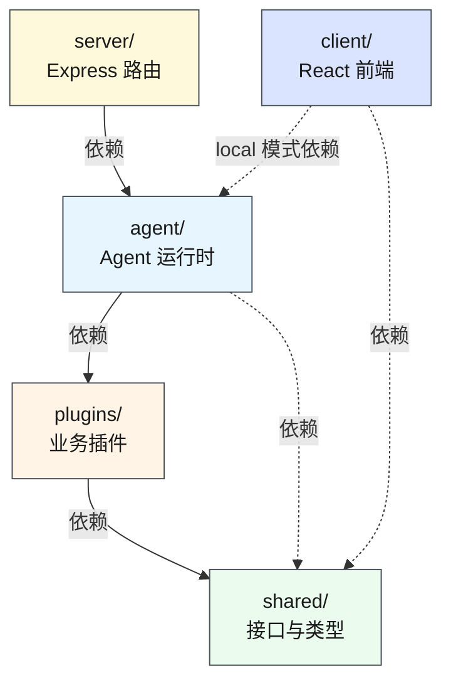
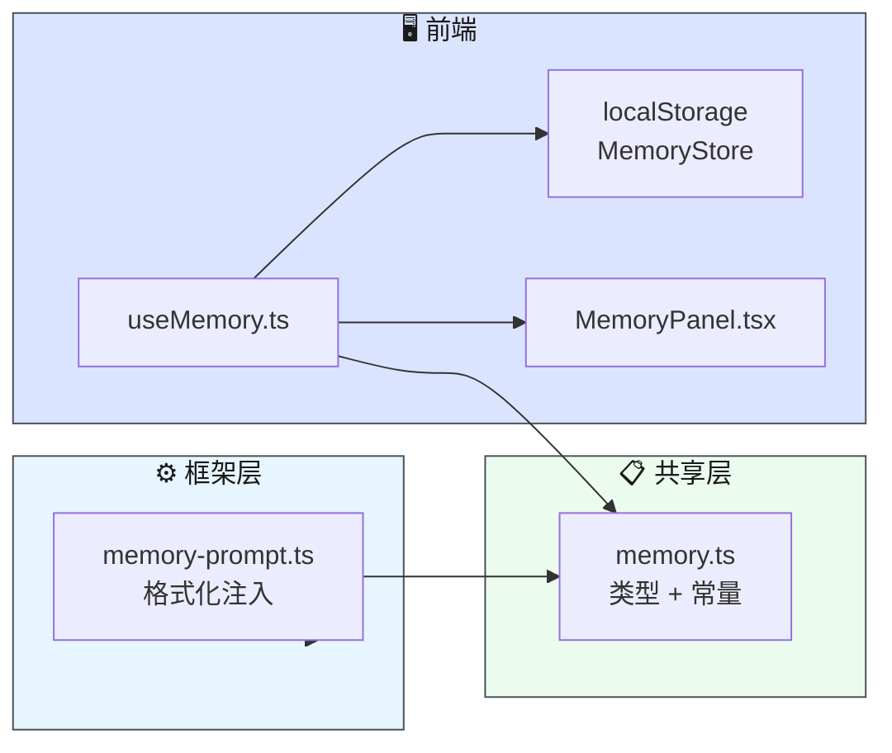
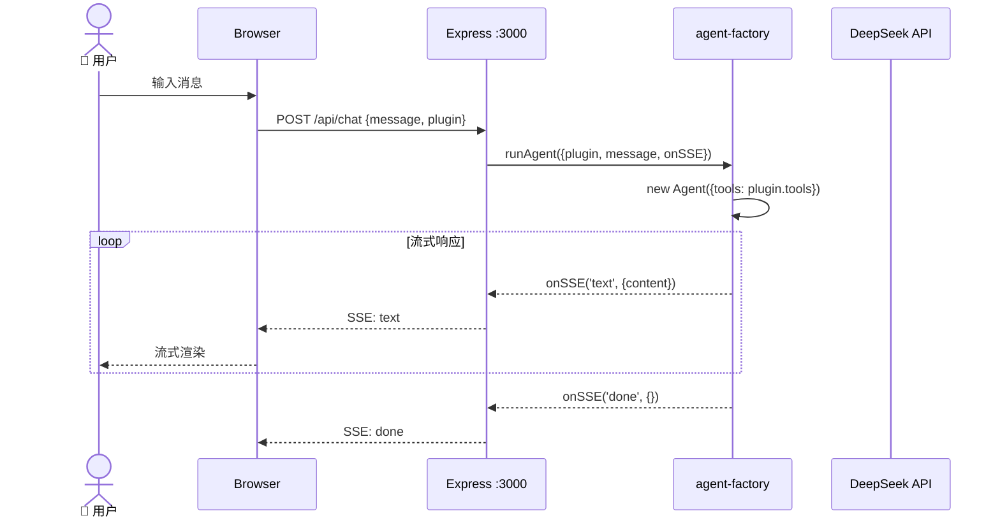
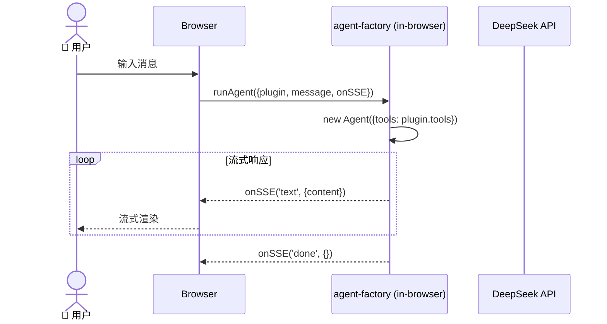
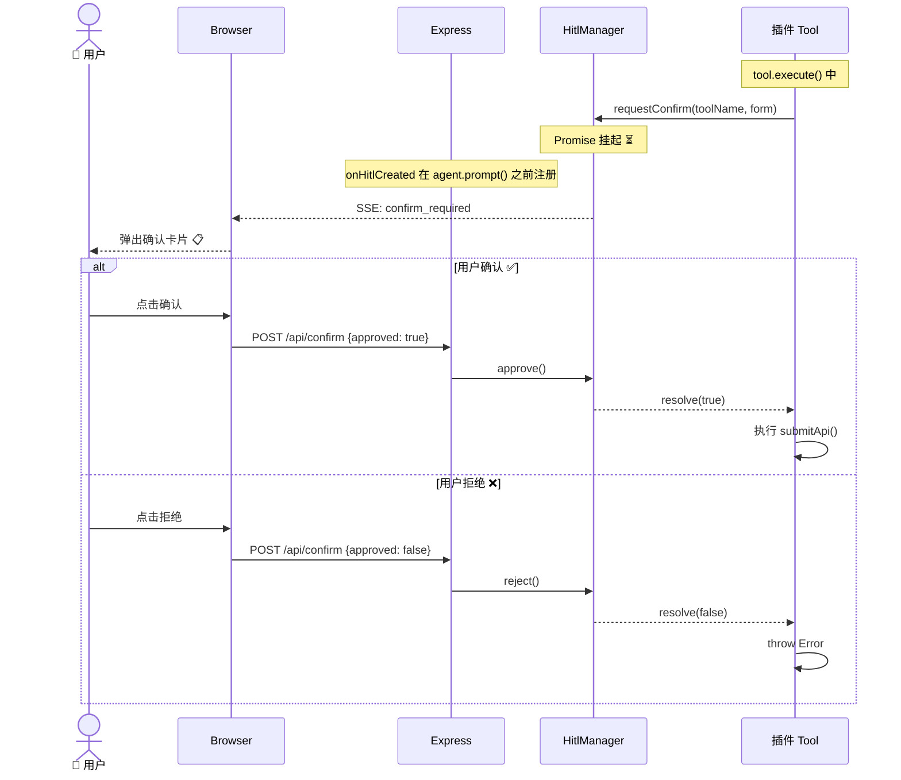
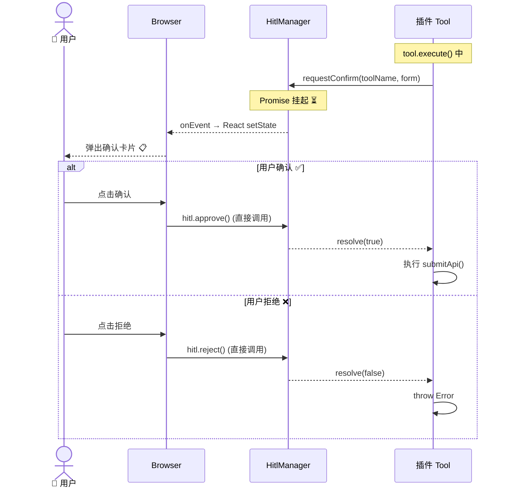

# 项目规范 — Leave Approval Agent

> **⬇️ 子目录文档导航**
>
> | 层 | 目录 | 文档 | 说明 |
> |---|------|------|------|
> | 🎨 | `src/client/` | [CLAUDE.md](src/client/CLAUDE.md) | 前端 UI 壳层 |
> | 🔧 | `src/server/` | [CLAUDE.md](src/server/CLAUDE.md) | Express 服务端 |
> | ⚙️ | `src/agent/` | [CLAUDE.md](src/agent/CLAUDE.md) | Agent 框架层 (业务无关) |
> | 📦 | `src/plugins/` | [CLAUDE.md](src/plugins/CLAUDE.md) | 业务插件层 |
> | 📋 | `src/shared/` | [CLAUDE.md](src/shared/CLAUDE.md) | 共享类型和接口 |
>
> **延伸阅读:** 各子目录 [CLAUDE.md](src/client/CLAUDE.md) 包含层内详细文档

---

## 系统架构图



## 三层依赖方向图



## 记忆系统



**设计原则**: 服务端无状态，前端 localStorage 持久化。

| 记忆类型 | 作用域 | 说明 |
|---------|--------|------|
| user | 跨插件共享 | 用户画像/偏好 |
| feedback | 跨插件共享 | 用户纠正/确认 |
| project | 按插件隔离 | 业务上下文 |
| reference | 按插件隔离 | 外部资源指针 |

## 聊天请求时序图

**Server 模式** (Express 中转):



**Local 模式** (浏览器直接调用 Agent，无网络往返):



## HITL 确认流程时序图

**Server 模式** (通过 HTTP):



**Local 模式** (直接操作 HitlManager):



## 核心原则

1. **框架不知道 tool** — `agent/` 不定义任何 tool，tool 由插件完全自主提供
2. **插件完全自主** — 每个插件自带 prompt + tools + api + validator
3. **HITL 是可选能力** — 框架提供 `confirm-state`，插件按需 import
4. **前端零改动** — 新增插件或切换运行模式都不需要修改前端代码
5. **后端可选** — Express 是可选组件，前端可通过 local 模式直接在浏览器中运行 Agent
6. **MLflow Tracing** — 纯 fetch() REST API，双环境兼容，Strategy 模式自动切换

## 目录职责

| 目录 | 职责 | 详细文档 |
|------|------|---------|
| `src/agent/` | Agent 框架层（业务无关） | [CLAUDE.md](src/agent/CLAUDE.md) |
| `src/plugins/` | 业务插件层（完全自主） | [CLAUDE.md](src/plugins/CLAUDE.md) |
| `src/client/` | 前端 UI 壳 | [CLAUDE.md](src/client/CLAUDE.md) |
| `src/server/` | Express 服务端 | [CLAUDE.md](src/server/CLAUDE.md) |
| `src/shared/` | 共享类型和接口 | [CLAUDE.md](src/shared/CLAUDE.md) |
| `src/i18n/` | 多语言翻译 (i18next) | — |

## 编码规范

- 所有方法、类、重要步骤必须有中文注释
- 注释规范 (JSDoc 中文):
  - **文件头**: `/** 模块用途说明 */` — 每个 .ts 文件顶部必须有
  - **函数/方法**: `/** 功能描述 @param xxx 参数说明 @returns 返回值说明 */`
  - **类**: `/** 类职责说明 */` + 每个 public 方法单独注释
  - **接口/类型**: `/** 用途说明 */` — 每个字段单独注释
  - **属性/字段**: `/** 描述 */` (JSDoc 单行) — 说明业务含义
  - **行内注释**: `// 简短说明` — 解释非显而易见的逻辑 (Why, 不是 What)
  - **分区注释**: `// ═══...═══` — 长文件中分隔逻辑区块
- 文件编码: UTF-8 (无 BOM)
- 命名: TypeScript camelCase，文件 kebab-case
- 组件: React 函数式组件 + Hooks
- 样式: 墨韵设计系统，CSS Variables token，禁止蓝紫渐变
- 字体: Crimson Pro + Noto Serif SC + IBM Plex Mono + Noto Sans SC
- 主题: 墨韵 (warm paper + ink-dark + vermillion accent)，dark/light/system
- 依赖注入: 通过 `BusinessPlugin` 接口，禁止直接 import 具体业务

## 行为准则

### 1. 先思考，再编码

- 实现前先明确假设，不确定时主动提问
- 存在多种方案时，列出对比而非默默选择
- 有更简单方案时主动指出，敢于 push back
- 遇到不清楚的地方停下来，说清楚哪里困惑

### 2. 简洁优先

- 只实现需求范围内的功能，不做推测性编码
- 不引入单次使用场景的抽象
- 不添加未被请求的"灵活性"或"可配置性"
- 不为不可能发生的场景添加错误处理
- 200 行能缩到 50 行就重写，问自己"高级工程师会觉得过度设计吗？"

### 3. 手术式修改

- 只改必须改的，不改相邻代码、注释、格式
- 不重构没坏的东西
- 匹配现有风格，即使你有不同偏好
- 发现无关死代码时只提出来，不直接删除
- 只清理你自己的修改造成的孤立引用（import/变量/函数）
- **检验标准**: 每一行改动都应直接追溯到需求

### 4. 目标驱动执行

- 把任务转化为可验证的目标："修复 bug" → "写复现测试，修到通过"
- 多步骤任务先列简要计划: `1. [步骤] → 验证: [检查点]`
- 强验证标准让你能独立迭代，弱标准需要反复确认

这些准则起作用的表现是: diff 中不必要的改动变少、无过度设计导致的返工、实现前提出澄清问题而非实现后出错。

```bash
npm run dev           # 前端 local 模式 (浏览器直接运行 Agent，无需后端)
npm run dev:server    # Express 服务端
npm run dev:all       # Server 模式 (Express :3000 + Vite :5173 代理)
npm run build         # 生产构建
npm run cli           # CLI 模式
npm run cli -- --plugin=xxx  # 指定插件
```

**运行模式**:

| 命令 | 模式 | `import.meta.env.MODE` | 说明 |
|------|------|------------------------|------|
| `npm run dev` | local | `"development"` | Vite 独立运行，Agent 直接在浏览器中执行 |
| `npm run dev:all` | server | `"server"` | Express + Vite，Vite 代理 `/api` → `:3000` |
| `npm run dev:server` | 仅后端 | — | 只启动 Express，无前端 |

## Git 规范

- 分支: `feature/pi-framework`
- 提交格式: `type: 描述` (feat/fix/refactor/docs/chore)
- 提交描述使用中文

## 端口

- Express: `3000` / Vite dev: `5173`
- Local 模式: 无代理，前端直接调用 Agent
- Server 模式: Vite 代理 `/api` → `:3000` (由 `vite --mode server` 激活)

## Post-Commit: Update CLAUDE.md

After every commit, review the diff and update the corresponding CLAUDE.md file(s) to reflect what changed.

Mapping:
- `src/client/**` → `src/client/CLAUDE.md`
- `src/agent/**` → `src/agent/CLAUDE.md`
- `src/shared/**` → `src/shared/CLAUDE.md`
- `src/server/**` → `src/server/CLAUDE.md`
- `src/plugins/**` → `src/plugins/CLAUDE.md` + the specific plugin's `CLAUDE.md`
- `src/App.tsx`, `src/App.css` → `src/client/CLAUDE.md`
- Root-level files → root `CLAUDE.md`

What to update:
- Added/removed/renamed files or exports
- New components, hooks, types, or API endpoints
- Changed architecture or data flow
- New dependencies or config changes

Do NOT rewrite the entire file — only update the relevant sections. If nothing meaningful changed (typo fix, style tweak), skip the update.

---

> **延伸阅读:** 各子目录 [CLAUDE.md](src/client/CLAUDE.md) 包含层内详细文档