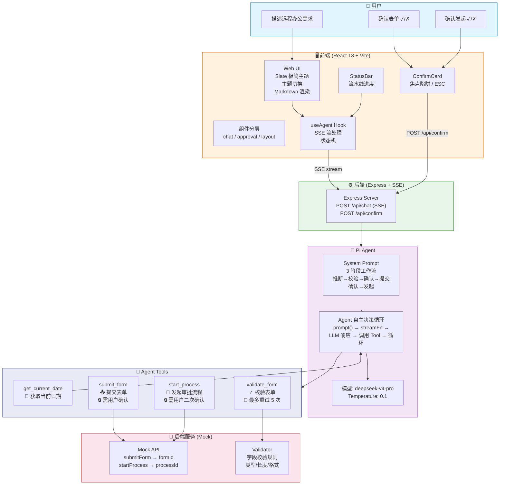
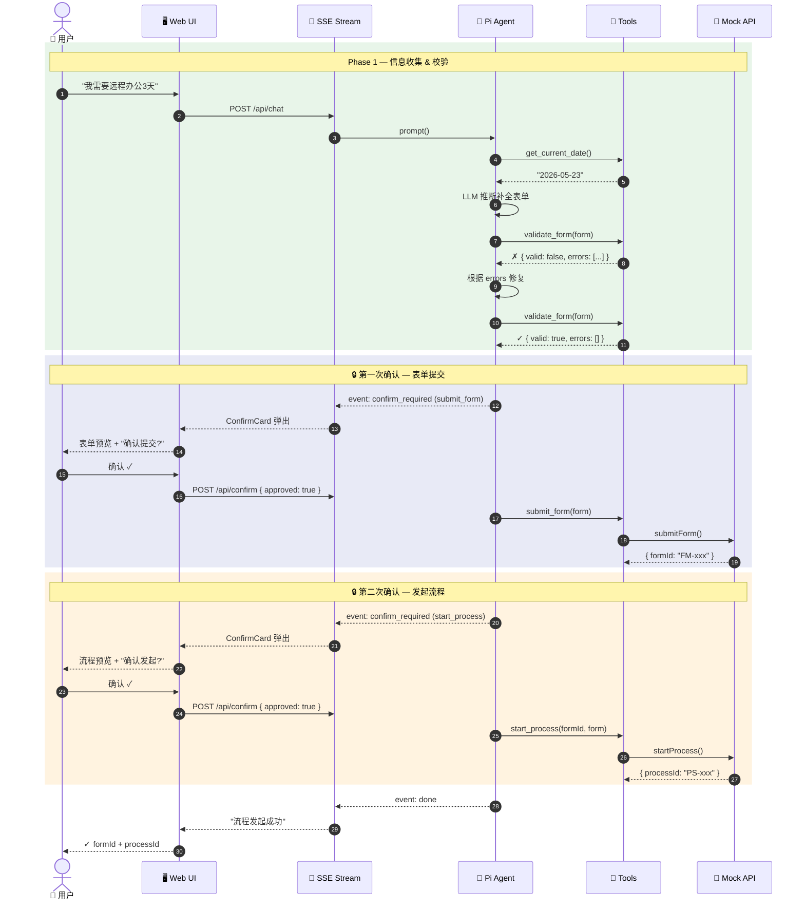
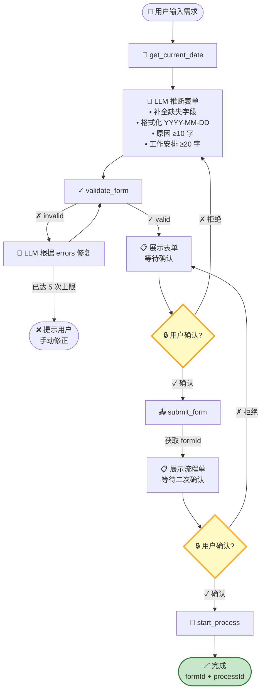
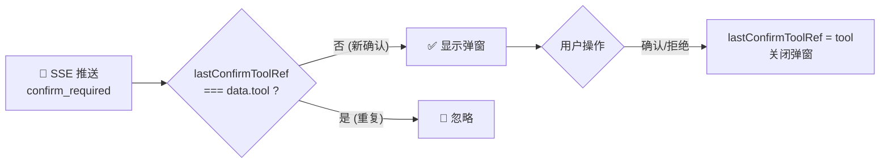

# 远程办公申请自动化审批 Agent — 设计文档 v2.1

> **框架**: Pi Agent Framework (`@earendil-works/pi-agent-core` + `@earendil-works/pi-ai`)  
> **模型**: DeepSeek V4 Pro  
> **分支**: `feature/pi-framework`  
> **前端**: React 18 + Vite 6 + TypeScript

---

## 1. 系统架构全景



---

## 2. 前端架构 (Clean Architecture)

```
src/
├── main.tsx                     # Vite/React 入口
├── App.tsx / App.css            # 根组件 & 设计系统
│
├── client/                      # ── 🖥️ 前端层 ──
│   ├── types.ts                 #   前端类型
│   ├── hooks/
│   │   └── useAgent.ts         #   状态机 (SSE + 确认 + 去重)
│   └── components/
│       ├── chat/                #   聊天功能
│       │   ├── ChatContainer   #   消息列表 + 空状态 + 滚动到底
│       │   ├── MessageBubble   #   Markdown 渲染
│       │   └── InputBar        #   输入框 + 字符计数
│       ├── approval/            #   审批功能
│       │   ├── StatusBar       #   流水线步骤指示器
│       │   └── ConfirmCard     #   确认弹窗 (焦点陷阱)
│       └── layout/              #   布局
│           ├── Header          #   顶部导航
│           └── ThemeToggle     #   主题切换
│
├── server/                      # ── ⚙️ 后端层 ──
│   ├── index.ts                 #   Express + SSE
│   ├── agent.ts                 #   Agent 工具 & 提示词
│   ├── api.ts                   #   Mock API
│   ├── validator.ts             #   校验规则
│   └── cli.ts                   #   CLI 入口
│
└── shared/                      # ── 🔗 共享层 ──
    ├── types.ts                 #   领域类型
    └── config.ts                #   全局配置
```

**分层依赖**: `client → shared ← server`，client 和 server 互不依赖。

---

## 3. 前端设计系统

### 3.1 色彩体系

| 角色 | 亮色 | 暗色 |
|------|------|------|
| 根背景 | `#fcfcfb` | `#0c0c0b` |
| 默认表面 | `#ffffff` | `#181817` |
| 悬浮表面 | `#f3f3f0` | `#262625` |
| 主文字 | `#141413` | `#ededec` |
| 次文字 | `#63635e` | `#a1a09c` |
| 边框 | `#ebebe8` | `rgba(255,255,255,0.08)` |
| 强调色 | `#334155` (slate) | `#94a3b8` (slate) |

### 3.2 组件设计

| 组件 | 功能 | 关键实现 |
|------|------|---------|
| **ThemeToggle** | 三段循环 (系统→暗→亮) | localStorage 持久化，`data-theme` 属性 |
| **StatusBar** | 流水线步骤 | `idle→thinking→filling→validating→confirming→done` |
| **ChatContainer** | 空状态 + 滚动 | 快捷建议语、滚动偏离按钮 |
| **MessageBubble** | Markdown 渲染 | react-markdown + remark-gfm |
| **ConfirmCard** | 确认弹窗 | 焦点陷阱、ESC关闭、遮罩点击关闭 |
| **InputBar** | 输入框 | 字数计数、SVG 发送图标、快捷语联动 |

### 3.3 Markdown 渲染支持

- 标题 (h1-h4)、加粗、斜体、删除线
- 行内代码 + 代码块
- 有序/无序列表、嵌套列表
- 引用块、分割线
- 表格 (GFM)
- 链接
- 用户/助手双模式颜色适配

---

## 4. Human-in-the-Loop 流程



---

## 5. Agent 决策流程



---

## 6. SSE 事件流

| 事件 | 方向 | 数据 | 说明 |
|------|------|------|------|
| `text` | server→client | `{ content: string }` | AI 流式文本输出 |
| `tool_result` | server→client | `{ tool, error }` | Tool 执行结果 |
| `confirm_required` | server→client | `{ tool, label, form, fieldLabels }` | 弹出确认卡片 |
| `confirm_resolved` | server→client | `{ tool }` | 确认已处理 |
| `done` | server→client | `{}` | Agent 执行完毕 |
| `error` | server→client | `{ message }` | 错误信息 |

**确认去重机制**: 前端 `useAgent` 使用 `lastConfirmToolRef` 按 tool 名去重，防止 SSE 重复推送同一确认。

---

## 7. Tool 详情

| Tool | 输入 | 输出 | 确认 |
|------|------|------|------|
| `get_current_date` | 无 | `2026-05-23 17:00:00` | 否 |
| `validate_form` | `{ form: LeaveForm }` | `{ valid, errors[] }` | 否 |
| `submit_form` | `{ form: LeaveForm }` | `{ formId }` | **是 (第一次)** |
| `start_process` | `{ formId, form }` | `{ processId }` | **是 (第二次)** |

### 校验规则

| 字段 | 规则 |
|------|------|
| `applicantName` | 非空 |
| `department` | 非空 |
| `employeeId` | 非空 |
| `remoteStartDate` | YYYY-MM-DD，≥ 当前日期 |
| `remoteEndDate` | YYYY-MM-DD，≥ 开始日期，≤ 30 天 |
| `reason` | ≥ 10 字 |
| `workPlan` | ≥ 20 字 |
| `emergencyContact` | 手机号格式 |
| `address` | 非空 |

---

## 8. 确认流程防重复



---

## 9. 关键设计决策

| 决策 | 理由 |
|------|------|
| **两次确认** | 表单提交和流程发起分开确认，防止误操作 |
| **Slate 极简主题** | 去蓝紫渐变，以文字层级和表面层次区分信息 |
| **SSE 流式** | 实时展示 AI 思考过程，提升交互感 |
| **Pi Agent 框架** | 53k token 上下文，Agent 自主决策循环，事件系统 |
| **Typebox Schema** | Pi 原生支持，类型安全 + 运行时校验 |
| **校验重试** | Agent 自主根据 errors 修复，最多 5 次 |
| **LLM 推断** | 用户只需描述需求，Agent 推断补全所有字段 |
| **Markdown 渲染** | 格式化 AI 回复，表格/代码/列表清晰可读 |
| **主题切换** | 系统/暗色/亮色三段式，localStorage 持久化 |
| **Clean Architecture** | client/server/shared 三层分离，单向依赖 |
