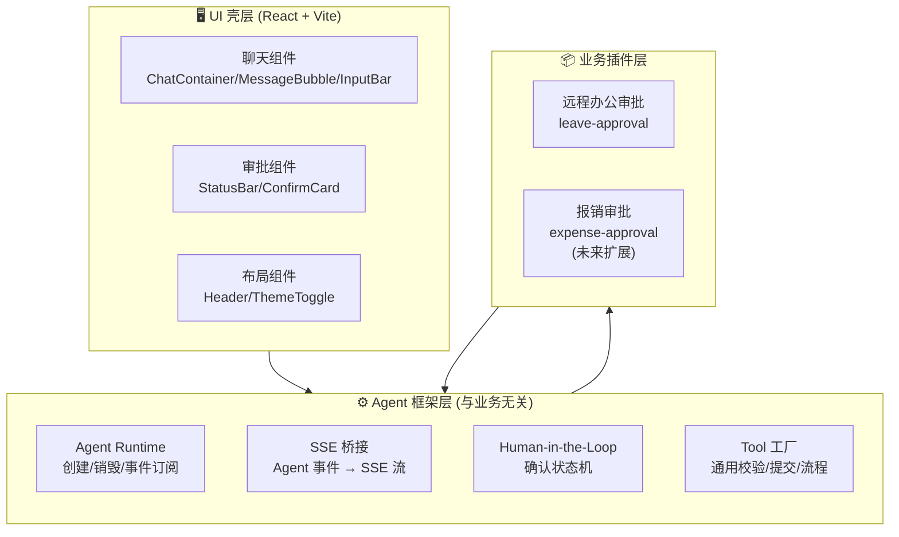
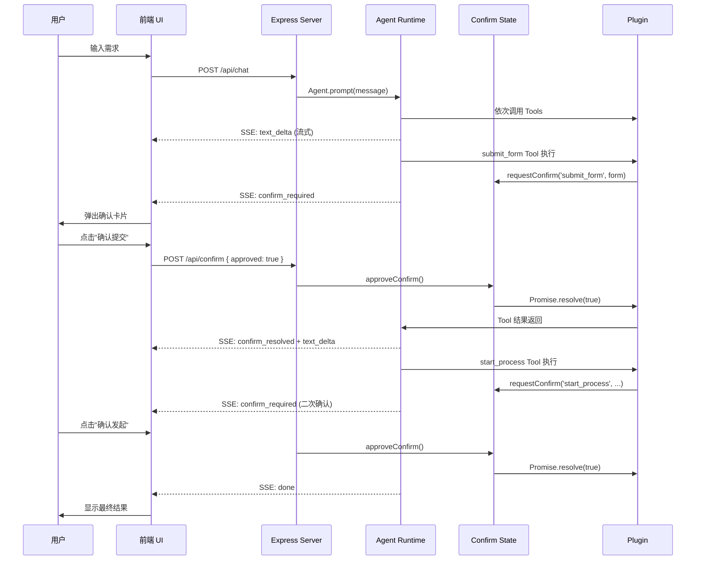

# 远程办公申请自动化审批 Agent — 设计文档 v3.0

> **框架**: Pi Agent Framework (`@earendil-works/pi-agent-core` + `@earendil-works/pi-ai`)  
> **模型**: DeepSeek V4 Pro  
> **分支**: `feature/pi-framework`  
> **前端**: React 18 + Vite 6 + TypeScript  
> **架构**: 插件化三层分离（Agent 框架 / 业务插件 / UI 壳）

---

## 1. 系统架构全景

### 1.1 三层架构



### 1.2 解耦核心：BusinessPlugin 接口

所有业务逻辑通过单一接口注入框架：

```typescript
interface BusinessPlugin {
  id: string;                    // 唯一标识
  displayName: string;           // UI 标题
  fields: FieldMeta[];           // 表单字段定义
  systemPrompt: string;          // Agent System Prompt
  tools: AgentTool[];            // Tool 列表
  validate(form): ValidationResult;  // 表单校验
  formatFormForDisplay?(form): Record<string, string>;  // 展示格式化
  confirmLabels?: {              // 确认阶段文案
    submit?: string;
    start?: string;
  };
}
```

---

## 2. 目录结构

```
src/
├── main.tsx                          # React 入口
├── App.tsx                           # 根组件
├── App.css                           # 全局样式 (CSS Token 体系)
│
├── agent/                            # ⚙️ Agent 框架层（业务无关）
│   ├── runtime.ts                    # Agent 创建/事件订阅/SSE 转换
│   ├── agent-factory.ts              # Agent 工厂：根据 plugin 创建 Agent
│   ├── confirm-state.ts              # HITL 确认状态机
│   ├── tools/                        # 通用 Tool 工厂
│   │   ├── get-current-date.ts       # 获取当前日期（所有业务通用）
│   │   ├── validate-form.ts          # 通用校验 Tool（注入 plugin.validate）
│   │   ├── submit-form.ts            # 通用提交 Tool（注入 plugin API）
│   │   └── start-process.ts          # 通用流程 Tool（注入 plugin API）
│   └── types.ts                      # 框架级类型定义
│
├── plugins/                          # 📦 业务插件层
│   ├── registry.ts                   # 插件注册表
│   └── leave-approval/               # 远程办公审批插件
│       ├── index.ts                  # 导出一个 BusinessPlugin 实例
│       ├── fields.ts                 # 表单字段元数据
│       ├── prompt.ts                 # System Prompt 模板
│       ├── validator.ts              # 字段校验规则
│       ├── api.ts                    # 后端 Mock/真实 API
│       └── tools.ts                  # Tool 列表组装
│
├── client/                           # 🖥️ 前端 UI
│   ├── types.ts                      # 泛化类型 (Message/AgentPhase/ConfirmRequest)
│   ├── hooks/useAgent.ts             # 聊天状态机 Hook（不再关心具体业务）
│   └── components/
│       ├── chat/                     # 聊天组件
│       │   ├── ChatContainer.tsx
│       │   ├── MessageBubble.tsx
│       │   └── InputBar.tsx
│       ├── approval/                 # 审批组件
│       │   ├── StatusBar.tsx
│       │   └── ConfirmCard.tsx
│       └── layout/                   # 布局组件
│           ├── Header.tsx
│           └── ThemeToggle.tsx
│
├── server/                           # 🔧 服务端
│   ├── index.ts                      # Express 路由（注入 plugin）
│   └── cli.ts                        # CLI 交互入口
│
└── shared/                           # 📋 共享类型
    ├── plugin.ts                     # BusinessPlugin 接口定义
    ├── types.ts                      # 领域类型（LeaveForm 保留兼容）
    └── config.ts                     # 全局配置
```

### 依赖方向

```
server → agent → plugins → shared
client → shared
agent → shared
```

- **agent/** 不依赖任何具体业务（不 import plugins/leave-approval）
- **server/** 负责选择并注入当前活动的 plugin
- **client/** 只通过 shared 的泛化类型通信，不关心 plugin 细节
- **plugins/** 只依赖 shared 的类型定义

---

## 3. 数据流

### 3.1 SSE 事件流

```
用户输入
  │
  ▼
POST /api/chat ────────────────────────────────────────┐
  │                                                     │
  ▼                                                     │
agent-factory.createAgent(plugin)                       │
  │                                                     │
  ▼                                                     │
Agent.prompt(message)                                   │
  │                                                     │
  ├── text_delta ──→ SSE: text { content }       ──→ 前端流式渲染
  │                                                        │
  ├── tool_execution_start (submit_form/start_process)     │
  │     │                                                  │
  │     ├── confirm-state.request() ──→ SSE:               │
  │     │   confirm_required { tool, label, form,          │
  │     │   fieldLabels }                            ──→ 弹出确认卡片
  │     │                                                  │
  │     └── 定时轮询 confirm-state.getPending()            │
  │           │                                            │
  │           └── resolved ──→ SSE: confirm_resolved ─→ 关闭确认卡片
  │                                                        │
  └── agent_end ──→ SSE: done                        ──→ 流程结束
```

### 3.2 Human-in-the-Loop 确认流程



---

## 4. 前端状态机

### 4.1 阶段定义 (AgentPhase)

```typescript
type AgentPhase =
  | 'idle'              // 就绪，等待用户输入
  | 'processing'        // Agent 工作中
  | 'awaiting_confirm'  // 等待用户确认（无业务特化）
  | 'done'              // 流程结束
  | 'error';            // 出错
```

### 4.2 StatusBar 阶段映射

StatusBar 不再固定显示"填表→校验→确认→完成"，而是从插件的阶段定义动态渲染：

```typescript
// plugin 可提供自定义阶段映射
interface BusinessPlugin {
  // ...
  pipeline?: PipelineStep[];
}

interface PipelineStep {
  key: string;
  label: string;
  toolName?: string;  // 关联的 tool 名称，用于自动切换阶段
}
```

前端 StatusBar 读取 `plugin.pipeline` 渲染相应的步骤胶囊。

---

## 5. 设计系统

### 5.1 CSS Token 体系

| Token | 用途 | Light | Dark |
|-------|------|-------|------|
| `--bg-primary` | 主背景 | `#fcfcfb` | `#0c0c0b` |
| `--bg-secondary` | 次背景 | `#f3f2f0` | `#1a1a19` |
| `--text-primary` | 主文字 | `#334155` | `#e2e2e0` |
| `--text-secondary` | 次文字 | `#64748b` | `#8b8b89` |
| `--accent` | 强调色 | `#334155` | `#94a3b8` |
| `--border` | 边框 | `#e2e2e0` | `#2a2a29` |
| `--radius` | 圆角 | `12px` | `12px` |

### 5.2 主题切换

三段式循环：**跟随系统 → 暗色 → 亮色**，持久化到 `localStorage`。

---

## 6. 扩展新业务指南

接入新业务只需 4-5 个文件：

### 创建新插件

```bash
mkdir src/plugins/expense-approval
```

### 文件清单

| 文件 | 内容 | 必填 |
|------|------|------|
| `index.ts` | 导出 `BusinessPlugin` 实例 | 是 |
| `fields.ts` | 表单字段 `FieldMeta[]` | 是 |
| `prompt.ts` | System Prompt | 是 |
| `validator.ts` | 校验规则 | 是 |
| `api.ts` | 后端 API 调用 | 是（可用 Mock） |
| `tools.ts` | Tool 列表组装 | 可选（默认用框架工厂） |

### 注册插件

```typescript
// plugins/registry.ts
import { leavePlugin } from './leave-approval/index.js';
import { expensePlugin } from './expense-approval/index.js';

export const pluginRegistry: Record<string, BusinessPlugin> = {
  leave_approval: leavePlugin,
  expense_approval: expensePlugin,
};

export function getPlugin(id: string): BusinessPlugin | undefined {
  return pluginRegistry[id];
}
```

### 前端零改动

- 通过 URL 参数指定插件：`/?plugin=expense_approval`
- StatusBar 自动读取 `plugin.pipeline` 渲染阶段
- ConfirmCard 自动读取 `plugin.fields` 渲染表单表格
- Header 自动读取 `plugin.displayName` 显示标题

---

## 7. 关键决策记录

| 决策 | 原因 | 日期 |
|------|------|------|
| Slate/Warm Gray 主题 | 用户明确拒绝蓝紫渐变，选择中性无渐变风格 | 2026-05-23 |
| `lastConfirmToolRef` 按 tool 名去重 | 允许两次不同确认，防止 SSE 重复推送同一确认 | 2026-05-23 |
| Clean Architecture 三层 | 清晰的依赖方向，client/server 只依赖 shared | 2026-05-23 |
| `react-markdown` + `remark-gfm` | 完整的 Markdown/GFM 支持，比正则稳定 | 2026-05-23 |
| 插件化架构 | 将业务逻辑从 Agent 框架解耦，支持多业务扩展 | 2026-05-23 |
| BusinessPlugin 接口 | 新业务只需实现一个接口，前端零改动 | 2026-05-23 |
