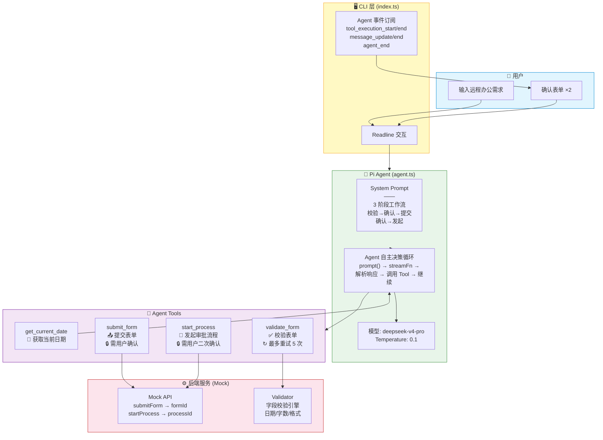
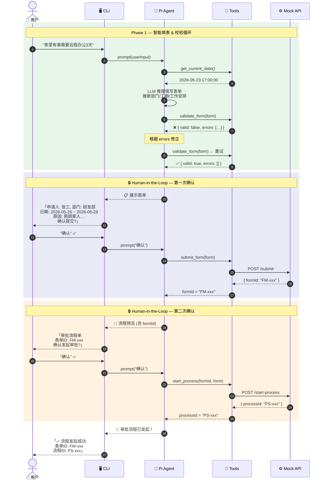
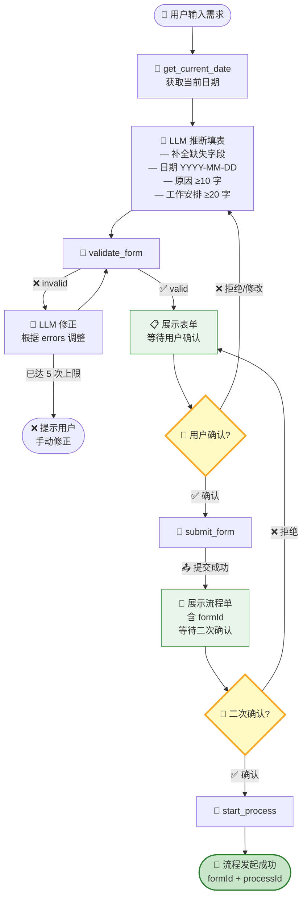
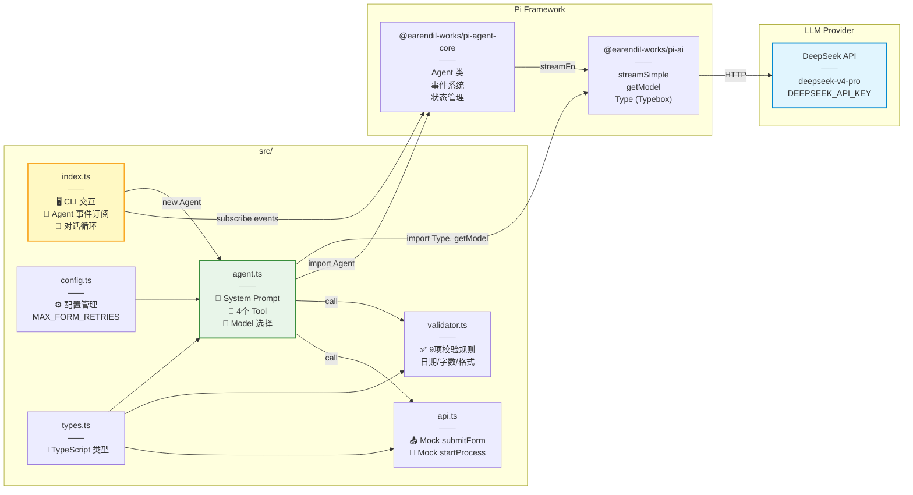
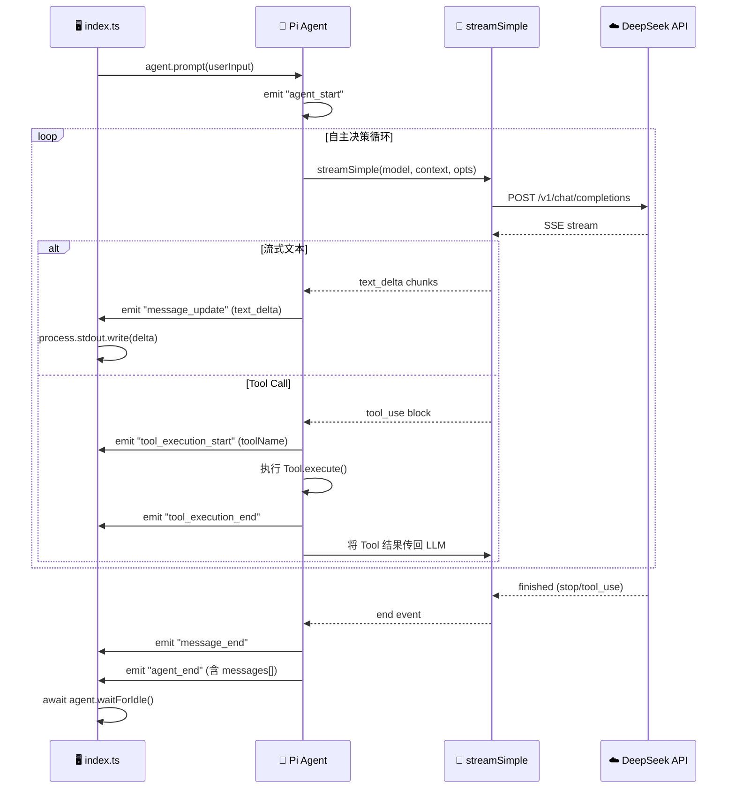

# 远程办公申请自动化审批 Agent — 设计文档 v2.0

> **框架**: Pi Agent Framework (`@earendil-works/pi-agent-core` + `@earendil-works/pi-ai`)  
> **模型**: DeepSeek V4 Pro  
> **分支**: `feature/pi-framework`

---

## 1. 系统架构总览



---

## 2. Human-in-the-Loop 交互序列



---

## 3. Agent 内部决策循环



---

## 4. 组件关系 & 数据流



---

## 5. Pi Agent 事件流



---

## 6. Tool 定义一览

| Tool | 参数 | 返回 | 调用条件 |
|------|------|------|---------|
| `get_current_date` | 无 | `2026-05-23 17:00:00` | 填表前必调用 |
| `validate_form` | `{ form: LeaveForm }` | `{ valid, errors[] }` | 填表后 / 修正后 |
| `submit_form` | `{ form: LeaveForm }` | `{ formId: "FM-xxx" }` | **用户确认后** |
| `start_process` | `{ formId, form }` | `{ processId: "PS-xxx" }` | **用户二次确认后** |

### 校验规则 (Validator)

| 字段 | 规则 |
|------|------|
| `applicantName` | 非空 |
| `department` | 非空 |
| `employeeId` | 非空 |
| `remoteStartDate` | YYYY-MM-DD，不早于当前日期 |
| `remoteEndDate` | YYYY-MM-DD，不早于开始日期，跨度 ≤ 30 天 |
| `reason` | ≥ 10 字 |
| `workPlan` | ≥ 20 字 |
| `emergencyContact` | 手机号 (1xx) 或邮箱 |
| `address` | 非空 |

---

## 7. System Prompt 结构

```
你是远程办公申请自动化审批助手。

Phase 1: 填写表单
  1. get_current_date → 获取日期
  2. 推断填写表单
  3. validate_form → 校验 (不通过则修正，最多5次)
  4. 展示表单 → 等待用户确认

Phase 2: 第一次确认 → 提交
  用户确认 → submit_form → 获取 formId

Phase 3: 第二次确认 → 发起
  展示含 formId 流程单 → 等待确认
  确认 → start_process → 完成

规则:
  - 日期 YYYY-MM-DD, 不早于今天, 跨度≤30天
  - 原因≥10字, 工作安排≥20字
  - 联系方式 手机号|邮箱
  - 提交/发起前 必须用户明确确认
```

---

## 8. 关键设计决策

| 决策 | 理由 |
|------|------|
| **两次确认** | 表单内容 + 流程发起 分开确认，防止误操作 |
| **Pi Agent 框架** | 复用 53k⭐ 成熟项目的 Agent 循环、事件系统、Provider 抽象 |
| **Typebox Schema** | Pi 框架原生支持，类型安全 + 运行时校验 |
| **DeepSeek Provider** | 系统已有 DEEPSEEK_API_KEY，无需额外配置 |
| **校验循环内置** | Agent 自主根据 errors 修正，减少用户交互次数 |
| **LLM 推断填表** | 用户只需描述需求，Agent 推断部门/工期/安排等字段 |
