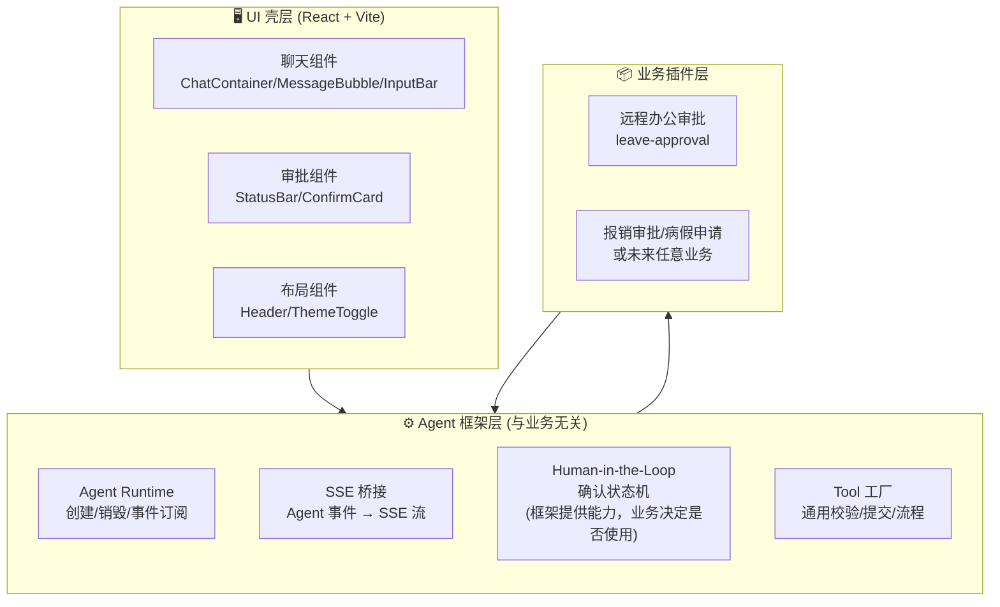
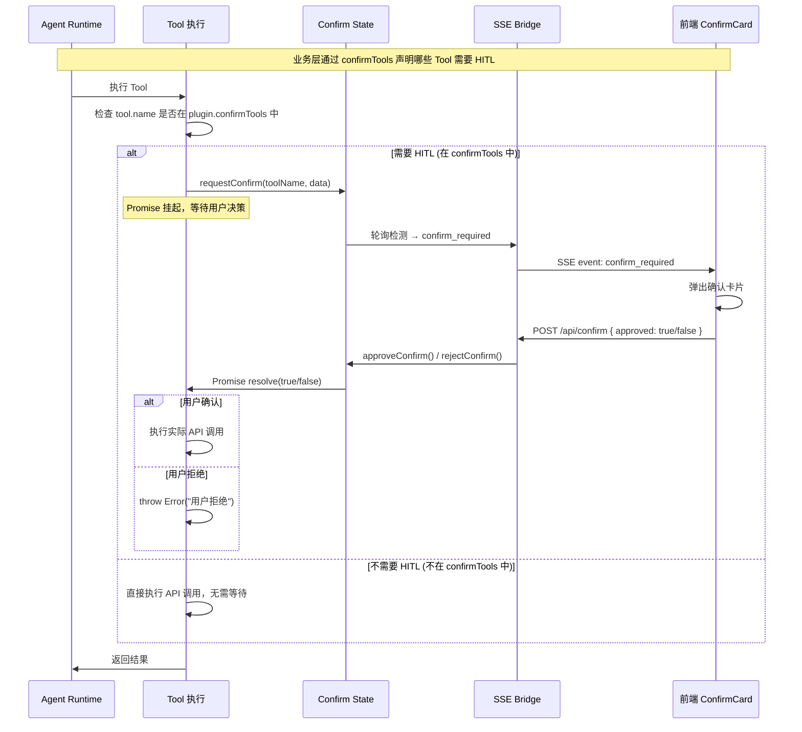

# 远程办公申请自动化审批 Agent — 设计文档 v3.1

> **框架**: Pi Agent Framework (`@earendil-works/pi-agent-core` + `@earendil-works/pi-ai`)  
> **模型**: DeepSeek V4 Pro  
> **分支**: `feature/pi-framework`  
> **前端**: React 18 + Vite 6 + TypeScript  
> **架构**: 插件化三层分离（Agent 框架 / 业务插件 / UI 壳）

---

## 1. 系统架构全景

### 1.1 三层架构



### 1.2 解耦核心：BusinessPlugin 接口

所有业务逻辑通过单一接口注入框架：

```typescript
interface BusinessPlugin {
  id: string;                    // 唯一标识
  displayName: string;           // UI 标题
  fields: FieldMeta[];           // 表单字段定义
  systemPrompt: string;          // Agent System Prompt
  tools: AgentTool[];            // Tool 列表
  validate(form): ValidationResult;  // 表单校验
  submitApi: (form) => Promise<SubmitResult>;      // 提交 API
  startProcessApi: (id, form) => Promise<ProcessResult>;  // 流程 API
  suggestions?: string[];        // 空状态快捷建议语
  confirmTools?: string[];       // ← HITL: 需要用户确认的 tool 列表
  confirmLabels?: Record<string, string>;  // ← HITL: 各确认阶段的文案
}
```

---

## 2. Human-in-the-Loop (HITL) 设计

### 2.1 核心原则：业务决定，框架提供能力

```
┌──────────────────────────────────────────────────────────┐
│  ⚠️ HITL 不是框架层的硬编码行为                             │
│                                                            │
│  框架层只提供：                                            │
│    ✓ confirm-state.ts — 确认状态机（requestConfirm 等）    │
│    ✓ SSE 事件转换 — confirm_required / confirm_resolved   │
│    ✓ 前端 ConfirmCard — 通用确认弹窗                       │
│                                                            │
│  业务层决定：                                              │
│    ✓ 哪些 tool 需要确认（confirmTools: string[]）          │
│    ✓ 确认弹窗的标题和文案（confirmLabels）                  │
│    ✓ 是否完全不需要确认（confirmTools: []）                 │
└──────────────────────────────────────────────────────────┘
```

### 2.2 三种 HITL 模式

| 模式 | confirmTools 配置 | 适用场景 |
|------|-------------------|---------|
| **两步确认** | `['xxx_submit', 'xxx_start']` | 高风险审批（如远程办公、报销） |
| **单步确认** | `['xxx_submit']` | 低风险操作，提交前确认即可 |
| **全自动** | `[]` 或不设置 | 低风险、高信任场景，无需人工确认 |

### 2.3 HITL 流程时序



### 2.4 框架层实现

```typescript
// agent/agent-factory.ts

/** 判断某 tool 是否需要 HITL — 完全由业务插件的 confirmTools 决定 */
function isConfirmTool(toolName: string, plugin: BusinessPlugin): boolean {
  const confirmTools = plugin.confirmTools || [];
  return confirmTools.includes(toolName);
}
```

```typescript
// agent/tools/submit-form.ts (Tool 工厂)

export function createSubmitTool(plugin: BusinessPlugin): AgentTool {
  return {
    name: `${plugin.id}_submit`,
    execute: async (_id, params) => {
      // 框架检查：此 tool 是否在 confirmTools 列表中？
      if (isConfirmTool(`${plugin.id}_submit`, plugin)) {
        const approved = await requestConfirm(`${plugin.id}_submit`, form);
        if (!approved) throw new Error(`用户拒绝`);
      }
      // 无论是否需要 HITL，最终都调用业务 API
      return await plugin.submitApi(form);
    }
  }
}
```

### 2.5 业务层配置示例

```typescript
// 远程办公审批 — 两步确认
const leavePlugin: BusinessPlugin = {
  confirmTools: ['leave_approval_submit', 'leave_approval_start'],
  confirmLabels: {
    leave_approval_submit: '📋 确认提交表单',
    leave_approval_start: '🚀 确认发起审批流程',
  },
  // ...
};

// 报销审批 — 两步确认
const expensePlugin: BusinessPlugin = {
  confirmTools: ['expense_approval_submit', 'expense_approval_start'],
  // ...
};

// 假设：低风险操作 — 全自动，无 HITL
const autoPlugin: BusinessPlugin = {
  confirmTools: [],  // 空数组 = 全自动
  // ...
};
```

---

## 3. 目录结构

```
src/
├── main.tsx                          # React 入口
├── App.tsx                           # 根组件
├── App.css                           # 全局样式 (CSS Token 体系)
│
├── agent/                            # ⚙️ Agent 框架层（业务无关）
│   ├── runtime.ts                    # Agent 创建/事件订阅/SSE 转换
│   ├── agent-factory.ts              # Agent 工厂：根据 plugin 创建 Agent
│   ├── confirm-state.ts              # HITL 确认状态机（通用能力）
│   ├── tools/                        # 通用 Tool 工厂
│   │   ├── get-current-date.ts       # 获取当前日期（所有业务通用）
│   │   ├── validate-form.ts          # 通用校验 Tool（注入 plugin.validate）
│   │   ├── submit-form.ts            # 通用提交 Tool（检查 confirmTools 决定 HITL）
│   │   └── start-process.ts          # 通用流程 Tool（检查 confirmTools 决定 HITL）
│   └── types.ts                      # 框架级类型定义
│
├── plugins/                          # 📦 业务插件层
│   ├── registry.ts                   # 插件注册表
│   └── leave-approval/               # 远程办公审批插件
│       ├── index.ts                  # 导出一个 BusinessPlugin 实例
│       ├── fields.ts                 # 表单字段元数据
│       ├── prompt.ts                 # System Prompt 模板
│       ├── validator.ts              # 字段校验规则
│       └── api.ts                    # 后端 Mock/真实 API
│
├── client/                           # 🖥️ 前端 UI
│   ├── types.ts                      # 泛化类型 (Message/AgentPhase/ConfirmRequest)
│   ├── hooks/useAgent.ts             # 聊天状态机 Hook（不再关心具体业务）
│   └── components/
│       ├── chat/                     # 聊天组件
│       │   ├── ChatContainer.tsx
│       │   ├── MessageBubble.tsx
│       │   └── InputBar.tsx
│       ├── approval/                 # 审批组件
│       │   ├── StatusBar.tsx
│       │   └── ConfirmCard.tsx       # 通用确认弹窗，内容由 confirmLabels 驱动
│       └── layout/                   # 布局组件
│           ├── Header.tsx
│           └── ThemeToggle.tsx
│
├── server/                           # 🔧 服务端
│   ├── index.ts                      # Express 路由（注入 plugin）
│   └── cli.ts                        # CLI 交互入口
│
└── shared/                           # 📋 共享类型
    ├── plugin.ts                     # BusinessPlugin 接口定义
    ├── types.ts                      # 领域类型（LeaveForm 保留兼容）
    └── config.ts                     # 全局配置
```

### 依赖方向

```
server → agent → plugins → shared
client → shared
agent → shared
```

- **agent/** 不依赖任何具体业务（不 import plugins/leave-approval）
- **agent/tools/** 的 submit/start 工厂检查 `plugin.confirmTools`，不硬编码 HITL
- **server/** 负责选择并注入当前活动的 plugin
- **client/** 只通过 shared 的泛化类型通信，不关心 plugin 细节
- **plugins/** 只依赖 shared 的类型定义

---

## 4. 数据流

### 4.1 SSE 事件流

```
用户输入
  │
  ▼
POST /api/chat { message, history, plugin }
  │
  ▼
agent-factory.createAgent(plugin)
  │
  ▼
Agent.prompt(message)
  │
  ├── text_delta ──→ SSE: text { content }       ──→ 前端流式渲染
  │
  ├── tool_execution_start
  │     │
  │     ├── isConfirmTool(name, plugin.confirmTools)?
  │     │     YES → confirm-state.request() → SSE: confirm_required
  │     │     NO  → 直接执行，无 HITL
  │     │
  │     └── 定时轮询 confirm-state.getPending()
  │           └── resolved → SSE: confirm_resolved
  │
  └── agent_end → SSE: done
```

---

## 5. 前端状态机

### 5.1 阶段定义 (AgentPhase)

```typescript
type AgentPhase =
  | 'idle'              // 就绪
  | 'processing'        // Agent 工作中
  | 'awaiting_confirm'  // 等待用户确认（由 confirm_required 触发）
  | 'done'              // 流程结束
  | 'error';            // 出错
```

---

## 6. 设计系统

（不变，同 v3.0）

---

## 7. 扩展新业务指南

接入新业务只需创建 4-5 个文件，并在 `index.ts` 中配置 HITL：

```typescript
// plugins/my-business/index.ts
export const myPlugin: BusinessPlugin = {
  id: 'my_business',
  displayName: '我的业务',
  fields: [...],
  systemPrompt: '...',
  tools: [],
  validate: (form) => ({ valid: true, errors: [] }),
  submitApi: async (form) => { ... },
  startProcessApi: async (id, form) => { ... },

  // ★ HITL 配置 — 由业务决定，不是框架硬编码
  confirmTools: ['my_business_submit'],  // 只在提交时确认
  confirmLabels: {
    my_business_submit: '📋 确认提交',
  },
  // confirmTools: [] → 全自动，无确认弹窗
};
```

### 注册

```typescript
// plugins/registry.ts
export const registry: PluginRegistry = {
  leave_approval: leavePlugin,
  my_business: myPlugin,
};
```

### 前端零改动

- ConfirmCard 自动根据 `confirmLabels` 显示文案
- `confirmTools` 为空时不弹确认卡片
- 一个 tool 或全部 tool 都可以需要确认

---

## 8. 关键决策记录

| 决策 | 原因 | 日期 |
|------|------|------|
| Slate/Warm Gray 主题 | 用户明确拒绝蓝紫渐变 | 2026-05-23 |
| `lastConfirmToolRef` 按 tool 名去重 | 允许两次不同确认，防止 SSE 重复 | 2026-05-23 |
| Clean Architecture 三层 | 清晰的依赖方向 | 2026-05-23 |
| `react-markdown` + `remark-gfm` | 完整 Markdown/GFM 支持 | 2026-05-23 |
| 插件化架构 | 将业务逻辑从 Agent 框架解耦 | 2026-05-23 |
| **HITL 由业务决定** | confirmTools 字段让插件控制哪些 tool 需要确认，框架不硬编码 | 2026-05-23 |
| **框架只提供 HITL 能力** | confirm-state 状态机是通用组件，使用与否由业务 confirmTools 决定 | 2026-05-23 |
