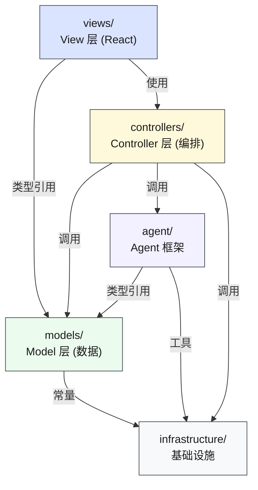

# MVC 全栈重组设计

> 日期: 2026-05-26 | 方案: 经典 MVC 三层（方案 A）

## 目标

将当前分层架构（domain/infrastructure/agent/services/scenarios/client/server）重组为 MVC 三层 + 基础设施，同时保持：

- 场景自治性（作为 Model 子模块）
- Agent 框架不动（作为 MVC 外的基础设施）
- 双模式运行（local/server）不变
- 所有现有功能不变

## MVC 映射

| MVC 角色 | 目录 | 包含内容 | 来源 |
|----------|------|---------|------|
| **Model** | `src/models/` | 领域类型 + 业务场景 + 记忆存储 | domain/ + scenarios/ + infrastructure/memory/ |
| **View** | `src/views/` | React 组件 + UI Hooks + i18n + 样式 + 类型 | client/ + i18n + App.css + index.css |
| **Controller** | `src/controllers/` | 路由 + 服务编排 + 业务 Hooks | server/ + services/ + useAgent 提取逻辑 |
| *(外部)* | `src/agent/` | Agent 框架（基础设施） | agent/（不动） |
| *(外部)* | `src/infrastructure/` | 常量 + 工具函数 | infrastructure/（去除 memory/） |

## 目标目录结构

```
src/
├── models/                          # Model 层 — 数据 + 业务逻辑
│   ├── domain/                      # 领域类型（原 domain/ 整体迁移）
│   │   ├── dto/
│   │   │   └── ApiResponses.ts
│   │   ├── enums/
│   │   │   └── MemoryType.ts
│   │   ├── interfaces/
│   │   │   ├── ConfirmToolConfig.ts
│   │   │   └── IScenario.ts
│   │   └── models/
│   │       ├── ChatMessage.ts
│   │       ├── FieldMeta.ts
│   │       ├── LeaveApplication.ts
│   │       ├── MemoryItem.ts
│   │       ├── PipelineStep.ts
│   │       ├── ScenarioRegistry.ts
│   │       └── ValidationResult.ts
│   ├── scenarios/                   # 业务场景（原 scenarios/ 整体迁移）
│   │   ├── registry.ts
│   │   ├── leave-approval/
│   │   ├── expense-approval/
│   │   ├── sick-leave/
│   │   ├── pure-chat/
│   │   ├── faq/
│   │   └── oncall/
│   ├── memory/                      # 记忆存储运行时（原 infrastructure/memory/）
│   │   └── store.ts
│   └── CLAUDE.md
│
├── views/                           # View 层 — 纯展示 + UI 交互
│   ├── components/                  # UI 组件（原 client/components/）
│   │   ├── chat/
│   │   │   ├── ChatContainer.tsx
│   │   │   ├── MessageBubble.tsx
│   │   │   └── InputBar.tsx
│   │   ├── approval/
│   │   │   ├── ConfirmCard.tsx
│   │   │   └── StatusBar.tsx
│   │   ├── layout/
│   │   │   ├── Header.tsx
│   │   │   ├── ThemeToggle.tsx
│   │   │   └── LanguageSwitcher.tsx
│   │   ├── memory/
│   │   │   └── MemoryPanel.tsx
│   │   ├── auth/
│   │   │   └── LoginScreen.tsx
│   │   ├── legal/
│   │   │   ├── PrivacyPolicy.tsx
│   │   │   └── LegalNotice.tsx
│   │   └── ui/
│   │       └── Tooltip.tsx
│   ├── hooks/                       # 纯 UI Hooks
│   │   ├── useAuth.ts              # 认证（原 client/hooks/useAuth.ts）
│   │   └── useMemory.ts            # 记忆 UI（原 client/hooks/useMemory.ts）
│   ├── i18n/                        # 国际化（原 i18n/ 整体迁移）
│   │   ├── index.ts
│   │   ├── types.ts
│   │   └── locales/
│   │       ├── en/
│   │       └── zh-CN/
│   ├── data/                        # 静态数据（原 client/data/）
│   │   └── users.ts
│   ├── types.ts                     # View 层类型（原 client/types.ts）
│   ├── styles/                      # 样式文件
│   │   ├── app.css                 # 原 App.css
│   │   └── index.css               # 原 index.css
│   └── CLAUDE.md
│
├── controllers/                     # Controller 层 — 编排 + 路由
│   ├── server/                      # Express 服务端（原 server/）
│   │   ├── index.ts                # Express 主入口
│   │   ├── routes/                 # 路由定义
│   │   │   └── index.ts
│   │   ├── middleware/             # 中间件
│   │   │   └── index.ts
│   │   └── cli.ts                  # CLI 入口
│   ├── services/                    # 业务编排服务（原 services/）
│   │   ├── chat/
│   │   │   └── index.ts
│   │   ├── memory/
│   │   │   └── index.ts
│   │   ├── scenarios/
│   │   │   └── index.ts
│   │   └── plugins/
│   │       └── index.ts
│   ├── hooks/                       # 业务 Hooks（从 useAgent.ts 提取）
│   │   ├── useAgent.ts             # 瘦身后：只管理 SSE 状态和 View 绑定
│   │   └── useAgentCore.ts         # 新增：Agent 调用/压缩/记忆提取编排逻辑
│   └── CLAUDE.md
│
├── agent/                           # Agent 框架（MVC 外的基础设施，不动）
│   ├── core/
│   │   ├── agent-factory.ts
│   │   └── types.ts
│   ├── hitl/
│   │   └── hitl.ts
│   ├── local/
│   │   └── local-utils.ts
│   ├── memory/
│   │   └── memory-prompt.ts
│   ├── tracing/
│   │   └── mlflow-tracer.ts
│   └── CLAUDE.md
│
├── infrastructure/                  # 基础设施（MVC 外）
│   ├── constants/
│   │   ├── agent.ts
│   │   └── memory.ts
│   ├── utils/
│   │   └── env.ts
│   └── CLAUDE.md
│
├── App.tsx                          # 应用入口（精简为路由/布局壳）
├── main.tsx                         # Vite 入口
└── vite-env.d.ts                    # Vite 类型声明
```

## 依赖方向（重组后）



**规则**：
- View 只引用 Model 的类型定义，不直接调用 Agent 或 Infra
- Controller 编排 Model + Agent + Infra，提供接口给 View
- Model 不依赖任何其他 MVC 层
- Agent 框架保持独立，不参与 MVC 分层

## 关键改造细节

### 1. useAgent.ts 拆分

**现状**：`useAgent.ts` (467 行) 混合了 UI 状态管理和业务编排逻辑。

**改造**：

| 文件 | 职责 | 行数估计 |
|------|------|---------|
| `controllers/hooks/useAgentCore.ts` | Agent 调用、SSE 流解析、HITL 管理、压缩/记忆提取 | ~250 行 |
| `controllers/hooks/useAgent.ts` | React 状态绑定、消息管理、UI 回调 | ~150 行 |

`useAgentCore.ts` 是纯逻辑（不依赖 React），导出函数/类：
- `createAgentSession(options)` — 创建会话，返回 `{ sendMessage, confirm, destroy }`
- 内部管理 SSE 连接、local 模式动态导入、HITL ref、压缩触发

`useAgent.ts` 是薄 Hook 包装：
- 调用 `useAgentCore` 的结果
- 管理 React state (messages, phase, confirmRequest 等)
- 持久化聊天历史到 localStorage

### 2. App.tsx 精简

**现状**：App.tsx 包含场景下拉、主界面、合规链接、ScenarioDropdown 组件。

**改造**：
- `App.tsx` 精简为入口壳（登录判断 + ThemeProvider + MainApp）
- `ScenarioDropdown` 提取到 `views/components/layout/ScenarioDropdown.tsx`
- `MainApp` 提取到 `views/components/layout/MainApp.tsx`
- import 路径更新：`./client/...` → `./views/...`，`./controllers/...`

### 3. 消除残留目录

- `src/components/`（ThemeProvider + button）→ `views/components/ui/`
- `src/lib/utils.ts`（cn 函数）→ `infrastructure/utils/cn.ts`

### 4. server/index.ts 拆分

**现状**：`server/index.ts` (271 行) 包含所有路由和启动逻辑。

**改造**：路由提取到 `controllers/server/routes/`，保持 index.ts 只做 app 组装。

### 5. CLAUDE.md 更新策略

重组后需要更新的文档：
- `src/CLAUDE.md` — 系统架构图全部重写
- `src/models/CLAUDE.md` — 新建，合并原 domain + scenarios 文档
- `src/views/CLAUDE.md` — 新建，基于原 client 文档
- `src/controllers/CLAUDE.md` — 新建，合并原 server + services 文档
- `src/agent/CLAUDE.md` — 更新依赖路径
- `src/infrastructure/CLAUDE.md` — 更新（去除 memory 部分）
- 根 `CLAUDE.md` — 更新目录职责表

## 迁移步骤

### Phase 1: 目录创建 + 文件移动（纯重命名）

1. 创建 `src/models/`、`src/views/`、`src/controllers/` 三层目录
2. 移动 `domain/` → `models/domain/`
3. 移动 `scenarios/` → `models/scenarios/`
4. 移动 `infrastructure/memory/` → `models/memory/`
5. 移动 `client/components/` → `views/components/`
6. 移动 `client/hooks/useAuth.ts` + `useMemory.ts` → `views/hooks/`
7. 移动 `client/data/` → `views/data/`
8. 移动 `client/types.ts` → `views/types.ts`
9. 移动 `i18n/` → `views/i18n/`
10. 移动 `App.css` + `index.css` → `views/styles/`
11. 移动 `server/` → `controllers/server/`
12. 移动 `services/` → `controllers/services/`
13. 移动 `components/` → `views/components/ui/`（合并）
14. 移动 `lib/utils.ts` → `infrastructure/utils/cn.ts`

### Phase 2: import 路径修复

批量更新所有文件中的 import 路径，对应关系：

| 旧路径 | 新路径 |
|--------|--------|
| `../domain/` 或 `../../domain/` | `../models/domain/` 或对应相对路径 |
| `../scenarios/` 或 `../../scenarios/` | `../models/scenarios/` 或对应相对路径 |
| `../infrastructure/memory/` | `../models/memory/` |
| `../client/components/` | `../views/components/` |
| `../client/hooks/` | `../controllers/hooks/` 或 `../views/hooks/` |
| `../client/types` | `../views/types` |
| `../i18n/` | `../views/i18n/` |
| `./client/` | `./views/` (App.tsx) |
| `../../agent/` | 保持不变 |
| `../infrastructure/` | `../infrastructure/`（大部分不变） |
| `./lib/utils` | `./infrastructure/utils/cn` (App.tsx) |

### Phase 3: useAgent.ts 拆分

1. 从 `useAgent.ts` 提取 `useAgentCore.ts`
2. `useAgent.ts` 改为薄 Hook 包装
3. 更新 App.tsx 中的 import

### Phase 4: App.tsx 精简

1. `ScenarioDropdown` → `views/components/layout/ScenarioDropdown.tsx`
2. `MainApp` → `views/components/layout/MainApp.tsx`
3. App.tsx 精简为入口壳

### Phase 5: server/index.ts 路由拆分

1. 提取 `/api/chat` → `controllers/server/routes/chat.ts`
2. 提取 `/api/confirm` → `controllers/server/routes/confirm.ts`
3. 提取 `/api/compact` → `controllers/server/routes/compact.ts`
4. 提取 `/api/extract-memories` → `controllers/server/routes/extract-memories.ts`
5. 提取 `/api/scenarios` → `controllers/server/routes/scenarios.ts`
6. index.ts 只保留 app 组装 + 启动

### Phase 6: CLAUDE.md 更新

按映射表更新所有受影响的 CLAUDE.md。

## 不变的部分

- `src/agent/` — 完全不动（已确认）
- `src/infrastructure/constants/` — 保持不变
- `src/infrastructure/utils/env.ts` — 保持不变
- `src/main.tsx` — Vite 入口不动
- `src/vite-env.d.ts` — 不动
- `package.json` — 不动（不改依赖）
- `vite.config.ts` / `tsconfig.json` — 可能需要调整路径别名

## 风险和缓解

| 风险 | 缓解 |
|------|------|
| import 路径批量修复遗漏 | 全量 grep 旧路径 + 编译验证 |
| useAgent 拆分引入 bug | 保持功能等价，不改变行为 |
| CLAUDE.md 文档过时 | Phase 6 专门更新文档 |
| CSS import 路径变更导致样式丢失 | 移动后立即 `npm run dev` 验证 |
