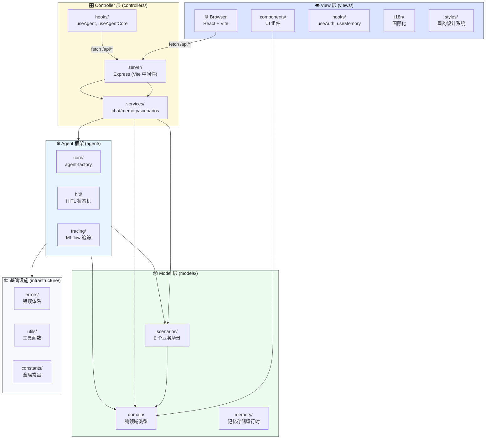
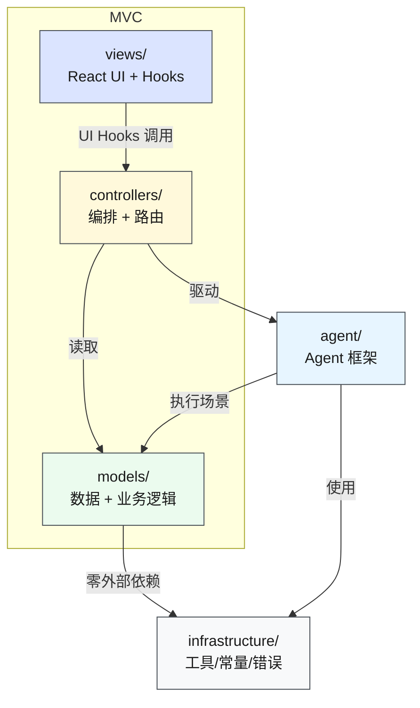
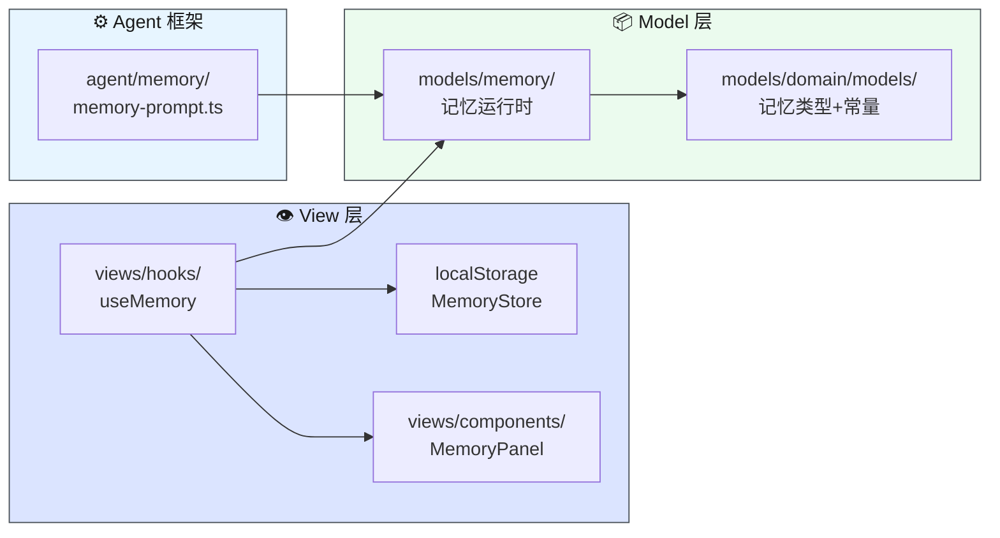
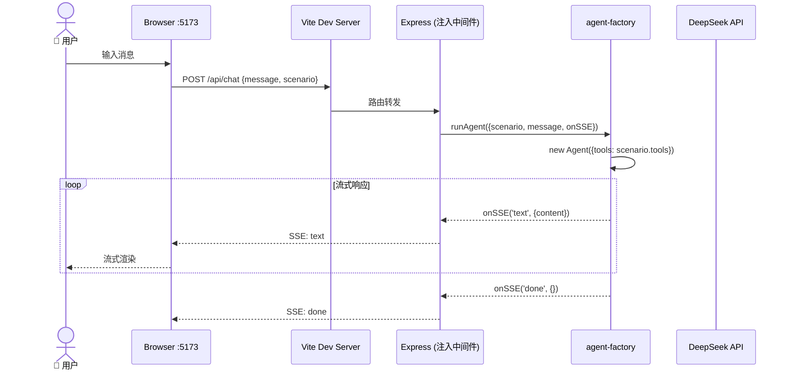
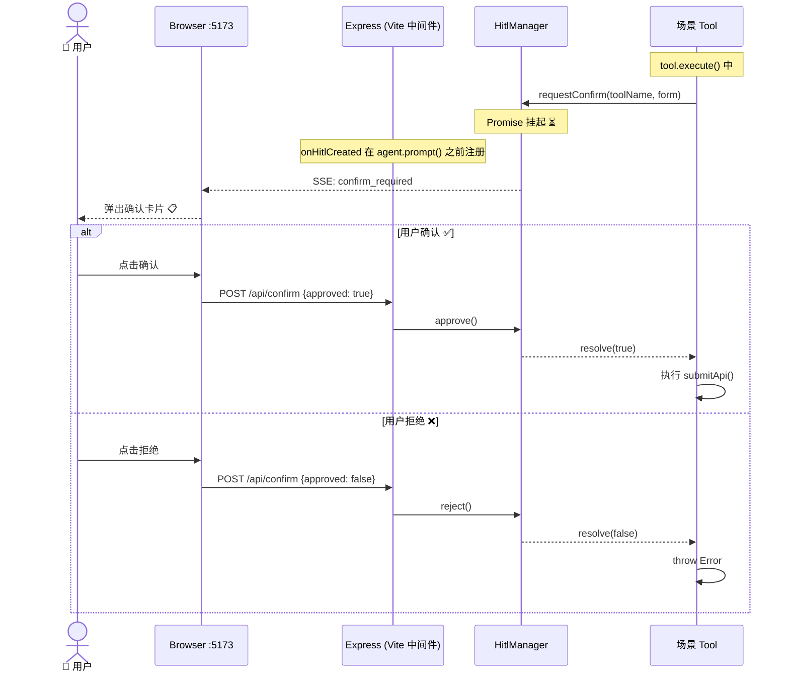

# src/ 源码架构

> ⬆️ [返回项目根目录](../CLAUDE.md)

## 目录结构

```
src/
├── models/                    # Model 层 — 数据 + 业务逻辑
│   ├── domain/               # 纯领域类型 (dto/enums/interfaces/models/vo)
│   ├── scenarios/            # 业务场景 (6 个场景 + registry.ts)
│   ├── memory/               # 记忆存储运行时
│   └── CLAUDE.md
├── views/                    # View 层 — 纯展示 + UI 交互
│   ├── components/           # React UI 组件
│   │   ├── approval/         # 审批相关组件
│   │   ├── auth/             # 登录认证组件
│   │   ├── chat/             # 聊天界面组件
│   │   ├── layout/           # 布局组件
│   │   ├── legal/            # 法律声明组件
│   │   ├── memory/           # 记忆面板组件
│   │   └── ui/               # 基础 UI 组件
│   ├── hooks/                # 纯 UI Hooks (useAuth, useMemory)
│   ├── i18n/                 # 国际化 (i18next + locales)
│   ├── data/                 # 静态数据
│   ├── styles/               # 样式文件
│   ├── types.ts              # View 层类型
│   └── CLAUDE.md
├── controllers/              # Controller 层 — 编排 + 路由
│   ├── hooks/                # 业务 Hooks (useAgent, useAgentCore)
│   ├── server/               # Express 服务端 (routes/controllers/middleware 已拆分)
│   ├── services/             # 业务编排服务 (chat/memory/plugins/scenarios)
│   └── CLAUDE.md
├── agent/                    # Agent 框架（MVC 外的基础设施）
│   ├── core/                 # agent-factory
│   ├── hitl/                 # HITL 确认状态机
│   ├── local/                # 浏览器端辅助
│   ├── memory/               # 记忆注入 prompt
│   ├── tracing/              # MLflow 追踪
│   └── CLAUDE.md
├── infrastructure/           # 基础设施（MVC 外）
│   ├── api/                  # API 客户端 (axios + SSE 流)
│   ├── constants/            # 全局常量
│   ├── errors/               # 错误体系
│   ├── utils/                # 工具函数 (env.ts, cn.ts)
│   └── CLAUDE.md
├── App.tsx                   # 入口壳 (登录 + MainApp)
├── main.tsx                  # Vite 入口
└── vite-env.d.ts
```

## 子目录文档

| MVC 层 | 目录 | 文档 | 说明 |
|--------|------|------|------|
| **Model** | `models/` | [CLAUDE.md](models/CLAUDE.md) | 数据 + 业务逻辑 — domain/scenarios/memory |
| **View** | `views/` | [CLAUDE.md](views/CLAUDE.md) | 纯展示 + UI 交互 — components/hooks/i18n/styles |
| **Controller** | `controllers/` | [CLAUDE.md](controllers/CLAUDE.md) | 编排 + 路由 — hooks/server/services |
| 基础设施 | `agent/` | [CLAUDE.md](agent/CLAUDE.md) | Agent 框架 (业务无关) |
| 基础设施 | `infrastructure/` | [CLAUDE.md](infrastructure/CLAUDE.md) | 工具函数/常量/错误体系 |

## 系统架构图



## 依赖方向图



## Vite + Express 单进程注入机制

### 1. Express 工厂函数 (`controllers/server/index.ts`)

`createApp()` 创建一个完整的 Express 应用，挂载所有 `/api` 路由，返回 `app` 实例供外部使用。不调用 `listen()`，由宿主环境决定如何运行。

```ts
// controllers/server/index.ts
export function createApp() {
  const app = express();
  const hitlSessions = new Map<string, HitlManager>();

  app.use(express.json());

  // 挂载所有 API 路由
  app.use('/api', createChatRouter(hitlSessions));     // POST /api/chat
  app.use('/api', createConfirmRouter(hitlSessions));   // POST /api/confirm
  app.use('/api', createCompactRouter());               // POST /api/compact
  app.use('/api', createExtractMemoriesRouter());        // POST /api/extract-memories
  app.use('/api', createScenariosRouter());             // GET  /api/scenarios

  // 生产模式: 伺服 dist/ 静态文件
  const staticDir = path.join(__dirname, '..', '..', 'dist');
  if (fs.existsSync(staticDir)) {
    app.use(express.static(staticDir));
  }

  return { app, hitlSessions };
}
```

### 2. Vite 插件注入 (`vite.config.ts`)

通过自定义 Vite 插件的 `configureServer` 钩子，在开发模式启动时将 Express app 注入 Vite 的 Connect 中间件链。Express 兼容 Connect 的 `(req, res, next)` 签名，可直接作为中间件使用。

```ts
// vite.config.ts
import { createApp } from './src/controllers/server/index.js';

export default defineConfig({
  plugins: [
    react(),
    tailwindcss(),
    {
      name: 'express-middleware',
      configureServer(server) {
        // createApp() 返回完整的 Express 实例
        const { app } = createApp();
        // 注入到 Vite 中间件链 — /api/* 请求由 Express 处理，其余由 Vite 处理
        server.middlewares.use(app);
      },
    },
  ],
  server: { port: 5173 },
});
```

**中间件链顺序**:

```
请求 → Vite :5173
        ├── /api/* → Express app (路由匹配)
        │             ├── POST /api/chat        → runAgent() → SSE 流
        │             ├── POST /api/confirm     → hitl.approve/reject
        │             ├── POST /api/compact     → mini Agent 压缩
        │             ├── POST /api/extract-memories → mini Agent 提取
        │             └── GET  /api/scenarios   → 场景列表 JSON
        └── 其他     → Vite 自身处理 (HMR、静态资源、SPA fallback)
```

### 3. 前端调用 (`controllers/hooks/useAgentCore.ts`)

前端通过标准 `fetch` 调用 `/api/*` 端点，不直接接触 Agent 框架。所有 AI 调用在服务端完成，API Key 不暴露给浏览器。

#### 聊天请求 — SSE 流式读取

```ts
// controllers/hooks/useAgentCore.ts → sendMessage()
import { createSSEStream } from '../../infrastructure/api/index.js';

const stream = createSSEStream({
  url: '/api/chat',
  body: { message: text, history, scenario: scenarioId, memories, summary, userId, sessionId },
});

await stream.read({
  onEvent: (eventType, data) => {
    // eventType: "text" | "confirm_required" | "done" | "error"
    // 触发 React 状态更新 → UI 渲染
    handleSSE(fullText, eventType, data, onEvent, lastConfirmTool);
  },
  onError: (err) => { onEvent({ type: 'error', message: err.message }); },
});
```

#### HITL 确认 — 独立 POST 请求

```ts
// controllers/hooks/useAgentCore.ts → confirm()
import { api } from '../../infrastructure/api/index.js';

await api.post('/confirm', { approved: true/false, sessionId });
```

#### 对话压缩 & 记忆提取 — 后台 POST

```ts
// 压缩: 消息数超阈值时自动触发
const { data } = await api.post('/compact', { messages: oldMessages, scenario: scenarioId });

// 提取记忆: 每 N 轮自动触发
const { data } = await api.post('/extract-memories', { messages: recentMessages, scenario: scenarioId });
```

### 4. React Hook 桥接 (`controllers/hooks/useAgent.ts`)

`useAgent` 是薄 React 包装，管理 React 状态并将 `useAgentCore` 的 `onEvent` 映射到 `setState`。

```ts
// controllers/hooks/useAgent.ts
const session = createAgentSession({
  scenarioId,
  userId,
  sessionId,
  memories,
  summary,
  onEvent: (event) => {
    switch (event.type) {
      case 'text':    updateLastAssistant(event.content); break;
      case 'confirm_required': setConfirmRequest({...});  break;
      case 'done':    setPhase('done');                   break;
      case 'error':   setError(event.message);            break;
    }
  },
});

// 发送消息 → 内部 fetch /api/chat → SSE 回调 onEvent → React setState → UI 更新
session.sendMessage(text, history, allMessages, messageCount);
```

## 记忆系统



**设计原则**: 服务端无状态，前端 localStorage 持久化。

| 记忆类型 | 作用域 | 说明 |
|---------|--------|------|
| user | 跨场景共享 | 用户画像/偏好 |
| feedback | 跨场景共享 | 用户纠正/确认 |
| project | 按场景隔离 | 业务上下文 |
| reference | 按场景隔离 | 外部资源指针 |

## 聊天请求时序图

**开发模式** (Vite + Express 单进程):



## HITL 确认流程时序图



---

> ⬆️ [返回项目根目录](../CLAUDE.md)
