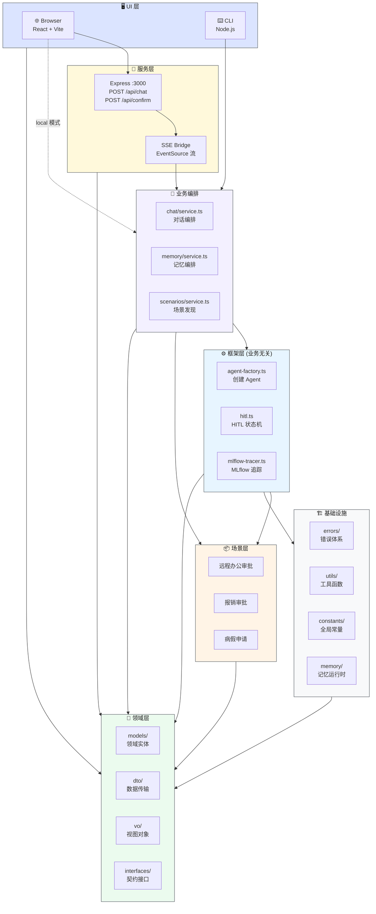
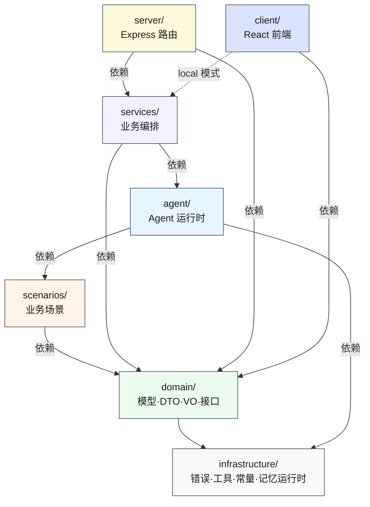
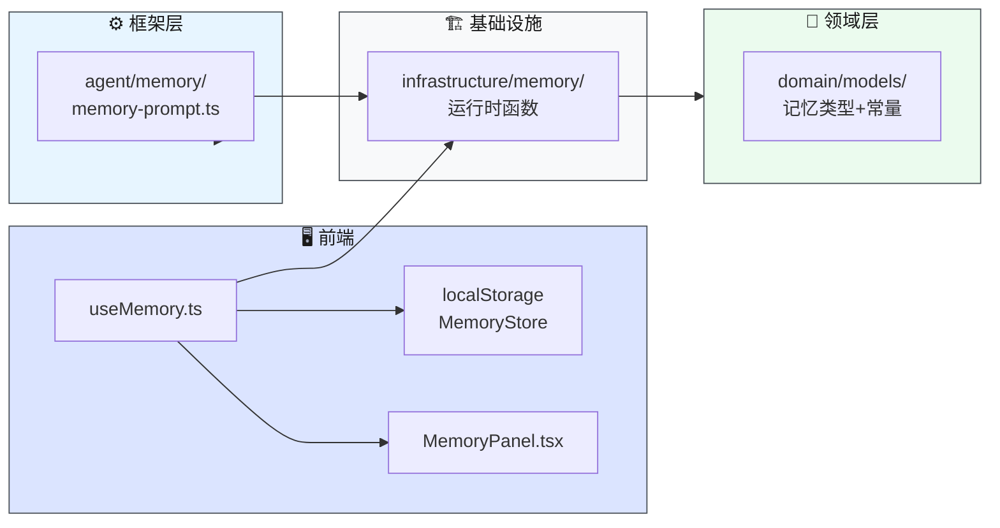
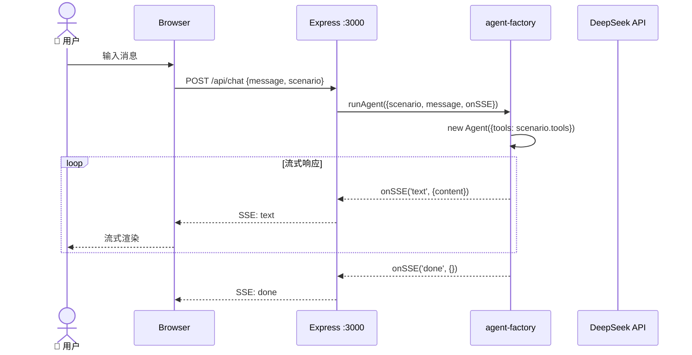
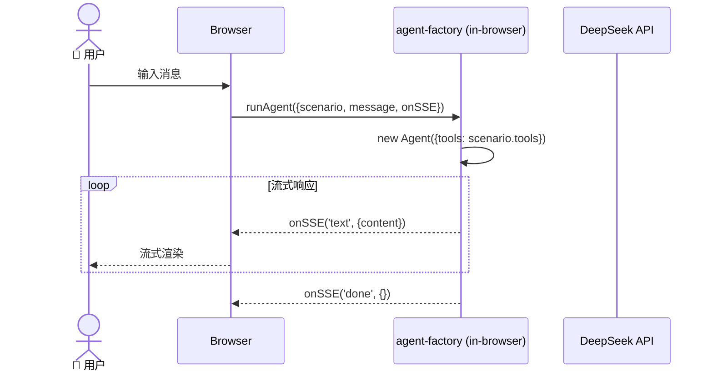
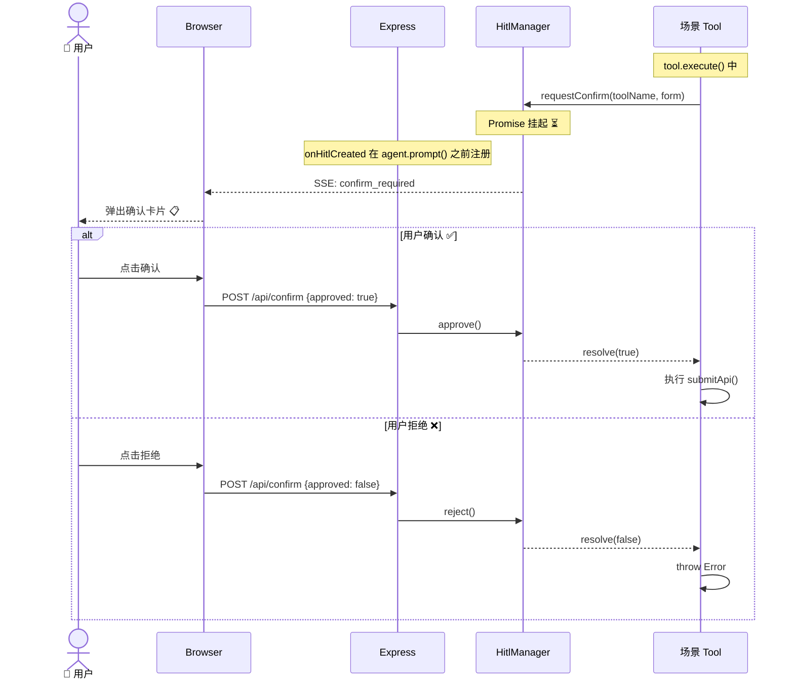
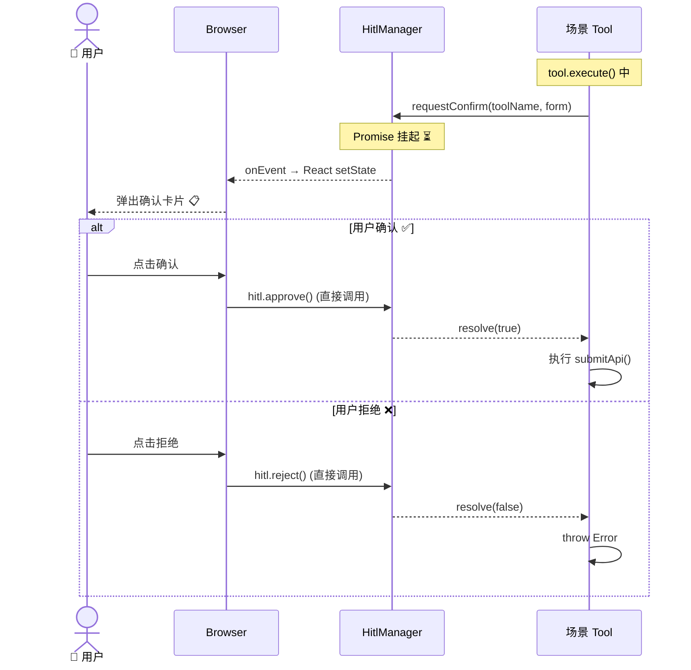

# src/ 源码架构

> ⬆️ [返回项目根目录](../CLAUDE.md)

## 目录结构

```
src/
├── domain/            # 🧱 领域模型 (models/DTO/VO/interfaces) — 零外部依赖
├── infrastructure/    # 🏗️ 基础设施 (errors/utils/constants/memory)
├── shared/            # ⚠️ 弃用中 → 迁移到 domain/ + infrastructure/
├── agent/             # ⚙️ Agent 框架层 (业务无关)
│   ├── core/              # agent-factory, types
│   ├── hitl/              # HITL 确认状态机
│   ├── tracing/           # MLflow 追踪
│   ├── memory/            # 记忆注入 prompt
│   └── local/             # 浏览器端辅助
├── services/          # 🔀 业务编排 (对话/记忆/场景发现)
├── scenarios/         # 📦 业务场景 (完全自主: prompt + tools + api + validator)
├── client/            # 🎨 前端 UI 壳 (React + Vite)
├── server/            # 🔧 Express 服务端 (可选)
├── i18n/              # 🌐 多语言翻译 (i18next)
├── App.tsx            # 主应用组件
└── App.css            # 墨韵设计系统样式
```

## 子目录文档

| 层 | 目录 | 文档 | 说明 |
|---|------|------|------|
| 🧱 | `domain/` | [CLAUDE.md](domain/CLAUDE.md) | 领域模型 — models/DTO/VO/接口 |
| 🏗️ | `infrastructure/` | [CLAUDE.md](infrastructure/CLAUDE.md) | 基础设施 — 错误/工具/常量/记忆运行时 |
| ⚙️ | `agent/` | [CLAUDE.md](agent/CLAUDE.md) | Agent 框架层 (业务无关) |
| 🔀 | `services/` | [CLAUDE.md](services/CLAUDE.md) | 服务层 — 业务逻辑编排 |
| 📦 | `scenarios/` | [CLAUDE.md](scenarios/CLAUDE.md) | 业务场景层 |
| 🎨 | `client/` | [CLAUDE.md](client/CLAUDE.md) | 前端 UI 壳层 |
| 🔧 | `server/` | [CLAUDE.md](server/CLAUDE.md) | Express 服务端 |
| 🌐 | `i18n/` | — | 多语言翻译 (i18next) |

## 系统架构图



## 依赖方向图



## 记忆系统



**设计原则**: 服务端无状态，前端 localStorage 持久化。

| 记忆类型 | 作用域 | 说明 |
|---------|--------|------|
| user | 跨场景共享 | 用户画像/偏好 |
| feedback | 跨场景共享 | 用户纠正/确认 |
| project | 按场景隔离 | 业务上下文 |
| reference | 按场景隔离 | 外部资源指针 |

## 聊天请求时序图

**Server 模式** (Express 中转):



**Local 模式** (浏览器直接调用 Agent，无网络往返):



## HITL 确认流程时序图

**Server 模式** (通过 HTTP):



**Local 模式** (直接操作 HitlManager):



---

> ⬆️ [返回项目根目录](../CLAUDE.md)
