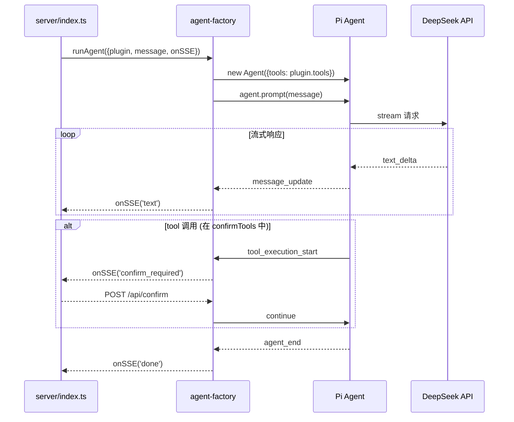
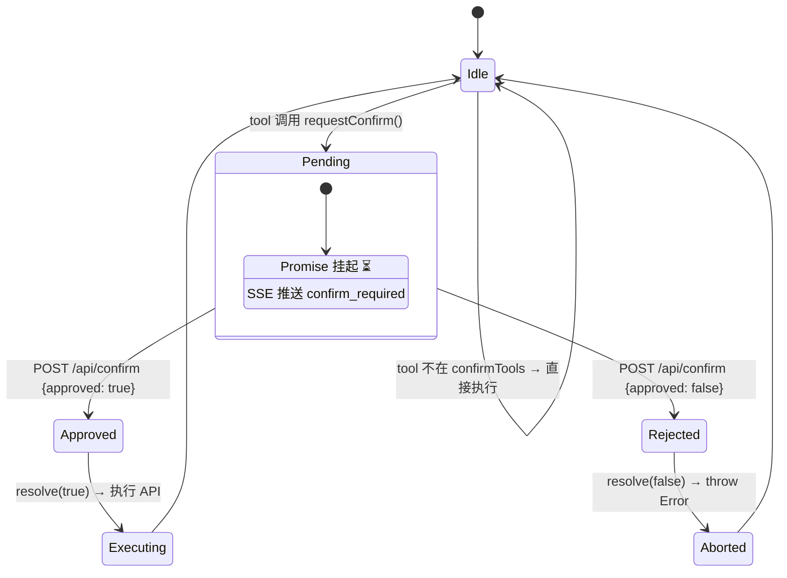

# Agent 框架层

> ⬆️ [返回项目根目录](../../AGENTS.md) · 📋 相关: [plugins/](../plugins/AGENTS.md) · [shared/](../shared/AGENTS.md) · [server/](../server/AGENTS.md)

## 职责

Agent 框架层是运行时核心，创建和管理 Pi Agent 实例、SSE 事件桥接、HITL 确认状态机。

**核心约束：本层完全业务无关，不定义任何 tool。**

## 架构

```
agent/
├── AGENTS.md           # 本文档
├── agent-factory.ts    # 创建 Agent、SSE 转发
├── confirm-state.ts    # HITL 通用状态机
└── types.ts            # 框架级类型
```

## Agent 运行时序图



## HITL 状态机



## SSE 事件转换

| Pi Agent 事件 | SSE 事件 | 前端行为 |
|--------------|---------|---------|
| message_update (text_delta) | `text { content }` | 流式渲染 |
| tool_execution_start (confirmTools) | `confirm_required` | 弹确认卡片 |
| tool_execution_end | `tool_result` | 显示结果 |
| agent_end | `done {}` | 回到 idle |

## 文件说明

### agent-factory.ts

- `runAgent(params)` — 创建 Agent，订阅事件，SSE 转发
- `getDefaultModel()` — DeepSeek 模型配置
- 不 import 任何 tool，直接使用 `plugin.tools`

### confirm-state.ts

- `requestConfirm()` — 挂起 Promise
- `approveConfirm()` / `rejectConfirm()` — 解除挂起
- `getPending()` — 获取当前请求
- 通用工具库，插件按需 import

## 依赖

- `@earendil-works/pi-agent-core` / `@earendil-works/pi-ai`
- [shared/plugin.ts](../shared/AGENTS.md) · [shared/types.ts](../shared/AGENTS.md)

## 约束

- ❌ 不 import plugins/ 下的任何模块
- ❌ 不定义任何 tool
- ✅ 只通过 BusinessPlugin 接口通信

---

> ⬆️ [返回项目根目录](../../AGENTS.md) · 📋 相关: [plugins/](../plugins/AGENTS.md) · [shared/](../shared/AGENTS.md) · [server/](../server/AGENTS.md)