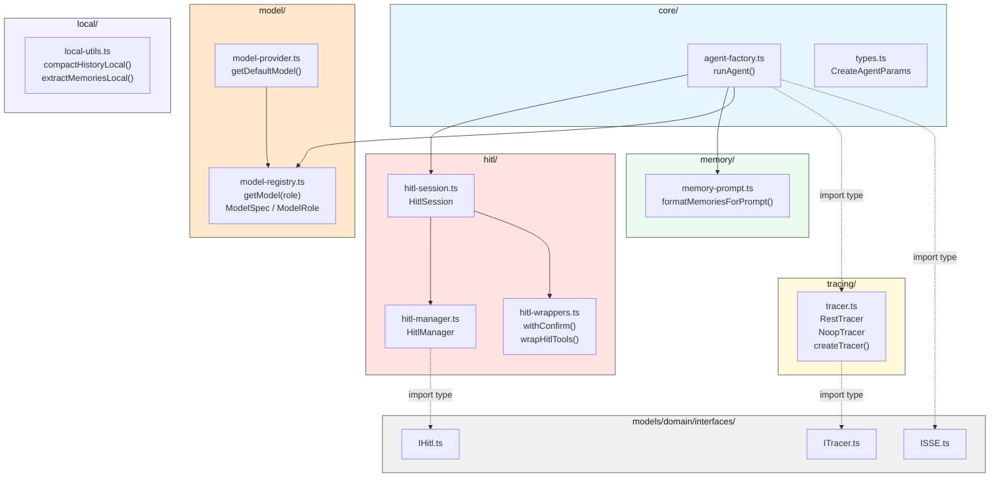
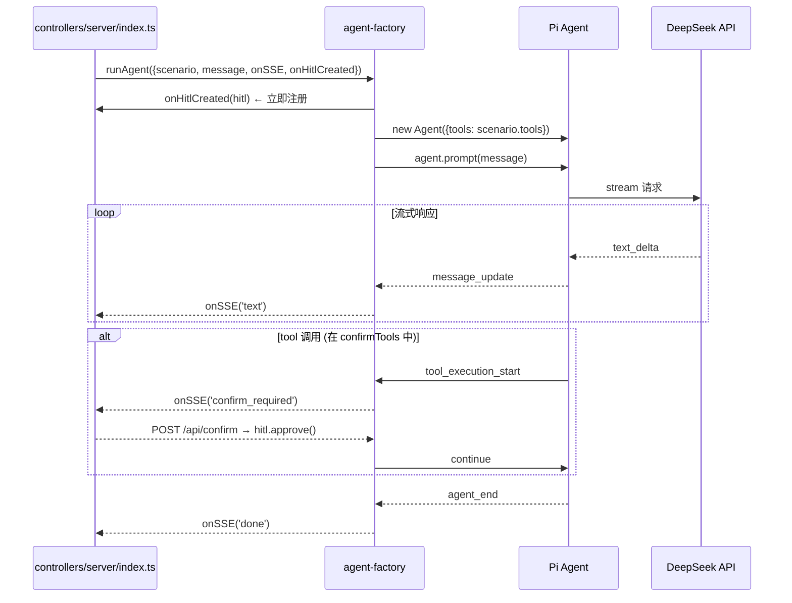
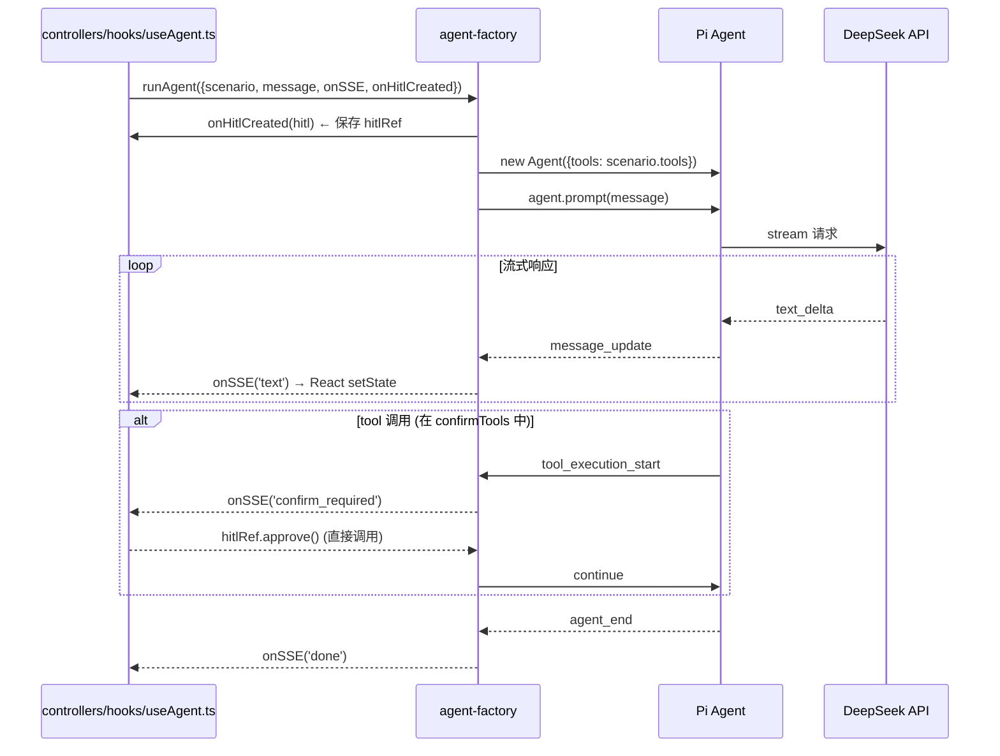
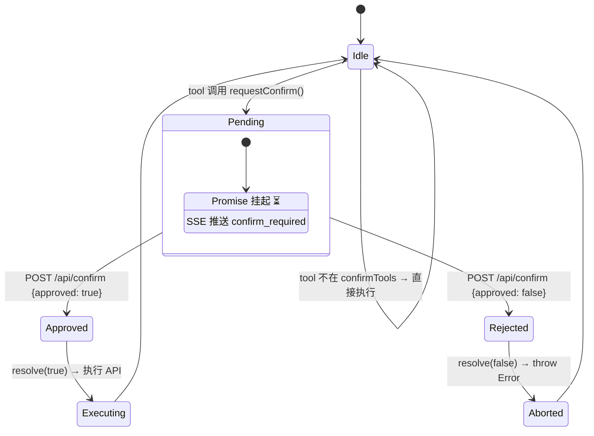

# Agent 框架层

> ⬆️ [返回 src/](../CLAUDE.md) · 📋 依赖: [models/domain/](../models/domain/CLAUDE.md) · [infrastructure/](../infrastructure/CLAUDE.md) · 📋 被引用: [controllers/](../controllers/CLAUDE.md) · [views/](../views/CLAUDE.md)

## 职责

Agent 框架层是运行时核心，创建和管理 Pi Agent 实例、SSE 事件桥接、HITL 确认状态机。

**核心约束：本层完全业务无关，不定义任何 tool。**

## 架构

```
agent/
├── core/                 # 核心运行时
│   ├── agent-factory.ts      # runAgent() 工厂 + AgentFactoryParams
│   └── types.ts              # 框架内部类型 (CreateAgentParams)
├── hitl/                 # HITL 确认
│   ├── hitl-manager.ts       # HitlManager 类 (状态机)
│   ├── hitl-session.ts       # HitlSession 类 (SSE 桥接 + tool 包装)
│   ├── hitl-wrappers.ts      # withConfirm() + wrapHitlTools()
│   └── index.ts              # 汇总导出
├── model/                # 模型配置
│   ├── model-registry.ts     # 声明式注册表 — getModel(role), ModelSpec, ModelRole
│   ├── model-provider.ts     # getDefaultModel() — 兼容旧接口
│   └── index.ts              # 汇总导出
├── tracing/              # 追踪
│   ├── tracer.ts             # RestTracer + NoopTracer + createTracer()
│   └── index.ts              # 汇总导出
├── memory/               # 记忆注入
│   └── memory-prompt.ts      # 记忆格式化注入 system prompt
└── local/                # 浏览器端辅助
    └── local-utils.ts        # compact/extract-memories 辅助函数
```

**纯类型定义在 `models/domain/interfaces/` 中:**
- `ITracer.ts` — 追踪接口 + TracerOptions
- `IHitl.ts` — HitlEvent + HitlEventCallback
- `ISSE.ts` — SSECallback + SSEEventType + SSEPayload

## 模块架构图



## Agent 运行时序图

**Server 模式** (Express 调用):



**Local 模式** (浏览器直接调用):



## HITL 状态机



## SSE 事件转换

| Pi Agent 事件 | SSE 事件 | 前端行为 |
|--------------|---------|---------|
| message_update (text_delta) | `text { content }` | 流式渲染 |
| tool_execution_start (confirmTools) | `confirm_required` | 弹确认卡片 |
| tool_execution_end | `tool_result` | 显示结果 |
| agent_end | `done {}` | 回到 idle |

## 文件说明

### core/agent-factory.ts

- `runAgent(params)` — 创建 Agent，订阅事件，SSE 转发
- `getDefaultModel()` — DeepSeek 模型配置
- `AgentFactoryParams` — 工厂参数接口

### core/types.ts

- `CreateAgentParams` — Agent 创建参数 (框架内部类型)

### hitl/hitl-manager.ts

- `HitlManager` — HITL 确认状态机
  - `requestConfirm()` — 挂起 Promise
  - `approve()` / `reject()` — 解除挂起

### hitl/hitl-session.ts

- `HitlSession` — HITL 会话封装 (HitlManager 创建 + SSE 桥接 + tool 包装)

### hitl/hitl-wrappers.ts

- `withConfirm()` — 单个 tool 的 HITL 包装
- `wrapHitlTools()` — 批量包装 confirmTools

### model/model-registry.ts

- `ModelSpec` — 模型配置项 (provider + modelId)
- `ModelRole` — 模型角色 (`'chat'` | `'utility'`)
- `getModel(role)` — 按角色获取模型，环境变量驱动
  - `chat` — 主 Agent 推理 (MODEL_PROVIDER / MODEL_ID)
  - `utility` — 压缩/提取等简单任务 (UTILITY_MODEL_* 回退到 MODEL_*)

### model/model-provider.ts

- `getDefaultModel()` — 兼容旧接口，委托给 `getModel('chat')`

### tracing/tracer.ts

- `RestTracer` — MLflow REST API 上报 (axios)
- `NoopTracer` — 空操作
- `createTracer()` — 工厂函数 (带连接预检)

### memory/memory-prompt.ts

- `formatMemoriesForPrompt()` / `formatSummaryForHistory()` — 记忆注入格式化

### local/local-utils.ts

- `compactHistoryLocal()` / `extractMemoriesLocal()` — 浏览器端辅助

## 依赖

- `@earendil-works/pi-agent-core` / `@earendil-works/pi-ai`
- `models/domain/interfaces/` — `IScenario`, `ITracer`, `IHitl`, `ISSE` 等接口契约
- `models/domain/models/` — `ChatMessage`, `MemoryItem` 等领域实体
- `models/memory/` — 记忆存储运行时

## 约束

- ❌ 不 import models/scenarios/ 下的任何模块
- ❌ 不定义任何 tool
- ❌ 纯类型定义不放本层，统一放 `models/domain/interfaces/`
- ✅ 本层只放实现类和工厂函数
- ✅ 一个文件只放一个类或一组密切相关的纯函数
- ✅ 模块入口 `index.ts` 只做汇总导出
- ❌ 不 import controllers/ 或 views/

---

> ⬆️ [返回 src/](../CLAUDE.md) · 📋 依赖: [models/domain/](../models/domain/CLAUDE.md) · [infrastructure/](../infrastructure/CLAUDE.md)
