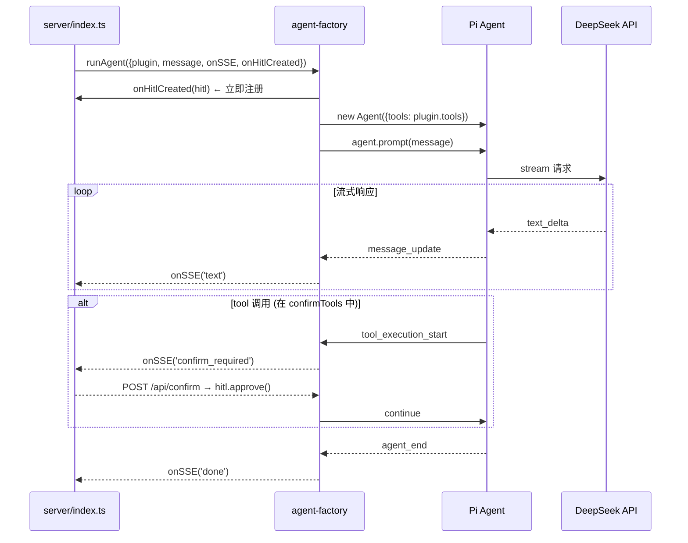
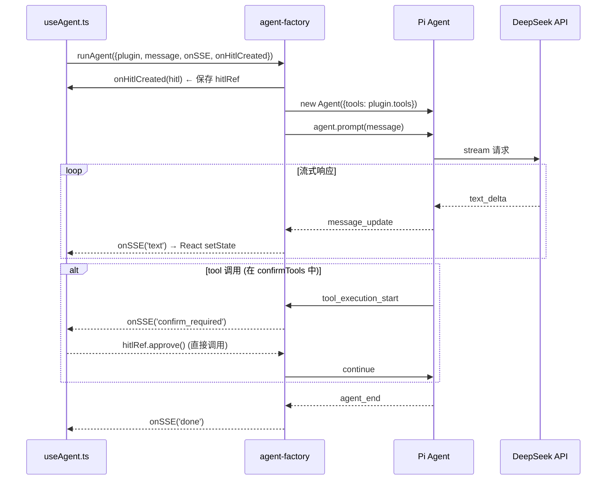
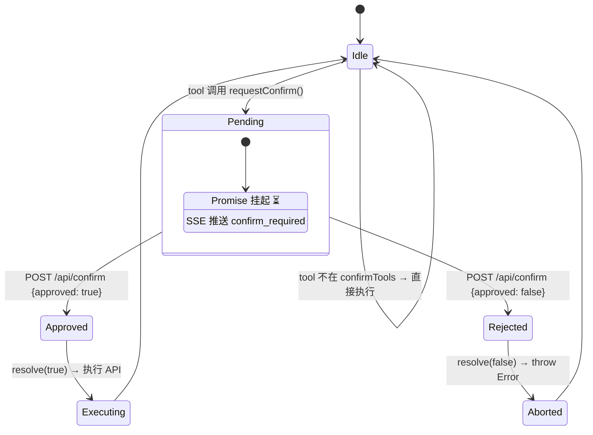

# Agent 框架层

> ⬆️ [返回项目根目录](../../CLAUDE.md) · 📋 依赖: [domain/](../domain/CLAUDE.md) · [infrastructure/](../infrastructure/CLAUDE.md) · 📋 被引用: [server/](../server/CLAUDE.md) · [client/](../client/CLAUDE.md)

## 职责

Agent 框架层是运行时核心，创建和管理 Pi Agent 实例、SSE 事件桥接、HITL 确认状态机。

**核心约束：本层完全业务无关，不定义任何 tool。**

## 架构

```
agent/
├── core/             # 核心运行时
│   ├── agent-factory.ts  # 创建 Agent、SSE 转发、HITL 注册
│   └── types.ts          # 框架级类型
├── hitl/             # HITL 确认
│   └── hitl.ts           # HitlManager 类 + withConfirm 包装器
├── tracing/          # 追踪
│   └── mlflow-tracer.ts  # MLflow 追踪 (Strategy 模式，双环境兼容)
├── memory/           # 记忆注入
│   └── memory-prompt.ts  # 记忆格式化注入 system prompt
└── local/            # 浏览器端辅助
    └── local-utils.ts    # compact/extract-memories 辅助函数
```

## Agent 运行时序图

**Server 模式** (Express 调用):



**Local 模式** (浏览器直接调用):



## HITL 状态机



## SSE 事件转换

| Pi Agent 事件 | SSE 事件 | 前端行为 |
|--------------|---------|---------|
| message_update (text_delta) | `text { content }` | 流式渲染 |
| tool_execution_start (confirmTools) | `confirm_required` | 弹确认卡片 |
| tool_execution_end | `tool_result` | 显示结果 |
| agent_end | `done {}` | 回到 idle |

## 文件说明

### core/agent-factory.ts

- `runAgent(params)` — 创建 Agent，订阅事件，SSE 转发
  - `onHitlCreated` 回调在 `agent.prompt()` 之前触发，用于注册 HitlManager 到会话映射
  - 返回 `Promise<HitlManager>`（流程结束后 resolve）
- `getDefaultModel()` — DeepSeek 模型配置
- 不 import 任何 tool，直接使用 `plugin.tools`

### core/types.ts

- 框架级类型定义（Agent 配置、运行参数、事件回调等）

### hitl/hitl.ts

- `HitlManager` — HITL 确认管理器类
  - `requestConfirm()` — 挂起 Promise，事件驱动 SSE
  - `approve()` / `reject()` — 解除挂起
  - `pending` — 当前待确认项（只读）
- `withConfirm()` — 声明式 HITL 工具包装器
- `wrapHitlTools()` — 批量包装 HITL tools（agent-factory 使用）

### local/local-utils.ts

- `compactHistoryLocal(messages)` — 浏览器端对话压缩，创建 mini Agent 生成摘要
- `extractMemoriesLocal(messages)` — 浏览器端记忆提取，创建 mini Agent 返回结构化记忆
- 替代 `/api/compact` 和 `/api/extract-memories` HTTP 端点
- 仅 local 模式使用（通过 `useAgent` 动态 import）

### tracing/mlflow-tracer.ts

- **Strategy 模式**: `ITracer` 接口 + `FetchTracer` (REST API) + `NoopTracer` (空操作)
- `createTracer(opts)` 工厂 — 有 `MLFLOW_TRACKING_URI` 时创建 FetchTracer，否则 NoopTracer
- 纯 `fetch()` 实现，零 SDK 依赖，Node.js 和浏览器双环境兼容
- `core/agent-factory` 通过 `import type { ITracer }` 引用接口（编译时擦除）

### memory/memory-prompt.ts

- `formatMemoriesForPrompt(memories)` — 将记忆列表格式化为 system prompt 区块
- `formatSummaryForHistory(summary)` — 将对话摘要格式化为 history 注入
- 按 user/feedback/project/reference 分组输出

## 依赖

- `@earendil-works/pi-agent-core` / `@earendil-works/pi-ai`
- `domain/interfaces/` — `IBusinessPlugin`, `ITracer` 等接口契约
- `domain/models/` — `ChatMessage`, `MemoryItem` 等领域实体
- `infrastructure/memory/` — 记忆存储运行时

## 约束

- ❌ 不 import plugins/ 下的任何模块
- ❌ 不定义任何 tool
- ✅ 只通过 IBusinessPlugin 接口通信
- ❌ 不 import server/ 或 client/

---

> ⬆️ [返回项目根目录](../../CLAUDE.md) · 📋 依赖: [domain/](../domain/CLAUDE.md) · [infrastructure/](../infrastructure/CLAUDE.md)
