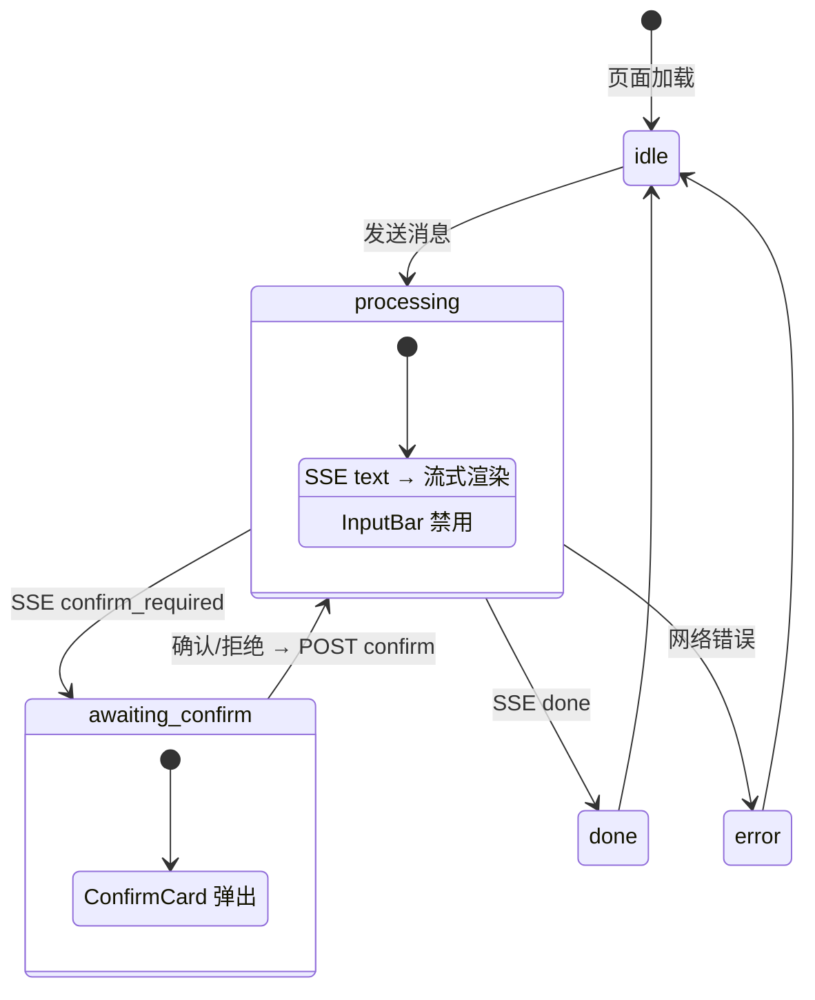
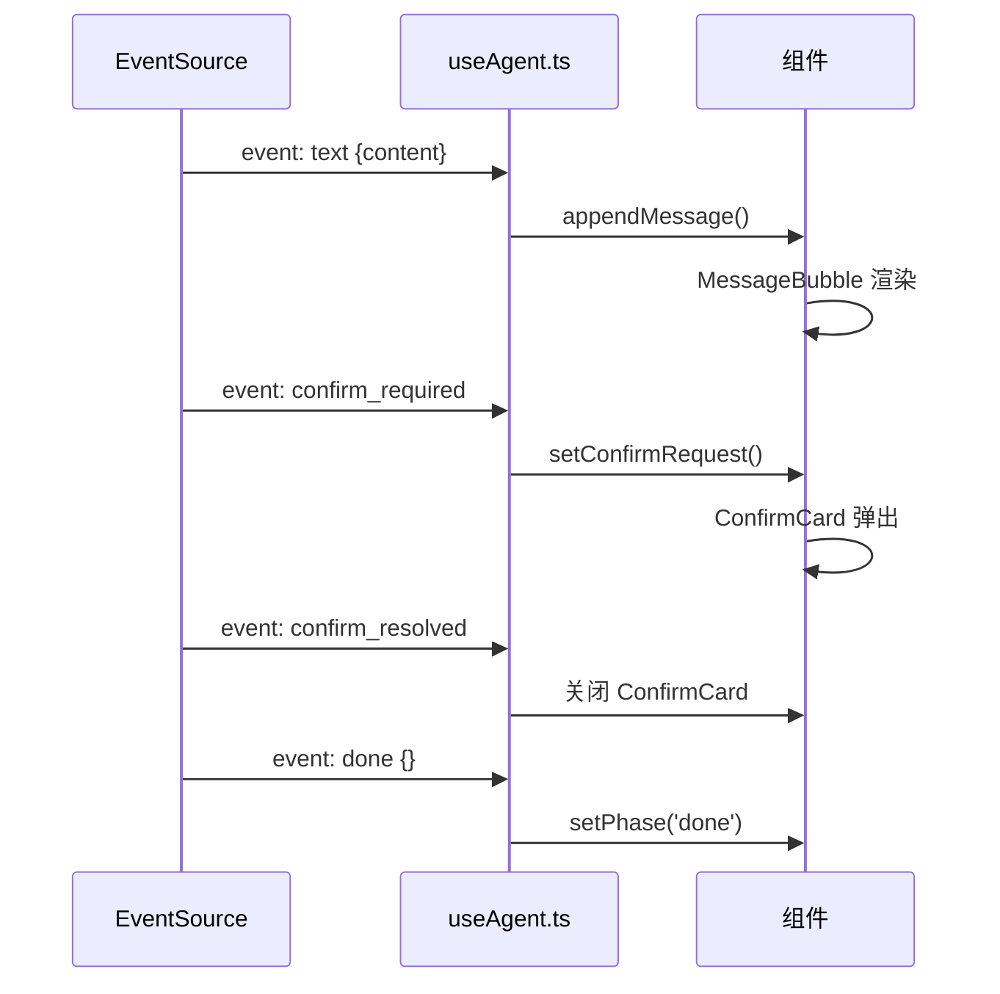
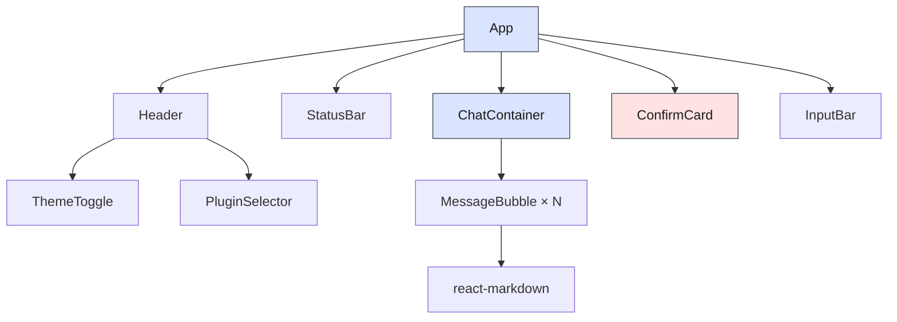

# 前端 UI 壳层

> ⬆️ [返回项目根目录](../../AGENTS.md) · 📋 相关: [shared/](../shared/AGENTS.md) · [server/](../server/AGENTS.md)

## 职责

React 前端，通过 SSE 与后端通信。不关心具体业务逻辑。

**核心约束：前端不知道任何具体业务插件的存在。**

## 架构

```
client/
├── types.ts                    # 泛化类型
├── hooks/useAgent.ts           # 聊天状态机 Hook
└── components/
    ├── chat/   (Container, Bubble, Input)
    ├── approval/ (ConfirmCard, StatusBar)
    └── layout/ (Header, ThemeToggle)
```

## 前端状态机图



## SSE 事件处理流程



## 组件层级



## 设计系统

- Slate/Warm Gray 极简，CSS Variables token
- 禁止蓝紫渐变
- 响应式 `640px` 断点
- dark/light/system 主题
- Inter + Noto Sans SC

## 约束

- ❌ 不 import plugins/ agent/
- ❌ 不硬编码具体 tool 名称
- ✅ 业务信息全通过 SSE 事件获取

---

> ⬆️ [返回项目根目录](../../AGENTS.md) · 📋 相关: [shared/](../shared/AGENTS.md) · [server/](../server/AGENTS.md)