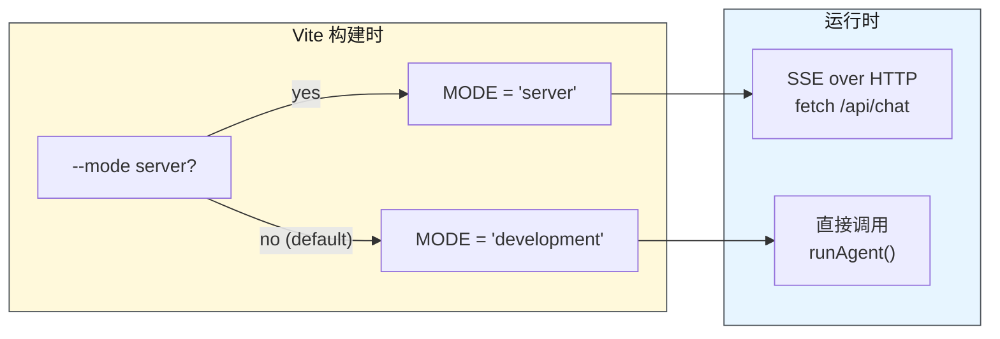
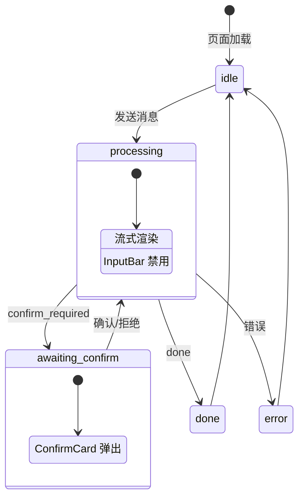
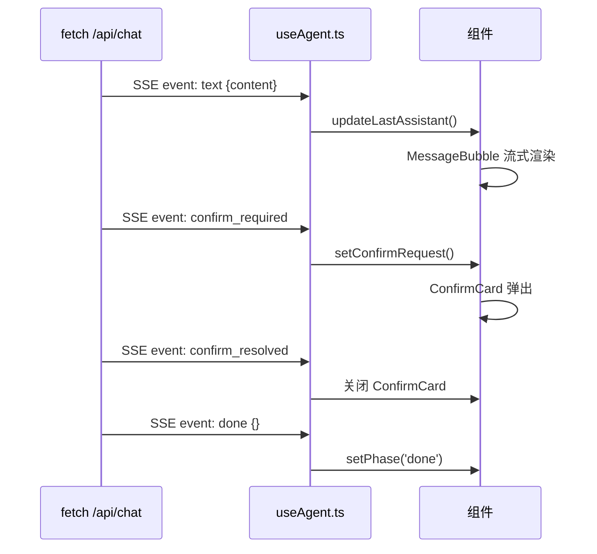
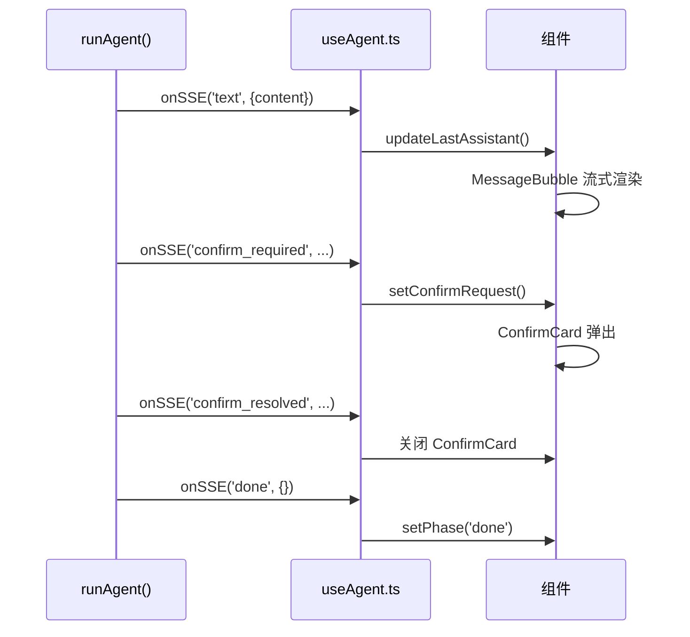
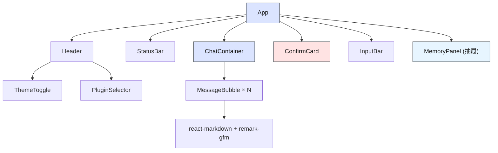
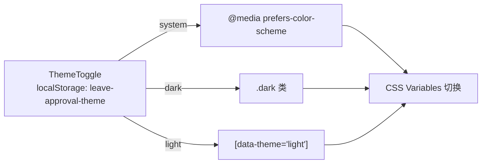

# 前端 UI 壳层

> ⬆️ [返回项目根目录](../../CLAUDE.md) · 📋 相关: [shared/](../shared/CLAUDE.md) · [server/](../server/CLAUDE.md) · [agent/](../agent/CLAUDE.md)

## 职责

React 前端，支持两种运行模式。不关心具体业务逻辑。

**核心约束：前端不知道任何具体业务插件的存在。**

## 双模式架构



| 模式 | 通信方式 | 后端 | 适用场景 |
|------|---------|------|---------|
| server | SSE (`/api/chat`) | Express :3000 | 生产部署、多客户端 |
| local | 直接 `runAgent()` | 不需要 | 开发调试、单机使用 |

## 架构

```
client/
├── types.ts                         # 泛化类型
├── hooks/
│   ├── useAgent.ts                  # 聊天状态机 Hook v5.0（双模式）
│   └── useMemory.ts                 # 记忆系统 Hook (localStorage)
└── components/
    ├── chat/
    │   ├── ChatContainer.tsx        # 消息列表 + 自动滚动 + 回到底部按钮
    │   ├── MessageBubble.tsx        # 消息气泡 (react-markdown + remark-gfm)
    │   └── InputBar.tsx             # 输入框 + 发送
    ├── approval/
    │   ├── ConfirmCard.tsx          # HITL 确认弹窗
    │   └── StatusBar.tsx            # 流水线状态栏
    ├── layout/
    │   ├── Header.tsx               # 顶部导航 + 插件选择
    │   └── ThemeToggle.tsx          # 主题切换 (system/dark/light)
    └── memory/
        └── MemoryPanel.tsx          # 记忆面板 (抽屉式)
```

## 前端状态机图



## 事件处理流程（两种模式对比）

**Server 模式 — SSE over HTTP：**



**Local 模式 — 直接 Agent 调用：**



## 组件层级



## 设计系统 — 墨韵 (Ink Resonance)

| 概念 | 值 | 说明 |
|------|-----|------|
| 色调 | Warm paper + ink-dark + vermillion | 宣纸 + 墨色 + 朱砂 |
| 亮色背景 | `#F5F0E8` | 暖纸白 |
| 暗色背景 | `#121210` | 浓墨色 |
| 强调色 | `#D4463A` | 朱砂红 |
| 正文色 | `#1C1814` / `#E8E2D6` | 墨色/淡墨 |
| 标题字体 | Crimson Pro + Noto Serif SC | 衬线体 |
| 等宽字体 | IBM Plex Mono | 代码块 |
| 正文字体 | Noto Sans SC | 无衬线 |
| 主题 | system (auto) / dark / light | 三态切换 |
| 布局 | 全宽 + 内容居中 `max(24px, (100%-820px)/2)` | 自适应 |
| 断点 | 820px / 640px | 响应式 |

### 主题系统



### 字体加载策略

Google Fonts 通过 `media="print" onload="this.media='all'"` 异步加载，避免阻塞渲染。`<head>` 内联关键 CSS 提供背景色 fallback。

## 记忆系统 (前端)

| 概念 | 实现 |
|------|------|
| 持久化 | `localStorage` (`agent_memory_store`) |
| Hook | `useMemory.ts` — CRUD + 容量管理 (FIFO 淘汰) |
| UI | `MemoryPanel.tsx` — 桌面右侧抽屉 / 平板覆盖层 / 手机底部抽屉 |
| 隔离 | user/feedback 跨插件共享，project/reference 按插件隔离 |

## 文件说明

### hooks/useAgent.ts

- 聊天状态机 Hook v5.0，支持 server / local 双模式
- `sendMessage()` 根据 `import.meta.env.MODE` 分支：
  - local 模式: 动态 `import('../../agent/agent-factory.js')` + `import('../../agent/mlflow-tracer.js')`，通过 `createTracer()` + `tracer.run()` 包裹 `runAgent()`
  - server 模式: `fetch('/api/chat')` 读 SSE 流，解析 text/confirm_required/done 事件
- `confirm()` 同样分支：local 模式直接操作 `hitlRef`，server 模式 POST `/api/confirm`
- `compactHistory()` / `extractMemories()` 在 local 模式使用 `local-utils.ts` 进程内处理，server 模式走 HTTP 端点
- `hitlRef` — local 模式通过 `onHitlCreated` 回调获取 HitlManager 引用
- HITL 用户拒绝（`'用户拒绝'`）视为正常流程结束，不显示错误

### hooks/useMemory.ts

- localStorage 持久化 (`agent_memory_store`)，FIFO 容量管理
- user/feedback 跨插件共享，project/reference 按插件隔离

## 约束

- ❌ 不硬编码具体 tool 名称
- ✅ 业务信息全通过 SSE 事件/onSSE 回调获取
- ✅ 记忆通过 `useMemory` Hook 管理
- ✅ local 模式通过动态 `import()` 加载 agent/ 模块（编译时不依赖 Node.js 运行时）
- ✅ 模式切换使用 `import.meta.env.MODE`（Vite 内置），无需手写 define 注入

---

> ⬆️ [返回项目根目录](../../CLAUDE.md) · 📋 相关: [shared/](../shared/CLAUDE.md) · [server/](../server/CLAUDE.md)
