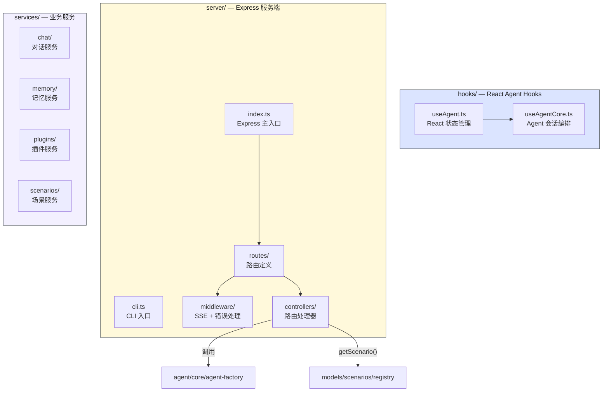
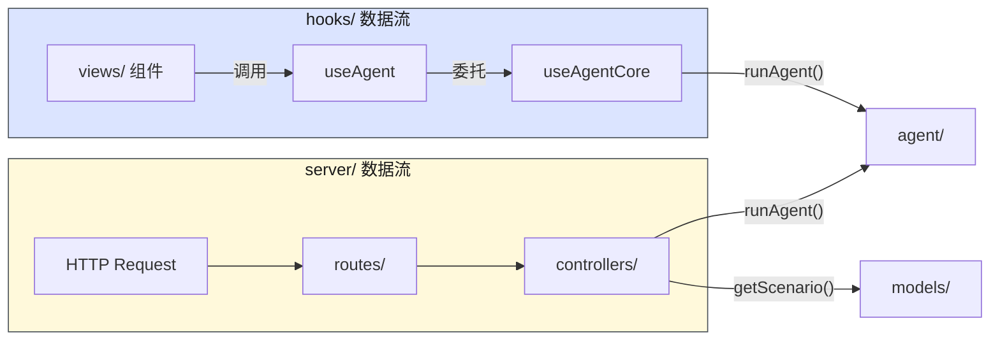
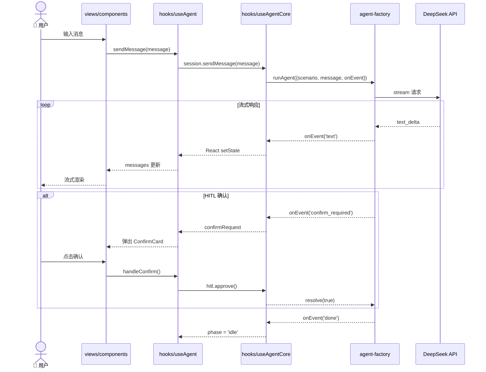
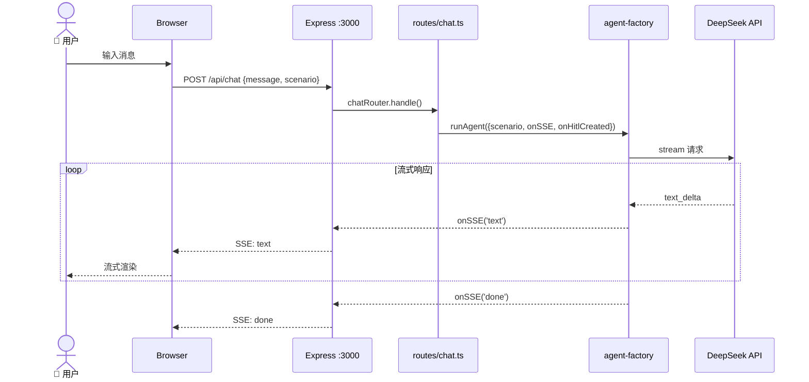

# Controller 层 — 控制器与业务编排

> ⬆️ [返回 src/](../CLAUDE.md) · 📋 依赖: [models/](../models/CLAUDE.md) · [agent/](../agent/CLAUDE.md) · [infrastructure/](../infrastructure/CLAUDE.md) · 📋 被引用: [views/](../views/CLAUDE.md)

## 职责

Controller 层是 MVC 的 C，包含三层职责：
1. **React Hooks** — Agent 会话管理（useAgent / useAgentCore）
2. **服务端** — Express 路由、SSE 流转发、CLI 入口
3. **业务服务** — 对话/记忆/场景/插件编排

**核心约束：不定义 tool（那是 models/scenarios/ 的职责），不包含 UI 组件（那是 views/ 的职责）。**

## 目录结构

```
controllers/
├── hooks/                     # 🪝 React Agent Hooks
│   ├── useAgentCore.ts            # 纯业务编排（零 React 依赖）
│   └── useAgent.ts                # 薄 React Hook 包装
├── server/                    # 🔧 Express 服务端
│   ├── index.ts                   # Express 主入口（app 组装 + 启动）
│   ├── cli.ts                     # CLI 入口（独立终端模式）
│   ├── controllers/               # 路由处理器
│   │   └── index.ts
│   ├── middleware/                # Express 中间件
│   │   └── index.ts
│   ├── routes/                    # Express 路由
│   │   ├── index.ts                   # 路由汇总导出
│   │   ├── chat.ts                    # POST /api/chat — SSE 流式对话
│   │   ├── confirm.ts                 # POST /api/confirm — HITL 确认
│   │   ├── compact.ts                 # POST /api/compact — 对话压缩
│   │   ├── extract-memories.ts        # POST /api/extract-memories — 记忆提取
│   │   └── scenarios.ts              # GET /api/scenarios — 场景列表
│   └── CLAUDE.md                  # 服务端详细文档
└── services/                  # 🔀 业务服务编排
    ├── chat/                      # 对话服务
    │   └── index.ts
    ├── memory/                    # 记忆服务
    │   └── index.ts
    ├── plugins/                   # 插件服务
    │   └── index.ts
    ├── scenarios/                 # 场景服务
    │   └── index.ts
    └── CLAUDE.md                  # 服务层详细文档
```

## 架构图



## 数据流



## 时序图 — Local 模式 (浏览器直接调用)



## 时序图 — Server 模式 (Express 中转)



## 子模块说明

### hooks/useAgentCore.ts

纯业务编排，零 React 依赖。管理 SSE/Agent 会话，处理 HITL 确认流程，记忆注入和压缩触发。所有状态变化通过 `onEvent` 回调通知外部。可被 React Hook、CLI、测试等任意宿主使用。

### hooks/useAgent.ts

薄 React Hook 包装。管理 React 状态（messages, phase, confirmRequest），持久化聊天历史到 localStorage，将 `useAgentCore` 的 `onEvent` 映射到 `setState`。

### server/

Express 服务端。路由拆分到 `routes/` 目录，中间件在 `middleware/`。支持 SSE 流式对话、HITL 确认、对话压缩、记忆提取。CLI 模式通过 `cli.ts` 独立启动。

### services/

业务服务编排层（当前为占位文件）。按职责分为对话、记忆、插件、场景四个子目录，未来扩展时填充业务策略逻辑。

## API 端点 (server/)

| 方法 | 路径 | 说明 |
|------|------|------|
| GET | `/api/scenarios` | 可用场景列表 |
| POST | `/api/chat` | SSE 流，运行 Agent |
| POST | `/api/confirm` | HITL 确认/拒绝 |
| POST | `/api/compact` | 对话压缩 |
| POST | `/api/extract-memories` | 记忆提取 |

## 依赖

- [agent/core/agent-factory.ts](../agent/CLAUDE.md) — runAgent
- [agent/hitl/hitl.ts](../agent/CLAUDE.md) — HitlManager
- [agent/tracing/mlflow-tracer.ts](../agent/CLAUDE.md) — ITracer / createTracer
- [models/scenarios/registry.ts](../models/scenarios/CLAUDE.md) — 场景注册表
- [models/domain/](../models/domain/CLAUDE.md) — Scenario, ChatMessage, MemoryItem
- [infrastructure/](../infrastructure/CLAUDE.md) — MEMORY_LIMITS, cn()

## 约束

- 不定义 tool（tool 在 models/scenarios/）
- 不包含 UI 组件（组件在 views/）
- 不直接 import 具体 Scenario 实现，通过 registry 查找
- Express 为可选项，前端 local 模式不依赖 server/

---

> ⬆️ [返回 src/](../CLAUDE.md) · 📋 详细: [server/CLAUDE.md](server/CLAUDE.md) · [services/CLAUDE.md](services/CLAUDE.md)
