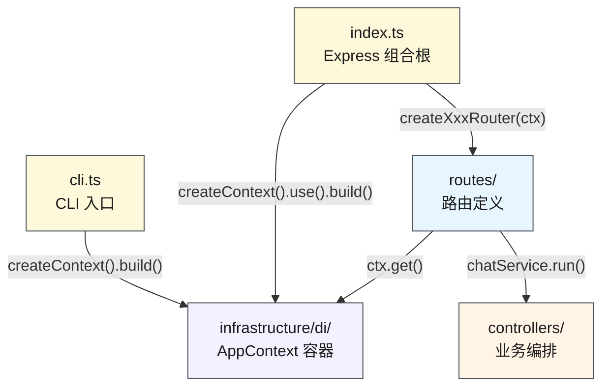
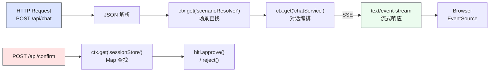
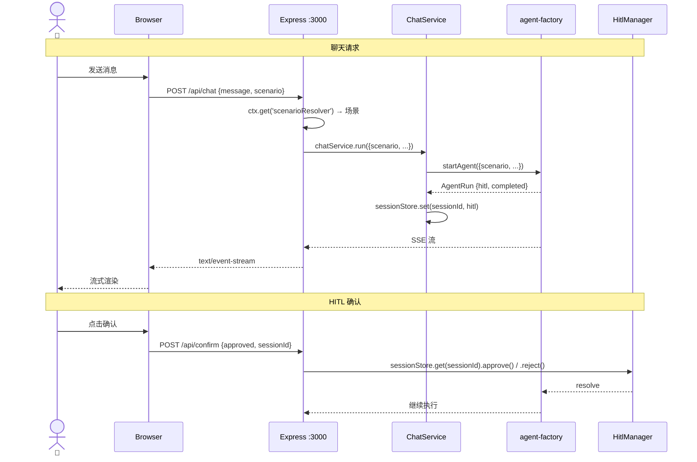

# 服务端

> ⬆️ [返回 controllers/](../CLAUDE.md) · 📋 依赖: [models/domain/](../../models/domain/CLAUDE.md) · [agent/](../../agent/CLAUDE.md) · [models/scenarios/](../../models/scenarios/CLAUDE.md)

## 职责

Express 服务端，HTTP 路由、SSE 流转发、场景注入。前端与 Agent 框架的桥梁。

**运行方式**: 开发时通过 Vite `configureServer` 钩子注入，单进程同时提供 API 和前端 HMR；生产时 Express 独立运行伺服 `dist/` 静态文件。

## 架构

```
controllers/server/
├── routes/                # Express 路由
│   ├── index.ts               # 路由汇总导出
│   ├── chat.ts                # POST /api/chat — SSE 流式对话
│   ├── confirm.ts             # POST /api/confirm — HITL 确认
│   ├── compact.ts             # POST /api/compact — 对话压缩
│   ├── extract-memories.ts    # POST /api/extract-memories — 记忆提取
│   └── scenarios.ts           # GET /api/scenarios — 场景列表
├── controllers/           # 路由处理器
│   └── index.ts
├── index.ts               # Express 工厂 (createApp) + DI 组合根
└── cli.ts                 # CLI 入口（独立终端模式）
```

## 模块架构图



## 数据流



## 请求时序图



## API 端点

| 方法 | 路径 | 说明 |
|------|------|------|
| GET | `/api/scenarios` | 可用场景列表 |
| POST | `/api/chat` | SSE 流，运行 Agent |
| POST | `/api/confirm` | HITL 确认/拒绝（按 sessionId 查找 HitlManager） |
| POST | `/api/compact` | 对话压缩（调用 mini Agent 生成摘要） |
| POST | `/api/extract-memories` | 记忆提取（调用 mini Agent 返回结构化记忆） |
| GET | `/*` | 静态文件（生产模式，dist/ 路径） |

## 关键设计

### 并发会话隔离

`sessionStore: Map<sessionId, HitlManager>` — 每个会话独立管理 HITL 状态。存储在 DI 容器的 `sessionStore` 中（`ctx.get('sessionStore')`），通过 ChatService 在 Agent 启动时自动注册。

### MLflow Tracing

通过 `createTracer()` 工厂创建 ITracer 实例（Strategy 模式）。local 和 server 模式均支持，由 `MLFLOW_TRACKING_URI` 环境变量控制启用。`tracer.run()` 包装 `runAgent()` 调用，`tracer.handleEvent()` 收集事件。

### 记忆压缩/提取端点

`/api/compact` 和 `/api/extract-memories` 使用独立的 mini Agent 实例（不经过业务场景），直接调用模型生成摘要/提取记忆。local 模式下由 `agent/local/local-utils.ts` 在浏览器进程内处理。

## 依赖

- [infrastructure/di/](../../infrastructure/CLAUDE.md) — AppContext 容器 + registerInfrastructure
- [agent/di.ts](../../agent/CLAUDE.md) — AgentRunner, HitlSessionFactory
- [controllers/di.ts](../CLAUDE.md) — IChatService
- [models/scenarios/di.ts](../../models/scenarios/CLAUDE.md) — ScenarioResolver
- [models/domain/interfaces/](../../models/domain/CLAUDE.md) — Scenario, ITracer
- [models/domain/dto/](../../models/domain/CLAUDE.md) — ApiResponses

## 约束

- ❌ 不定义业务逻辑
- ❌ 不直接 import 具体场景
- ✅ 只做路由转发和场景注入
- ✅ 开发: Vite `configureServer` 注入，单进程；生产: Express 独立运行

---

> ⬆️ [返回 controllers/](../CLAUDE.md) · 📋 依赖: [agent/](../../agent/CLAUDE.md) · [models/scenarios/](../../models/scenarios/CLAUDE.md)
