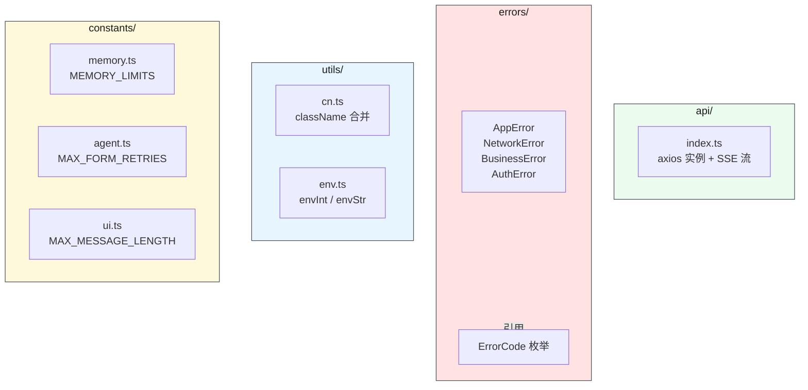
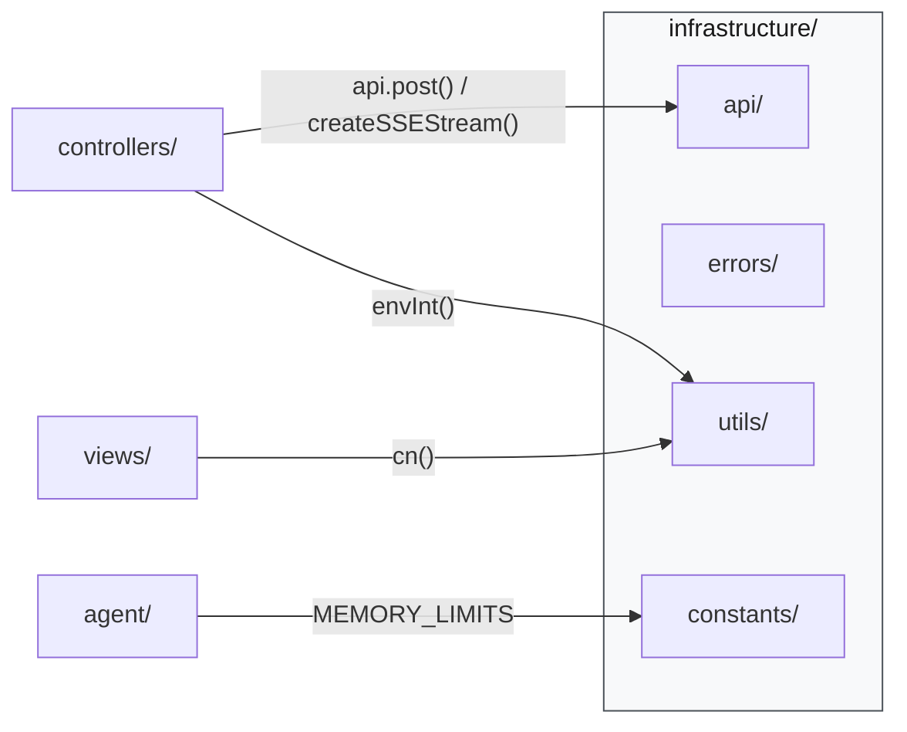
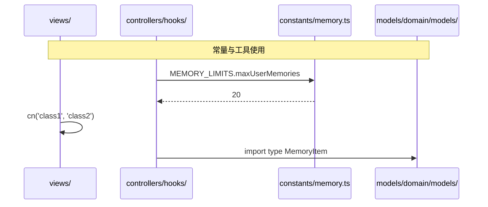

# 基础设施层

> ⬆️ [返回 src/](../CLAUDE.md) · 📋 被引用: [agent/](../agent/CLAUDE.md) · [controllers/](../controllers/CLAUDE.md) · [views/](../views/CLAUDE.md)

## 职责

提供全项目共用的基础设施能力：错误处理、工具函数、常量。

**核心约束：只包含纯函数和常量，不包含业务逻辑。**

## 架构

```
infrastructure/
├── api/           # API 客户端 (axios + SSE 流)
├── errors/        # 统一错误体系
├── utils/         # 纯工具函数
└── constants/     # 全局常量
```

## 模块架构图



## 数据流



## 调用时序图



## 各子目录说明

### api/ — 前端 API 客户端

统一的 HTTP 通信层，前端所有后端请求都通过此模块。

| 导出 | 说明 |
|------|------|
| `api` | axios 实例，baseURL `/api`，处理 JSON 请求 |
| `createSSEStream()` | 创建 SSE 流式连接，返回 `{ read(), abort() }` |

```ts
// JSON 请求
const { data } = await api.post('/compact', { messages, scenario });
const { data } = await api.post('/extract-memories', { messages, scenario });
await api.post('/confirm', { approved, sessionId });

// SSE 流式请求
const stream = createSSEStream({ url: '/api/chat', body: { message, history, ... } });
await stream.read({
  onEvent: (eventType, data) => { /* 处理 SSE 事件 */ },
  onError: (err) => { /* 错误处理 */ },
});
stream.abort(); // 中断流
```

**为什么 SSE 不用 axios**: axios 不支持 `ReadableStream` 逐块读取，SSE 协议需要实时解析 `event:` / `data:` 行，只能用原生 fetch。

### errors/ — 统一错误体系

用结构化错误替代字符串 throw。

```ts
// 基类
class AppError extends Error {
  code: ErrorCode;
  details?: Record<string, unknown>;
}

// 子类
class NetworkError extends AppError { ... }
class BusinessError extends AppError { ... }
class AuthError extends AppError { ... }
```

| 文件 | 说明 |
|------|------|
| `AppError.ts` | 错误基类 + 子类 |
| `ErrorCode.ts` | 错误码枚举 (从 `domain/enums/` re-export) |

**设计原则**: 前端按 `error.code` 分类处理，不再 `err.message.includes('用户拒绝')`。

### utils/ — 纯工具函数

零副作用的工具函数。不依赖 React、Node.js 特定 API。

| 文件 | 说明 |
|------|------|
| `cn.ts` | `clsx` + `tailwind-merge` className 合并 |
| `env.ts` | 浏览器兼容的 env 读取 (`envInt`, `envStr`) |

### constants/ — 全局常量

| 文件 | 说明 |
|------|------|
| `memory.ts` | `MEMORY_LIMITS` (maxUserMemories, compactThreshold 等) |
| `agent.ts` | `MAX_FORM_RETRIES`, `API_TIMEOUT` 等 |
| `ui.ts` | `MAX_MESSAGE_LENGTH`, `SCROLL_HYSTERESIS` 等 |

## 约束

- ✅ 可以 import `models/domain/` (类型)
- ✅ 可以 import npm 工具包 (`clsx`, `tailwind-merge` 等)
- ❌ 不 import `agent/`, `models/scenarios/`, `controllers/`, `views/`
- ❌ 函数保持纯净，不包含业务逻辑

---

> ⬆️ [返回 src/](../CLAUDE.md)
