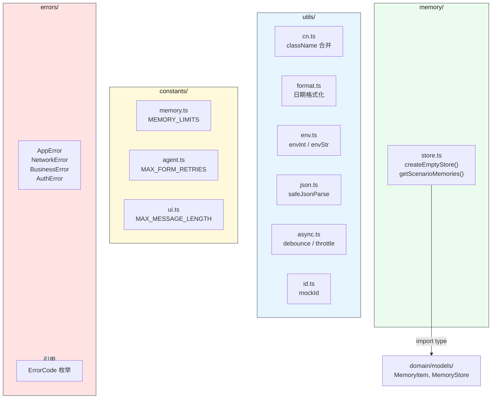
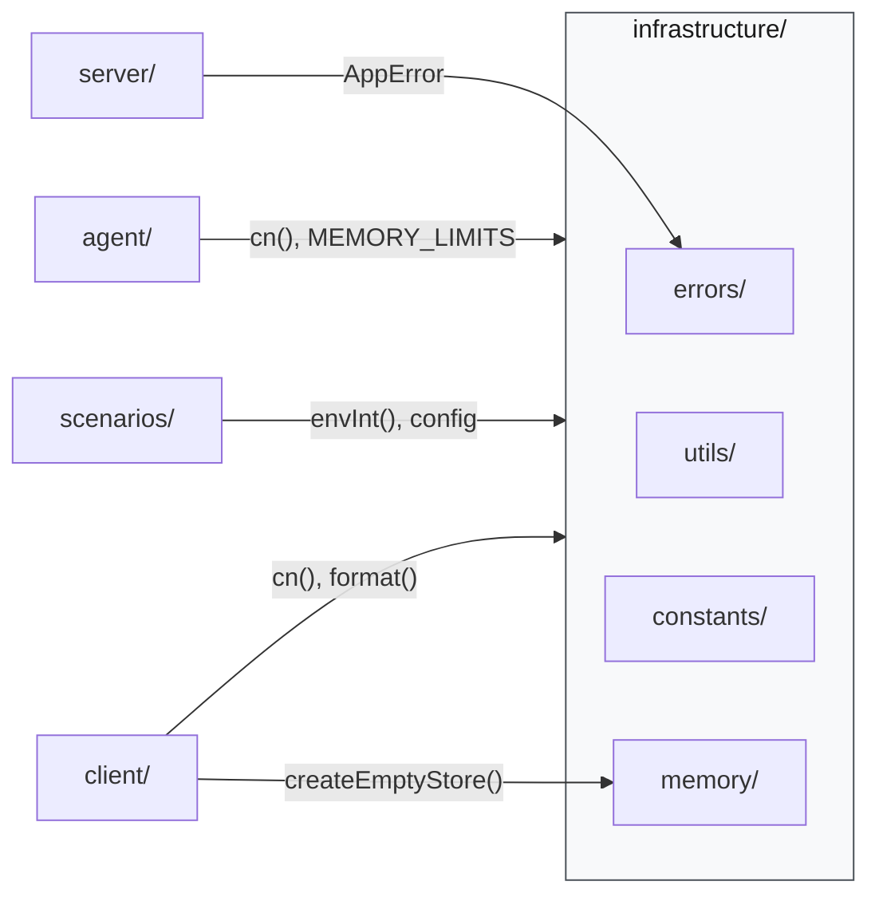
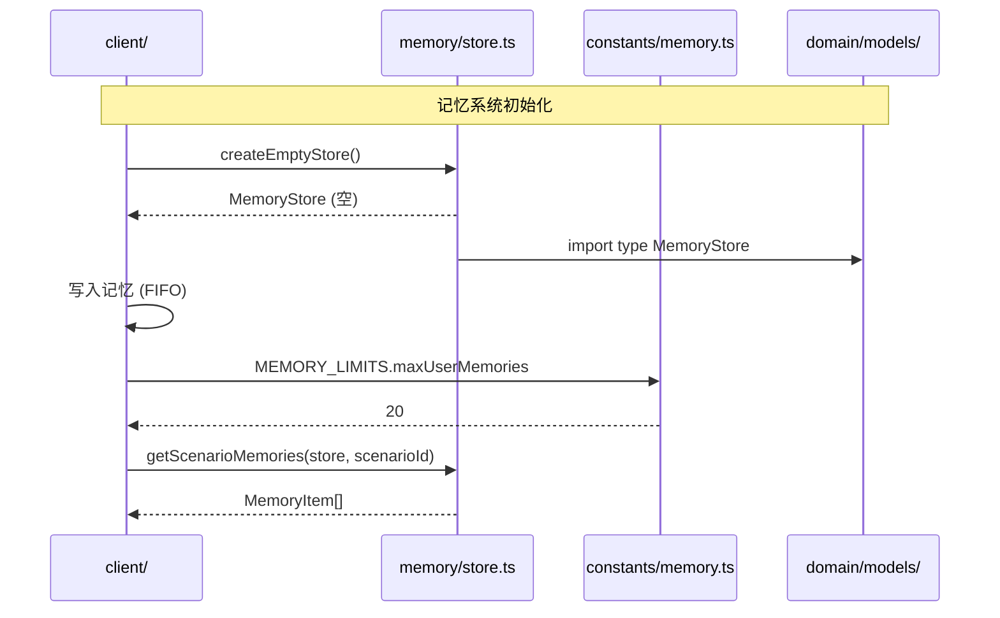

# 基础设施层

> ⬆️ [返回项目根目录](../../CLAUDE.md) · 📋 依赖: [domain/](../domain/CLAUDE.md) · 📋 被引用: [agent/](../agent/CLAUDE.md) · [services/](../services/CLAUDE.md) · [client/](../client/CLAUDE.md)

## 职责

提供全项目共用的基础设施能力：错误处理、工具函数、常量、记忆运行时。

**核心约束：只包含纯函数和常量，不包含业务逻辑。**

## 架构

```
infrastructure/
├── errors/        # 统一错误体系
├── utils/         # 纯工具函数
├── constants/     # 全局常量
└── memory/        # 记忆系统运行时
```

## 模块架构图



## 数据流



## 调用时序图



## 各子目录说明

### errors/ — 统一错误体系

用结构化错误替代字符串 throw。

```ts
// 基类
class AppError extends Error {
  code: ErrorCode;
  details?: Record<string, unknown>;
}

// 子类
class NetworkError extends AppError { ... }
class BusinessError extends AppError { ... }
class AuthError extends AppError { ... }
```

| 文件 | 说明 |
|------|------|
| `AppError.ts` | 错误基类 + 子类 |
| `ErrorCode.ts` | 错误码枚举 (从 `domain/enums/` re-export) |

**设计原则**: 前端按 `error.code` 分类处理，不再 `err.message.includes('用户拒绝')`。

### utils/ — 纯工具函数

零副作用的工具函数。不依赖 React、Node.js 特定 API。

| 文件 | 说明 |
|------|------|
| `cn.ts` | `clsx` + `tailwind-merge` className 合并 |
| `format.ts` | 日期格式化、相对时间 |
| `env.ts` | 浏览器兼容的 env 读取 (`envInt`, `envStr`) |
| `json.ts` | 安全 JSON 解析 (`safeJsonParse`) |
| `async.ts` | `debounce`, `throttle`, `sleep` 等 |
| `id.ts` | ID 生成 (`mockId` 等) |

### constants/ — 全局常量

| 文件 | 说明 |
|------|------|
| `memory.ts` | `MEMORY_LIMITS` (maxUserMemories, compactThreshold 等) |
| `agent.ts` | `MAX_FORM_RETRIES`, `API_TIMEOUT` 等 |
| `ui.ts` | `MAX_MESSAGE_LENGTH`, `SCROLL_HYSTERESIS` 等 |

### memory/ — 记忆系统运行时

从旧 `shared/memory.ts` 迁移的运行时函数。

| 文件 | 说明 |
|------|------|
| `store.ts` | `createEmptyStore()`, `getScenarioMemories()` |

**注意**: 记忆类型定义 (`MemoryType`, `MemoryItem`, `MemoryStore`) 在 `domain/models/`，不是这里。

## 与旧 `shared/` 的对应关系

| 旧文件 | 迁移到 |
|--------|--------|
| `shared/config.ts` → `envInt()` | `infrastructure/utils/env.ts` |
| `shared/config.ts` → 配置常量 | `infrastructure/constants/` |
| `shared/memory.ts` → 函数 | `infrastructure/memory/store.ts` |
| `lib/utils.ts` → `cn()` | `infrastructure/utils/cn.ts` |

## 约束

- ✅ 可以 import `domain/` (类型)
- ✅ 可以 import npm 工具包 (`clsx`, `tailwind-merge` 等)
- ❌ 不 import `agent/`, `scenarios/`, `server/`, `client/`
- ❌ 函数保持纯净，不包含业务逻辑

---

> ⬆️ [返回项目根目录](../../CLAUDE.md)
