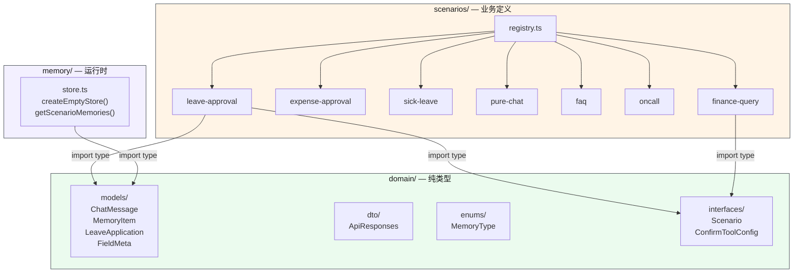
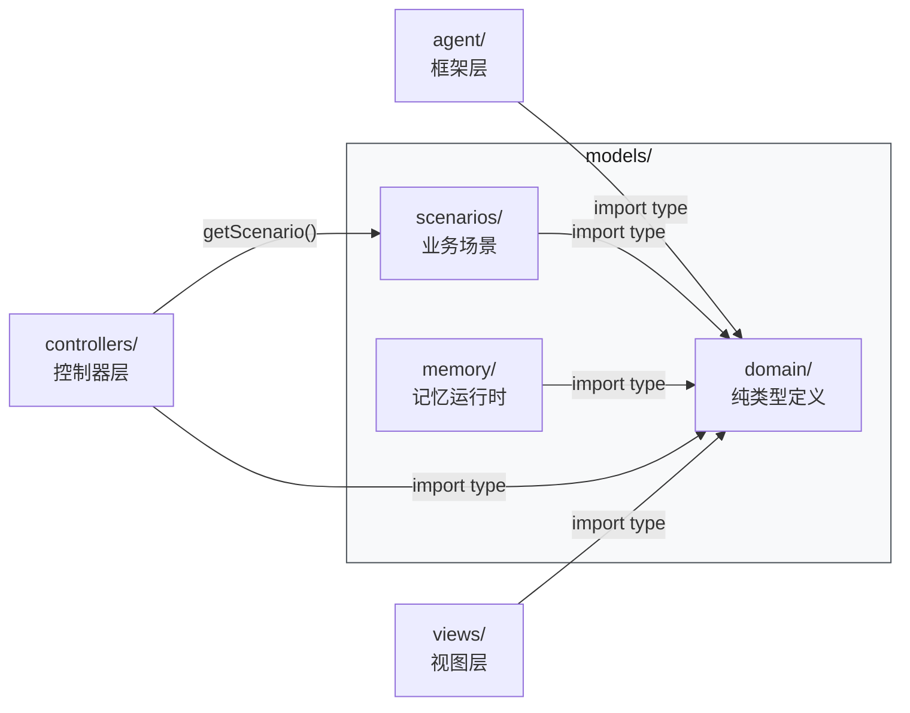
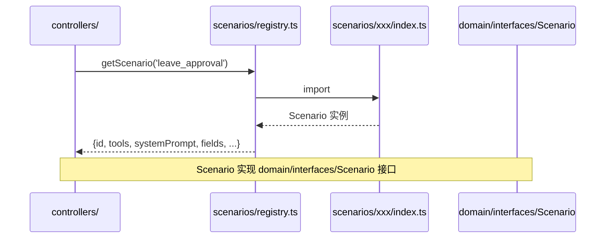

# Model 层 — 数据模型与业务定义

> ⬆️ [返回 src/](../CLAUDE.md) · 📋 被引用: [agent/](../agent/CLAUDE.md) · [controllers/](../controllers/CLAUDE.md) · [views/](../views/CLAUDE.md)

## 职责

Model 层是 MVC 的 M，包含全部领域类型定义、业务场景定义和记忆运行时。**零外部依赖**（domain/ 子目录只定义类型，不 import 任何 npm 包）。

**核心约束：domain/ 只定义类型；scenarios/ 自带 prompt + tools + api + validator；memory/ 只包含纯运行时函数。**

## 目录结构

```
models/
├── domain/                    # 🧱 领域模型 — 纯类型定义（零运行时依赖）
│   ├── models/                    # 领域实体 (ChatMessage, MemoryItem, LeaveApplication...)
│   ├── dto/                       # 数据传输对象 (ApiResponses...)
│   ├── vo/                        # 视图对象 (空目录，预留)
│   ├── interfaces/                # 接口契约 (Scenario, ConfirmToolConfig, ITracer)
│   ├── enums/                     # 枚举常量 (MemoryType, ErrorCode...)
│   └── CLAUDE.md                  # 领域层详细文档
├── scenarios/                 # 📦 业务场景（完全自主）
│   ├── registry.ts                # 场景注册表 — getScenario() / getDefaultScenario()
│   ├── leave-approval/            # 远程办公审批
│   ├── expense-approval/          # 报销审批
│   ├── sick-leave/                # 病假申请
│   ├── pure-chat/                 # 纯聊天
│   ├── faq/                       # 政策咨询
│   ├── oncall/                    # 值班排班
│   └── CLAUDE.md                  # 场景层详细文档
└── memory/                    # 🧠 记忆系统运行时
    └── store.ts                   # createEmptyStore() / getScenarioMemories()
```

## 架构图



## 数据流



## 时序图 — 场景注册与使用



## 各子目录说明

| 子目录 | 职责 | 详细文档 |
|--------|------|---------|
| `domain/` | 纯类型定义（models/DTO/VO/interfaces/enums） | [CLAUDE.md](domain/CLAUDE.md) |
| `scenarios/` | 业务场景（prompt + tools + api + validator） | [CLAUDE.md](scenarios/CLAUDE.md) |
| `memory/` | 记忆运行时（createEmptyStore, getScenarioMemories） | — |

### memory/store.ts

从旧 `infrastructure/memory/` 迁移的运行时函数：

| 函数 | 说明 |
|------|------|
| `createEmptyStore()` | 创建空的 MemoryStore |
| `getScenarioMemories(store, scenarioId)` | 获取指定场景的记忆（含共享 + 隔离） |

**注意**: 记忆类型定义 (`MemoryType`, `MemoryItem`, `MemoryStore`) 在 `domain/models/MemoryItem.ts`。

## 约束

- `domain/`: 不 import 任何外部包，只定义类型
- `scenarios/`: 不 import controllers/ 或 views/
- `memory/`: 只 import domain/ 类型，纯函数无副作用
- 所有层都可以 import `models/`

---

> ⬆️ [返回 src/](../CLAUDE.md)
