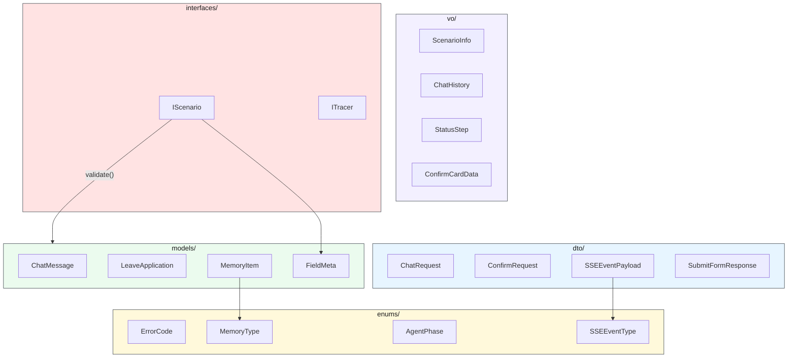
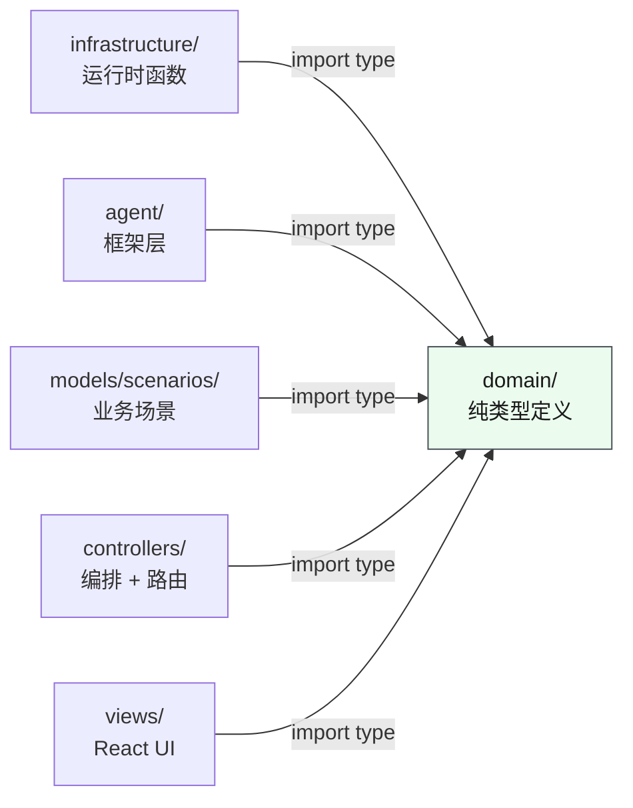
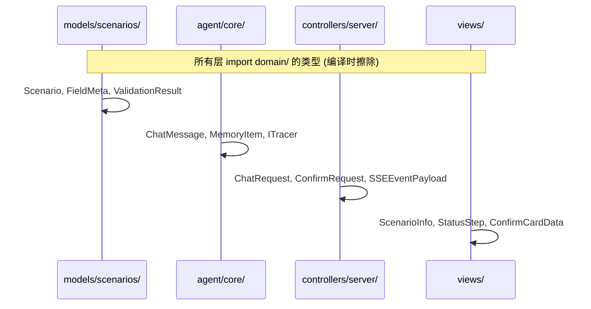

# 领域层 — 纯类型定义

> ⬆️ [返回 models/](../CLAUDE.md) · 📋 被所有层依赖

## 职责

定义项目所有数据结构、接口契约、枚举常量。**零运行时依赖**，不 import 任何外部包（包括 Node.js API 和 npm 包）。

**核心约束：只定义类型，不包含任何运行时逻辑。**

## 架构

```
domain/
├── models/        # 领域实体 — 核心业务对象
├── dto/           # DTO (Data Transfer Object) — API 请求/响应形状
├── vo/            # VO (View Object) — 前端展示专用数据
├── interfaces/    # 接口契约 — 跨层通信协议
└── enums/         # 枚举常量 — 状态码/错误码/类型标签
```

## 类型关系图



## 数据流 — 类型引用路径



## 类型使用时序图



## 各子目录说明

### models/ — 领域实体

核心业务对象的纯类型定义。不含任何 I/O 相关字段（如 `traceId`、`timestamp` 等 DTO 字段）。

| 类型 | 说明 |
|------|------|
| `LeaveApplication` | 远程办公申请 |
| `ApprovalProcess` | 审批流程实例 |
| `MemoryItem` | 单条记忆 |
| `MemoryStore` | 记忆完整存储结构 |
| `User` | 用户模型 |
| `ChatMessage` | 聊天消息 |
| `FieldMeta` | 表单字段元信息 |

### dto/ — 数据传输对象

API 层（server ↔ client / agent ↔ scenario）传输的数据形状。包含 I/O 专用字段。

| 类型 | 说明 |
|------|------|
| `SubmitFormRequest` | 表单提交请求 |
| `SubmitFormResponse` | 表单提交响应 |
| `ChatRequest` | POST /api/chat 请求体 |
| `SSEEventPayload` | SSE 事件负载 |
| `ConfirmRequest` | 确认请求 (SSE confirm_required) |
| `CompactRequest` / `CompactResponse` | 对话压缩 |
| `ExtractMemoriesResponse` | 记忆提取结果 |
| `ScenarioInfoResponse` | 场景列表响应 |

### vo/ — 视图对象

前端展示专用数据形状。可能合并多个 model/dto、添加前端专用字段。

| 类型 | 说明 |
|------|------|
| `ScenarioInfo` | 场景下拉选项 (id + displayName + fieldCount) |
| `ChatHistory` | 聊天历史 (localStorage 持久化格式) |
| `StatusStep` | 流水线步骤 (StatusBar 渲染) |
| `ConfirmCardData` | 确认卡片渲染数据 |
| `MemoryTabData` | 记忆面板 Tab 状态 |

### interfaces/ — 接口契约

跨层通信协议。定义"做什么"而非"怎么做"。

| 接口 | 说明 | 实现者 |
|------|------|--------|
| `IScenario` | 场景契约 | `scenarios/*/index.ts` |
| `ITracer` | 追踪器接口 | `agent/tracing/mlflow-tracer.ts` |
| `IMemoryStore` | 记忆存储接口 | `infrastructure/memory/` |
| `IApiService` | API 服务接口 | `scenarios/*/api.ts` |

### enums/ — 枚举常量

| 枚举 | 说明 |
|------|------|
| `ErrorCode` | 统一错误码 |
| `MemoryType` | 记忆类型 (user/feedback/project/reference) |
| `AgentPhase` | Agent 工作阶段 (idle/processing/...) |
| `SSEEventType` | SSE 事件类型 |

## 与旧 `shared/` 的对应关系

| 旧文件 | 迁移到 |
|--------|--------|
| `shared/types.ts` → `LeaveForm`, `ProcessForm` 等 | `domain/models/` |
| `shared/types.ts` → `FormSubmitResult`, `ProcessResult` 等 | `domain/dto/` |
| `shared/types.ts` → `ChatMessage` | `domain/models/` |
| `shared/plugin.ts` → `Scenario`, `FieldMeta` 等 | `domain/interfaces/` + `domain/models/` |
| `shared/memory.ts` → 类型部分 (`MemoryType`, `MemoryItem`, `MemoryStore`) | `domain/models/` + `domain/enums/` |
| `shared/memory.ts` → 常量部分 (`MEMORY_LIMITS`) | `infrastructure/constants/` |
| `shared/memory.ts` → 函数部分 (`createEmptyStore` 等) | `infrastructure/memory/` |
| `shared/config.ts` → `envInt()` | `infrastructure/utils/` |
| `shared/config.ts` → 配置常量 | `infrastructure/constants/` |

## 约束

- ❌ 不 import 任何外部包（npm、Node.js API）
- ❌ 不包含运行时函数、类实现
- ✅ 只包含 `type`, `interface`, `enum`, `const` 字面量
- ✅ 所有层都可以 import `domain/`

---

> ⬆️ [返回 models/](../CLAUDE.md)
