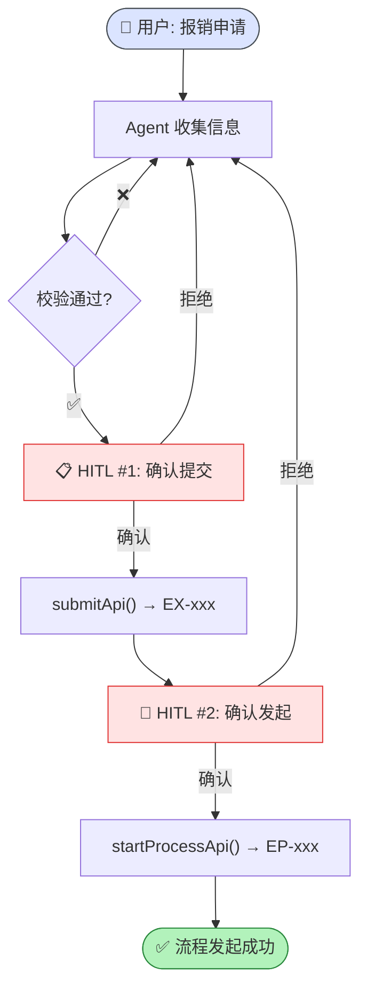
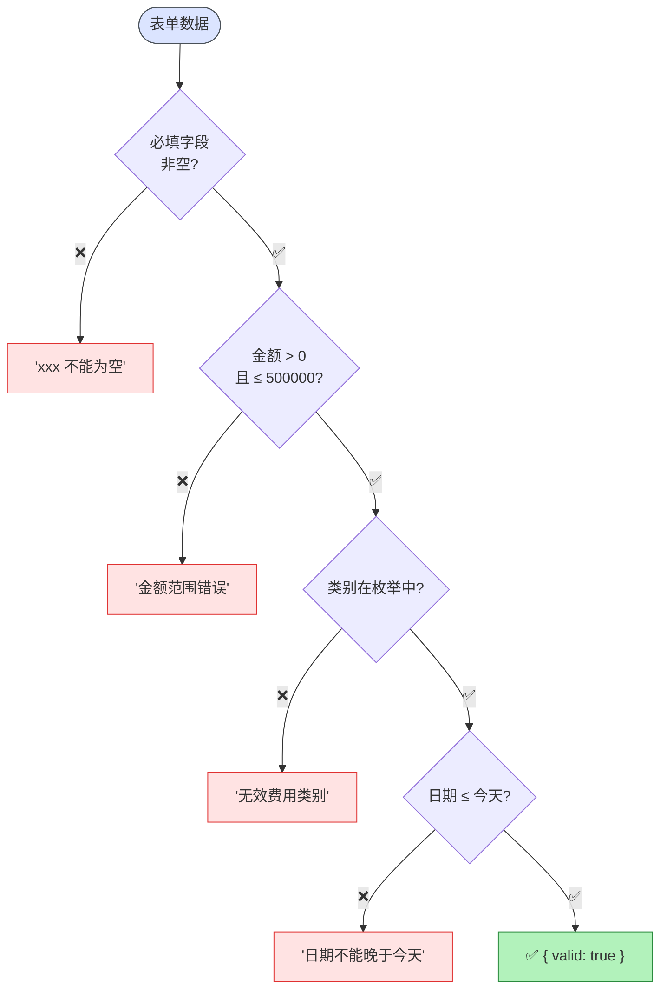

# 报销审批场景 (expense-approval)

> ⬆️ [返回 scenarios/](../CLAUDE.md) · [项目根目录](../../../CLAUDE.md)

## 目录结构

```
expense-approval/
├── index.ts       # Scenario 实例导出
├── tools.ts       # 4 个 Tool 定义
├── prompt.ts      # System Prompt
├── fields.ts      # 表单字段
├── validator.ts   # 校验规则 (金额/类别/日期)
└── api.ts         # Mock API (submit → EX-xxx, process → EP-xxx)
```

## 审批流程图



## 校验流程图



## Tool 列表

| Tool | HITL | 说明 |
|------|------|------|
| `get_current_date` | ❌ | 获取日期 |
| `expense_approval_validate` | ❌ | 校验 |
| `expense_approval_submit` | ✅ | 提交确认 |
| `expense_approval_start` | ✅ | 流程确认 |

## 校验规则

- 金额: > 0 且 ≤ 500000
- 类别: 差旅费/办公用品/招待费/交通费/通讯费/其他
- 日期: ≤ 今天

## Mock API

- 提交 → `EX-xxx` / 流程 → `EP-xxx`

---

> ⬆️ [返回 scenarios/](../CLAUDE.md) · [项目根目录](../../../CLAUDE.md)