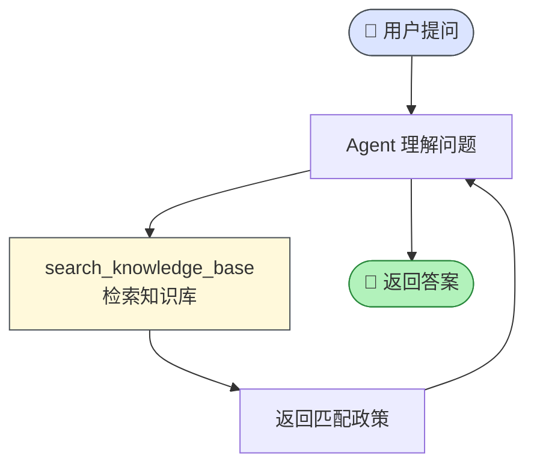

# FAQ 政策咨询场景 (faq)

> ⬆️ [返回 scenarios/](../CLAUDE.md) · [项目根目录](../../../CLAUDE.md)

## 业务描述

咨询类场景：只有检索 tool，无 HITL。查询结果直接返回。

## 目录结构

```
faq/
├── index.ts       # Scenario 实例导出
└── tools.ts       # search_knowledge_base tool + 模拟知识库数据
```

## 查询流程图



## Tool 列表

| Tool | HITL | 说明 |
|------|------|------|
| `search_knowledge_base` | ❌ | 检索知识库 |

## 知识库内容

远程办公政策、年假规定、报销流程、病假申请、加班制度、考勤制度、试用期、离职流程

## 文件说明

| 文件 | 职责 |
|------|------|
| `index.ts` | Scenario 实例 |
| `tools.ts` | search_knowledge_base tool + 模拟数据 |

---

> ⬆️ [返回 scenarios/](../CLAUDE.md) · [项目根目录](../../../CLAUDE.md)