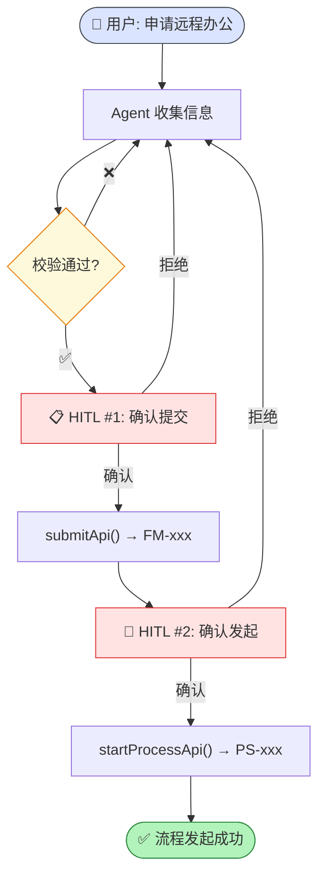
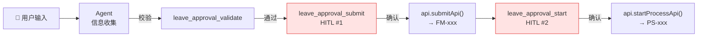
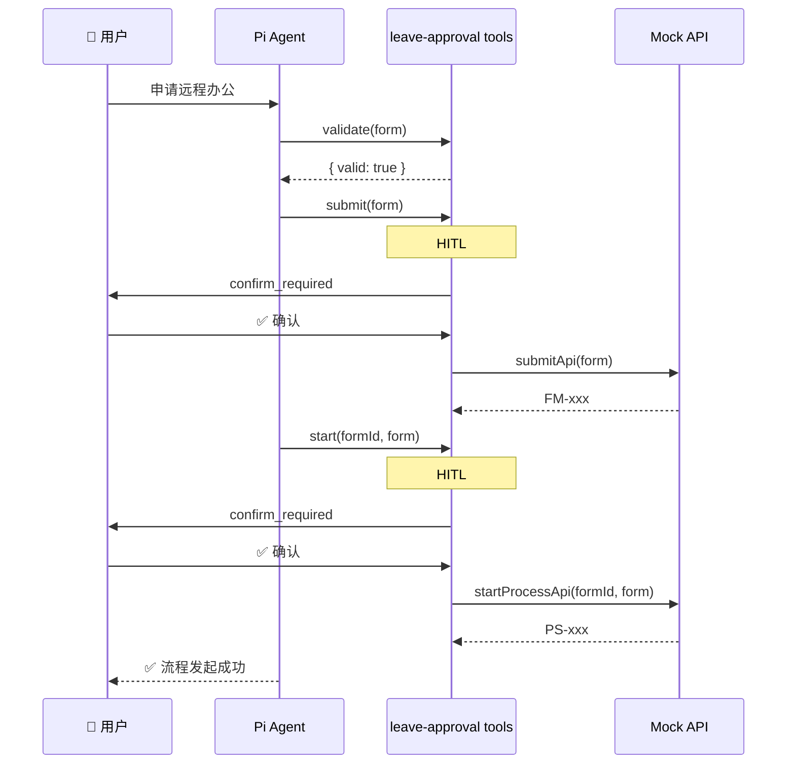

# 远程办公审批场景 (leave-approval)

> ⬆️ [返回 scenarios/](../CLAUDE.md) · [项目根目录](../../../CLAUDE.md)

## 目录结构

```
leave-approval/
├── index.ts       # Scenario 实例导出
├── tools.ts       # 4 个 Tool 定义
├── prompt.ts      # System Prompt
├── fields.ts      # 9 个表单字段
├── validator.ts   # 校验规则
└── api.ts         # Mock API (submit → FM-xxx, process → PS-xxx)
```

## 审批流程图



## Tool 列表

| Tool | HITL | 说明 |
|------|------|------|
| `get_current_date` | ❌ | 获取日期 |
| `leave_approval_validate` | ❌ | 校验表单 |
| `leave_approval_submit` | ✅ | 提交确认 |
| `leave_approval_start` | ✅ | 流程确认 |

## 表单字段 (9 个必填)

applicantName, department, employeeId, remoteStartDate, remoteEndDate, reason, workPlan, emergencyContact, address

## Mock API

- 提交 → `FM-xxx` / 流程 → `PS-xxx`

## 数据流



## 审批时序图



---

> ⬆️ [返回 scenarios/](../CLAUDE.md) · [项目根目录](../../../CLAUDE.md)