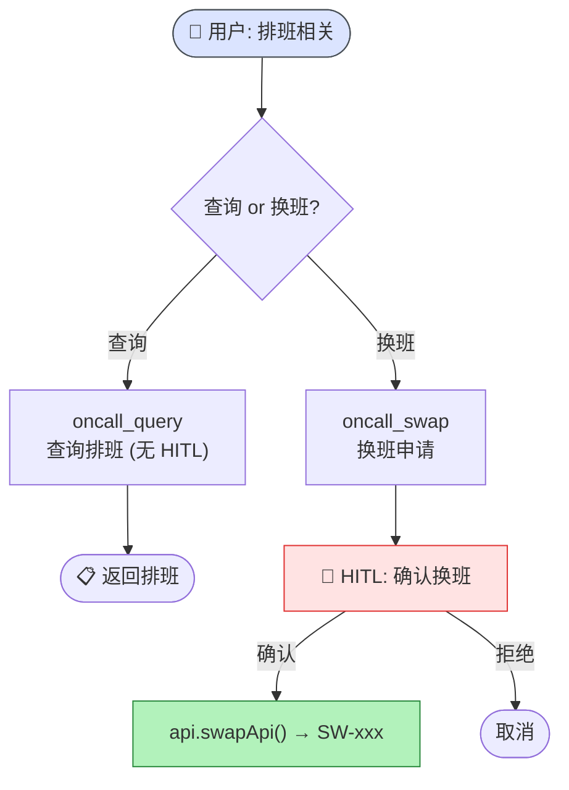
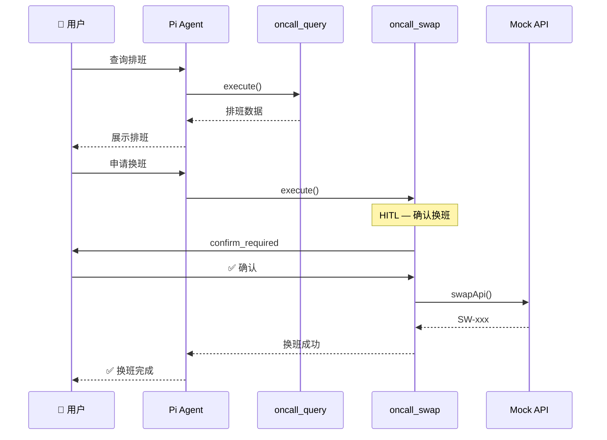
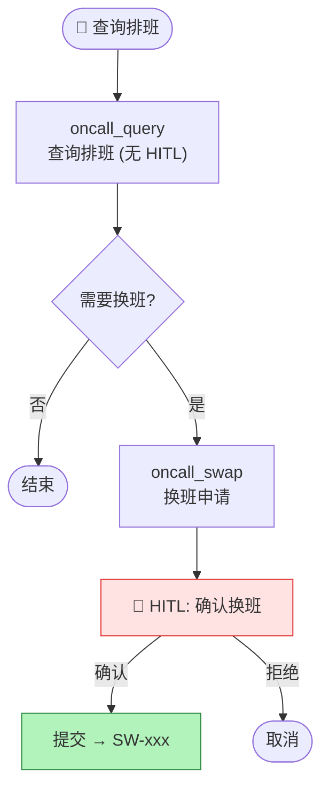

# 值班排班场景 (oncall)

> ⬆️ [返回 scenarios/](../CLAUDE.md) · [项目根目录](../../../CLAUDE.md)

## 业务描述

混合模式场景：查询无需确认 + 换班单步 HITL。

## 目录结构

```
oncall/
├── index.ts       # Scenario 实例导出
├── tools.ts       # 3 个 Tool (query 无 HITL, swap 单步 HITL)
└── api.ts         # Mock API (排班数据 + 换班)
```

## 业务流程图



## 换班时序图



## Tool 列表

| Tool | HITL | 说明 |
|------|------|------|
| `get_current_date` | ❌ | 获取日期 |
| `oncall_query` | ❌ | 查询排班 (直接返回) |
| `oncall_swap` | ✅ | 换班申请 (单步确认) |

## 换班流程图



## 文件说明

| 文件 | 职责 |
|------|------|
| `index.ts` | Scenario 实例 |
| `tools.ts` | 3 个 tool (query 无 HITL, swap 单步 HITL) |
| `api.ts` | Mock API (排班数据 + 换班) |

---

> ⬆️ [返回 scenarios/](../CLAUDE.md) · [项目根目录](../../../CLAUDE.md)