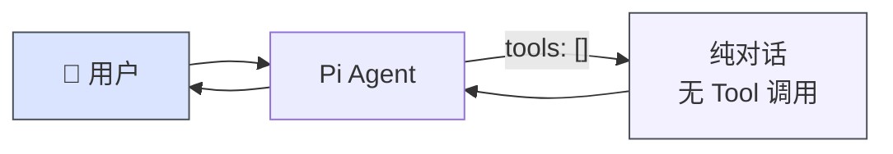
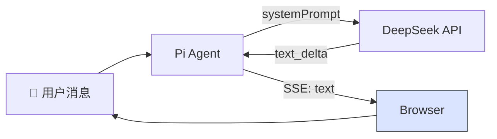

# 纯聊天场景 (pure-chat)

> ⬆️ [返回 scenarios/](../CLAUDE.md) · [项目根目录](../../../CLAUDE.md)

## 业务描述

最简单的场景形态：只有 prompt + 空 tools。无表单、无 HITL、纯对话。

## 目录结构

```
pure-chat/
└── index.ts       # Scenario 实例，只有 prompt + 空 tools
```

## 架构图



## 数据流



## 场景类型对比

```
tools: []           → 无任何 tool
confirmTools: 无    → 无 HITL
fields: 无          → 无表单
```

## 文件说明

| 文件 | 职责 |
|------|------|
| `index.ts` | Scenario 实例，只有 prompt + 空 tools |

---

> ⬆️ [返回 scenarios/](../CLAUDE.md) · [项目根目录](../../../CLAUDE.md)