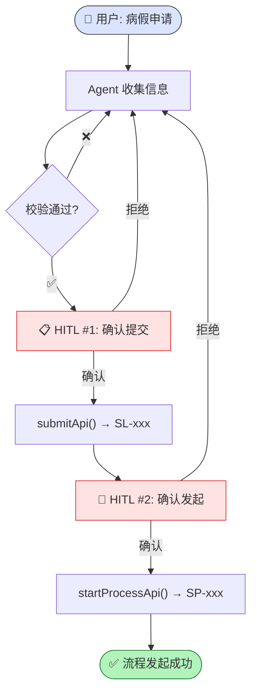
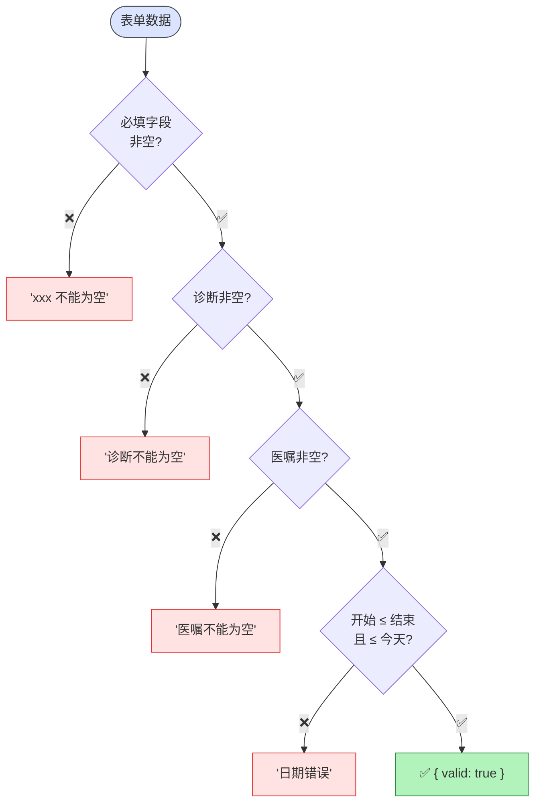

# 病假申请场景 (sick-leave)

> ⬆️ [返回 scenarios/](../CLAUDE.md) · [项目根目录](../../../CLAUDE.md)

## 目录结构

```
sick-leave/
├── index.ts       # Scenario 实例导出
├── tools.ts       # 4 个 Tool 定义
├── prompt.ts      # System Prompt
├── fields.ts      # 表单字段
├── validator.ts   # 校验规则 (诊断/医嘱/日期)
└── api.ts         # Mock API (submit → SL-xxx, process → SP-xxx)
```

## 审批流程图



## 校验流程图



## Tool 列表

| Tool | HITL | 说明 |
|------|------|------|
| `get_current_date` | ❌ | 获取日期 |
| `sick_leave_validate` | ❌ | 校验 |
| `sick_leave_submit` | ✅ | 提交确认 |
| `sick_leave_start` | ✅ | 流程确认 |

## 校验规则

- 诊断/医生建议: 非空
- 日期: startDate ≤ endDate，≤ 今天

## Mock API

- 提交 → `SL-xxx` / 流程 → `SP-xxx`

---

> ⬆️ [返回 scenarios/](../CLAUDE.md) · [项目根目录](../../../CLAUDE.md)