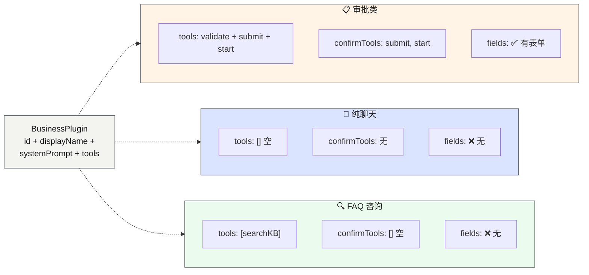
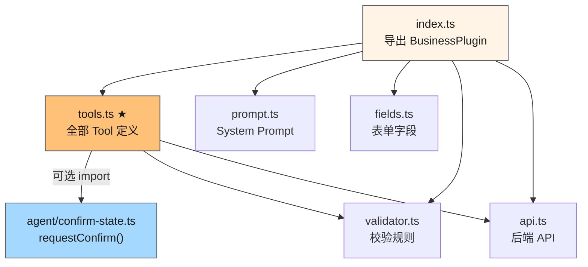
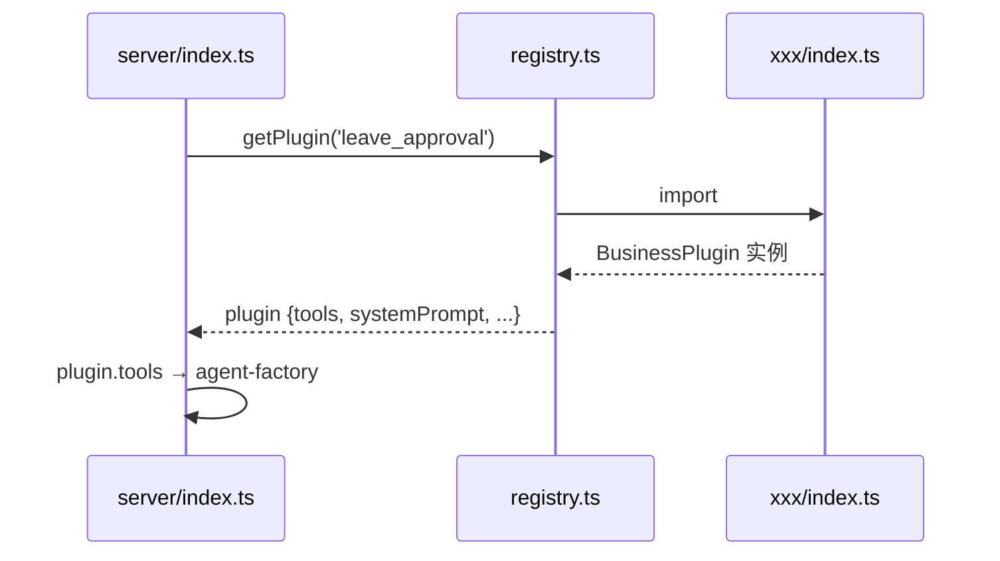

# 业务插件层

> ⬆️ [返回项目根目录](../../AGENTS.md) · 📋 相关: [agent/](../agent/AGENTS.md) · [shared/](../shared/AGENTS.md)

## 子插件文档

| 插件 | 文档 | 类型 | HITL |
|------|------|------|------|
| 远程办公审批 | [leave-approval/AGENTS.md](leave-approval/AGENTS.md) | 审批类 | 2 步 |
| 报销审批 | [expense-approval/AGENTS.md](expense-approval/AGENTS.md) | 审批类 | 2 步 |
| 病假申请 | [sick-leave/AGENTS.md](sick-leave/AGENTS.md) | 审批类 | 2 步 |
| 智能助手 | [pure-chat/AGENTS.md](pure-chat/AGENTS.md) | 纯聊天 | 无 |
| 政策咨询 | [faq/AGENTS.md](faq/AGENTS.md) | FAQ 咨询 | 无 |
| 值班排班 | [oncall/AGENTS.md](oncall/AGENTS.md) | 混合型 | 1 步 |

## 职责

每个插件完全自主：自带 prompt + tools + api + validator。框架不假设插件有哪些 tool。

## 插件类型对比图

## 单个插件内部结构

## 插件注册时序图

## BusinessPlugin 接口

> 完整定义见 [shared/plugin.ts](../shared/AGENTS.md)

| 字段 | 必填 | 说明 |
|------|------|------|
| `id` | ✅ | 唯一标识 |
| `displayName` | ✅ | UI 标题 |
| `systemPrompt` | ✅ | Agent Prompt |
| `tools` | ✅ | Tool 列表 (可以为空) |
| `fields` | ❌ | 表单字段 |
| `validate` | ❌ | 校验函数 |
| `submitApi` | ❌ | 提交 API |
| `startProcessApi` | ❌ | 流程 API |
| `confirmTools` | ❌ | HITL tool 列表 |
| `confirmLabels` | ❌ | 确认文案 |
| `suggestions` | ❌ | 空状态建议 |
| `pipeline` | ❌ | 流水线阶段 |

## 新增插件步骤

1. 创建 `plugins/{name}/` 目录
2. 实现必要文件
3. 在 `registry.ts` 注册
4. 前端零改动

## 依赖

- [agent/confirm-state.ts](../agent/AGENTS.md) — 按需使用
- [shared/plugin.ts](../shared/AGENTS.md) — BusinessPlugin

## 约束

- ❌ 不 import `../../server/` `../../client/`
- ✅ 可 import `../../agent/confirm-state.js`
- ✅ 可 import `../../shared/`

---

> ⬆️ [返回项目根目录](../../AGENTS.md) · ⬇️ [leave-approval](leave-approval/AGENTS.md) · [expense-approval](expense-approval/AGENTS.md) · [sick-leave](sick-leave/AGENTS.md) · [pure-chat](pure-chat/AGENTS.md) · [faq](faq/AGENTS.md) · [oncall](oncall/AGENTS.md)