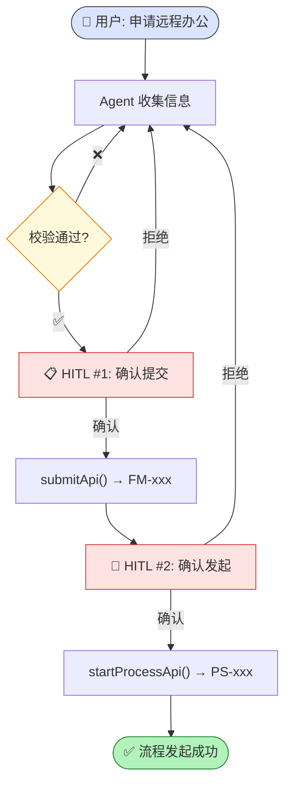

# 远程办公审批插件 (leave-approval)

> ⬆️ [返回 plugins/](../AGENTS.md) · [项目根目录](../../../AGENTS.md)

## 审批流程图

## Tool 列表

| Tool | HITL | 说明 |
|------|------|------|
| `get_current_date` | ❌ | 获取日期 |
| `leave_approval_validate` | ❌ | 校验表单 |
| `leave_approval_submit` | ✅ | 提交确认 |
| `leave_approval_start` | ✅ | 流程确认 |

## 表单字段 (9 个必填)

applicantName, department, employeeId, remoteStartDate, remoteEndDate, reason, workPlan, emergencyContact, address

## Mock API

- 提交 → `FM-xxx` / 流程 → `PS-xxx`

---

> ⬆️ [返回 plugins/](../AGENTS.md) · [项目根目录](../../../AGENTS.md)