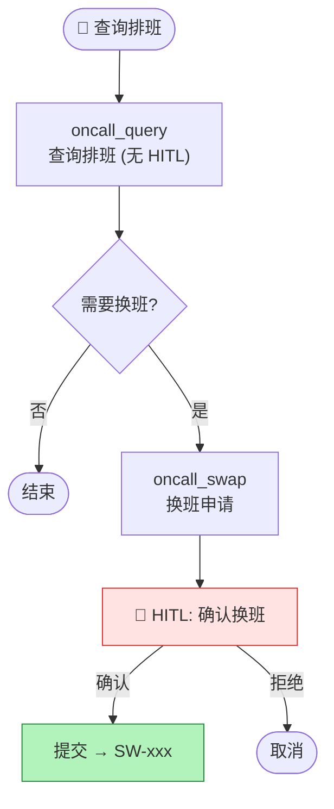

# 值班排班插件 (oncall)

> ⬆️ [返回 plugins/](../AGENTS.md) · [项目根目录](../../../AGENTS.md)

## 业务描述

混合模式插件：查询无需确认 + 换班单步 HITL。

## Tool 列表

| Tool | HITL | 说明 |
|------|------|------|
| `get_current_date` | ❌ | 获取日期 |
| `oncall_query` | ❌ | 查询排班 (直接返回) |
| `oncall_swap` | ✅ | 换班申请 (单步确认) |

## 换班流程图

## 文件说明

| 文件 | 职责 |
|------|------|
| `index.ts` | BusinessPlugin 实例 |
| `tools.ts` | 3 个 tool (query 无 HITL, swap 单步 HITL) |
| `api.ts` | Mock API (排班数据 + 换班) |

---

> ⬆️ [返回 plugins/](../AGENTS.md) · [项目根目录](../../../AGENTS.md)