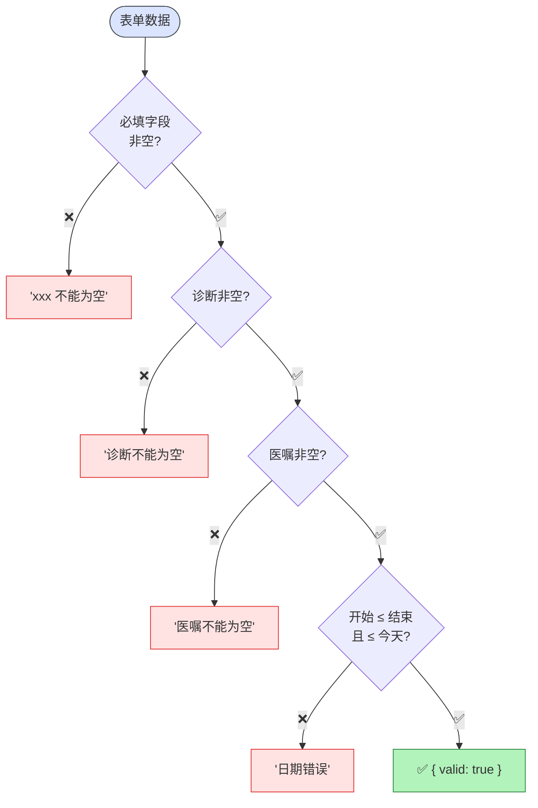

# 病假申请插件 (sick-leave)

> ⬆️ [返回 plugins/](../AGENTS.md) · [项目根目录](../../../AGENTS.md)

## 校验流程图

## Tool 列表

| Tool | HITL | 说明 |
|------|------|------|
| `get_current_date` | ❌ | 获取日期 |
| `sick_leave_validate` | ❌ | 校验 |
| `sick_leave_submit` | ✅ | 提交确认 |
| `sick_leave_start` | ✅ | 流程确认 |

## 校验规则

- 诊断/医生建议: 非空
- 日期: startDate ≤ endDate，≤ 今天

## Mock API

- 提交 → `SL-xxx` / 流程 → `SP-xxx`

---

> ⬆️ [返回 plugins/](../AGENTS.md) · [项目根目录](../../../AGENTS.md)