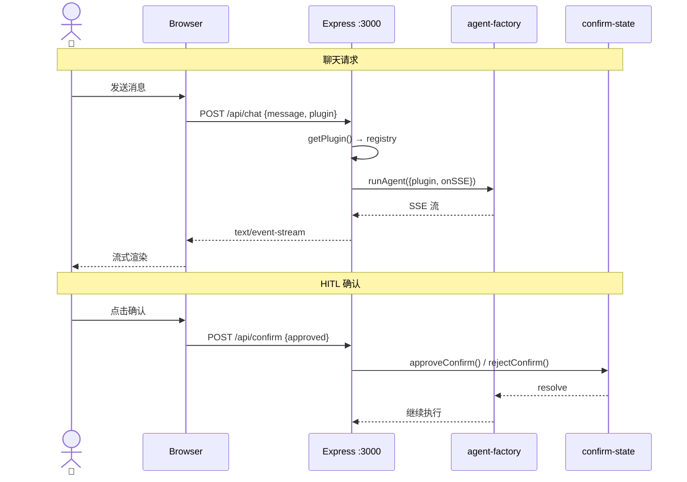

# 服务端

> ⬆️ [返回项目根目录](../../CLAUDE.md) · 📋 相关: [agent/](../agent/CLAUDE.md) · [plugins/](../plugins/CLAUDE.md) · [shared/](../shared/CLAUDE.md)

## 职责

Express 服务端，HTTP 路由、SSE 流转发、插件注入。前端与 Agent 框架的桥梁。

## 架构

```
server/
├── CLAUDE.md   # 本文档
├── index.ts    # Express 主入口
└── cli.ts      # CLI 入口
```

## 请求时序图



## API 端点

| 方法 | 路径 | 说明 |
|------|------|------|
| GET | `/api/plugins` | 可用插件列表 |
| POST | `/api/chat` | SSE 流，运行 Agent |
| POST | `/api/confirm` | HITL 确认/拒绝 |
| GET | `/*` | 静态文件 |

## 依赖

- [agent/agent-factory.ts](../agent/CLAUDE.md) — runAgent
- [agent/confirm-state.ts](../agent/CLAUDE.md) — HITL
- [plugins/registry.ts](../plugins/CLAUDE.md) — 插件注册表
- [shared/config.ts](../shared/CLAUDE.md) — 配置

## 约束

- ❌ 不定义业务逻辑
- ❌ 不直接 import 具体插件
- ✅ 只做路由转发和插件注入

---

> ⬆️ [返回项目根目录](../../CLAUDE.md) · 📋 相关: [agent/](../agent/CLAUDE.md) · [plugins/](../plugins/CLAUDE.md)