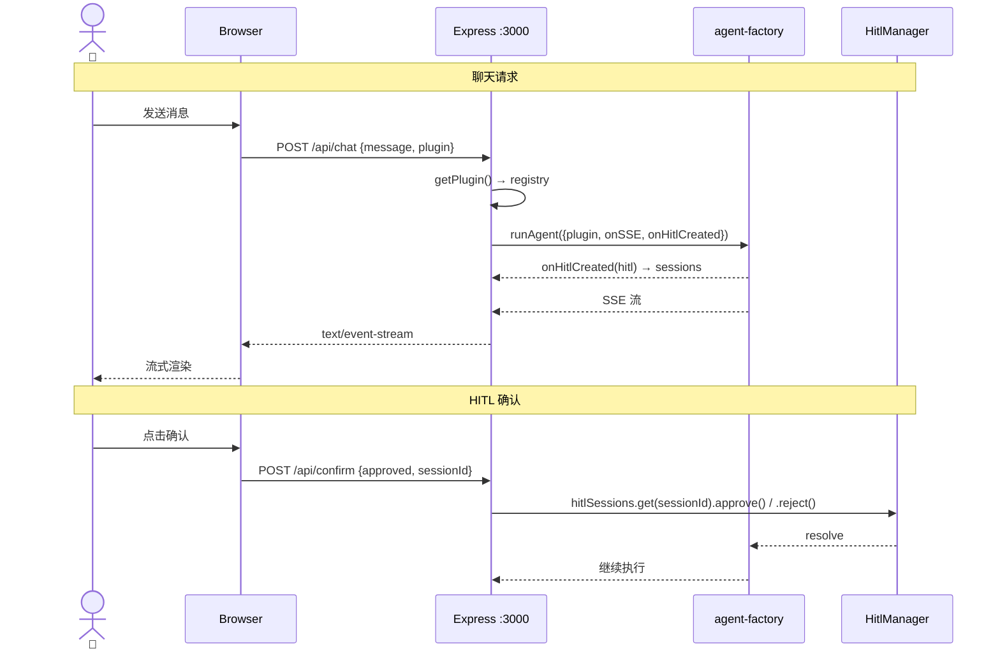

# 服务端

> ⬆️ [返回项目根目录](../../CLAUDE.md) · 📋 依赖: [domain/](../domain/CLAUDE.md) · [infrastructure/](../infrastructure/CLAUDE.md) · [agent/](../agent/CLAUDE.md) · [plugins/](../plugins/CLAUDE.md)

## 职责

Express 服务端，HTTP 路由、SSE 流转发、插件注入。前端与 Agent 框架的桥梁。

**Express 为可选项：前端支持 local 模式，跳过 Express 直接在浏览器调用 `runAgent()`。** Express 模式适用于生产部署和多客户端场景。

## 架构

```
server/
├── routes/            # Express 路由
│   ├── chat.ts            # POST /api/chat — SSE 流式对话
│   ├── confirm.ts         # POST /api/confirm — HITL 确认
│   ├── compact.ts         # POST /api/compact — 对话压缩
│   ├── extract-memories.ts # POST /api/extract-memories — 记忆提取
│   └── plugins.ts         # GET /api/plugins — 插件列表
├── middleware/         # Express 中间件
│   ├── sse.ts             # SSE 响应头 + sendSSE 辅助
│   └── error.ts           # 统一错误处理
├── controllers/        # 路由处理器（业务逻辑编排）
│   ├── chat-controller.ts
│   ├── confirm-controller.ts
│   └── compact-controller.ts
├── index.ts            # Express 主入口（app 组装 + 启动）
└── cli.ts              # CLI 入口（独立终端模式）
```

## 请求时序图



## API 端点

| 方法 | 路径 | 说明 |
|------|------|------|
| GET | `/api/plugins` | 可用插件列表 |
| POST | `/api/chat` | SSE 流，运行 Agent |
| POST | `/api/confirm` | HITL 确认/拒绝（按 sessionId 查找 HitlManager） |
| POST | `/api/compact` | 对话压缩（调用 mini Agent 生成摘要） |
| POST | `/api/extract-memories` | 记忆提取（调用 mini Agent 返回结构化记忆） |
| GET | `/*` | 静态文件（生产模式，dist/ 路径） |

## 关键设计

### 并发会话隔离

`hitlSessions: Map<sessionId, HitlManager>` — 每个会话独立管理 HITL 状态，通过 `onHitlCreated` 回调在 `agent.prompt()` 之前注册（避免竞态条件）。

### MLflow Tracing

通过 `createTracer()` 工厂创建 ITracer 实例（Strategy 模式）。local 和 server 模式均支持，由 `MLFLOW_TRACKING_URI` 环境变量控制启用。`tracer.run()` 包装 `runAgent()` 调用，`tracer.handleEvent()` 收集事件。

### 记忆压缩/提取端点

`/api/compact` 和 `/api/extract-memories` 使用独立的 mini Agent 实例（不经过业务插件），直接调用模型生成摘要/提取记忆。local 模式下由 `agent/local/local-utils.ts` 在浏览器进程内处理。

## 依赖

- [agent/core/agent-factory.ts](../agent/CLAUDE.md) — runAgent
- [agent/hitl/hitl.ts](../agent/CLAUDE.md) — HitlManager
- [agent/tracing/mlflow-tracer.ts](../agent/CLAUDE.md) — ITracer / createTracer
- [plugins/registry.ts](../plugins/CLAUDE.md) — 插件注册表
- [domain/interfaces/](../domain/CLAUDE.md) — IBusinessPlugin, ITracer
- [domain/dto/](../domain/CLAUDE.md) — ChatRequest, ConfirmRequest

## 约束

- ❌ 不定义业务逻辑
- ❌ 不直接 import 具体插件
- ✅ 只做路由转发和插件注入
- ✅ Express 为可选项，前端 local 模式不依赖本层

---

> ⬆️ [返回项目根目录](../../CLAUDE.md) · 📋 依赖: [agent/](../agent/CLAUDE.md) · [plugins/](../plugins/CLAUDE.md)
