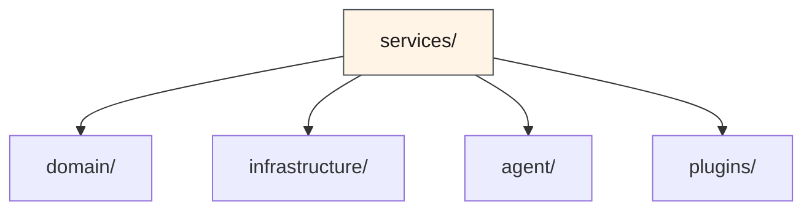

# 服务层 — 业务逻辑编排

> ⬆️ [返回项目根目录](../../CLAUDE.md) · 📋 依赖: [domain/](../domain/CLAUDE.md) · [infrastructure/](../infrastructure/CLAUDE.md) · [agent/](../agent/CLAUDE.md) · 📋 被引用: [server/](../server/CLAUDE.md) · [client/](../client/CLAUDE.md)

## 职责

服务层编排业务逻辑，将 Agent 框架能力与业务需求连接起来。区别于插件层（定义"做什么"），服务层定义"怎么做"。

**核心约束：服务层不定义 tool，不包含 UI，不处理 HTTP 请求。**

## 架构

```
services/
├── chat/              # 对话服务
│   ├── chat-service.ts     # 对话编排（消息路由、上下文构建）
│   └── compact-service.ts  # 对话压缩（摘要生成策略）
├── memory/            # 记忆服务
│   ├── memory-service.ts   # 记忆 CRUD 编排
│   └── extract-service.ts  # 记忆提取（结构化提取策略）
└── plugins/           # 插件服务
    ├── registry.ts         # 插件注册表（从 plugins/registry.ts 迁移）
    └── discovery.ts        # 插件发现（动态导入 + 元数据）
```

## 各子目录说明

### chat/ — 对话服务

对话编排层，负责消息路由、上下文构建、流式响应处理。

| 模块 | 说明 |
|------|------|
| `chat-service.ts` | 对话生命周期管理：创建会话、发送消息、处理 SSE 事件流 |
| `compact-service.ts` | 对话压缩策略：消息计数、触发阈值判断、摘要生成编排 |

**设计原则**: 服务层不直接操作 Agent 实例，通过 `agent-factory` 的 `runAgent()` 接口通信。

### memory/ — 记忆服务

记忆存储和提取的业务编排。

| 模块 | 说明 |
|------|------|
| `memory-service.ts` | 记忆 CRUD 编排：容量检查、FIFO 淘汰、跨插件隔离 |
| `extract-service.ts` | 记忆提取编排：构建提取 prompt、解析 AI 返回、去重合并 |

**与 infrastructure/memory/ 的区别**:
- `infrastructure/memory/store.ts` — 纯函数（创建空存储、查询记忆）
- `services/memory/` — 业务编排（何时提取、如何淘汰、策略决策）

### plugins/ — 插件服务

插件注册、发现、生命周期管理。

| 模块 | 说明 |
|------|------|
| `registry.ts` | 插件注册表：静态注册 + 动态查找 |
| `discovery.ts` | 插件发现：扫描 plugins/ 目录、读取元数据、构建 PluginInfo |

## 依赖方向



## 与其他层的对比

| 层 | 定义 | 举例 |
|----|------|------|
| `domain/` | 数据类型 | `ChatMessage`, `MemoryItem` |
| `infrastructure/` | 纯函数/常量 | `createEmptyStore()`, `MEMORY_LIMITS` |
| `agent/` | Agent 运行时（业务无关） | `runAgent()`, `HitlManager` |
| `plugins/` | 业务定义（自主） | `leave-approval/tools.ts`, `BusinessPlugin` |
| **`services/`** | **业务编排（策略）** | **何时压缩对话、如何淘汰记忆** |

## 约束

- ✅ 可以 import `domain/`, `infrastructure/`, `agent/`, `plugins/`
- ✅ 可以包含业务逻辑和策略决策
- ❌ 不定义 tool（那是 plugin 的职责）
- ❌ 不直接操作 HTTP request/response（那是 server 的职责）
- ❌ 不包含 UI 组件（那是 client 的职责）
- ❌ 不 import `server/` 或 `client/`

---

> ⬆️ [返回项目根目录](../../CLAUDE.md) · 📋 依赖: [domain/](../domain/CLAUDE.md) · [infrastructure/](../infrastructure/CLAUDE.md) · [agent/](../agent/CLAUDE.md)
