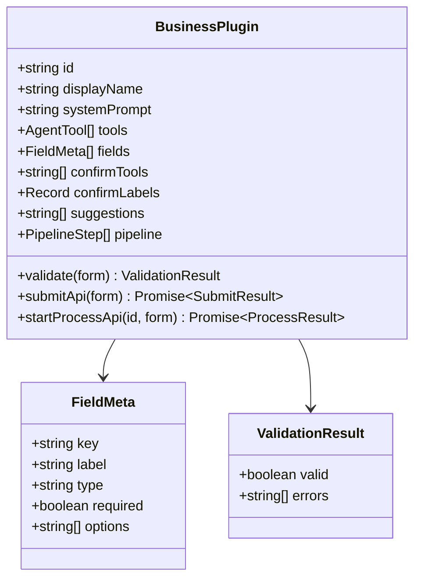

# 共享类型和接口

> ⬆️ [返回项目根目录](../../AGENTS.md) · 📋 被引用: [agent/](../agent/AGENTS.md) · [plugins/](../plugins/AGENTS.md) · [server/](../server/AGENTS.md) · [client/](../client/AGENTS.md)

## 职责

跨层共享的接口定义、类型和配置。依赖方向的终点。

```
shared/ 不依赖任何其他层，所有层都依赖 shared。
```

## 架构

```
shared/
├── plugin.ts    # BusinessPlugin 核心契约
├── types.ts     # 领域类型
└── config.ts    # 全局配置
```

## BusinessPlugin 接口类图



## 文件说明

### plugin.ts

- `BusinessPlugin` — 核心契约（必填: id, displayName, systemPrompt, tools）
- `FieldMeta` / `ValidationResult` / `SubmitResult` / `ProcessResult` / `PipelineStep`

### types.ts

- `ChatMessage` — 聊天消息 (role + content)
- `LeaveForm` — 远程办公表单（兼容）

### config.ts

- `MAX_FORM_RETRIES` = 5
- `PORT` = 3000

## 约束

- ❌ 不 import 任何其他层
- ✅ 只定义接口和类型

---

> ⬆️ [返回项目根目录](../../AGENTS.md) · 📋 被引用: [agent/](../agent/AGENTS.md) · [plugins/](../plugins/AGENTS.md) · [server/](../server/AGENTS.md) · [client/](../client/AGENTS.md)