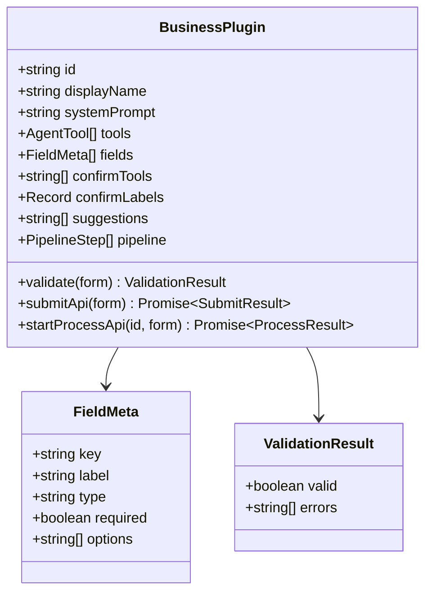

# 共享类型和接口

> ⬆️ [返回项目根目录](../../CLAUDE.md) · 📋 被引用: [agent/](../agent/CLAUDE.md) · [plugins/](../plugins/CLAUDE.md) · [server/](../server/CLAUDE.md) · [client/](../client/CLAUDE.md)

## 职责

跨层共享的接口定义、类型和配置。依赖方向的终点。

```
shared/ 不依赖任何其他层，所有层都依赖 shared。
```

## 架构

```
shared/
├── plugin.ts    # BusinessPlugin 核心契约
├── types.ts     # 领域类型
├── memory.ts    # 记忆系统类型和常量
└── config.ts    # 全局配置
```

## BusinessPlugin 接口类图



## 文件说明

### plugin.ts

- `BusinessPlugin` — 核心契约（必填: id, displayName, systemPrompt, tools）
- `FieldMeta` / `ValidationResult` / `SubmitResult` / `ProcessResult` / `PipelineStep`

### types.ts

- `ChatMessage` — 聊天消息 (role + content)
- `LeaveForm` — 远程办公表单（兼容）

### config.ts

- `MAX_FORM_RETRIES` = 5
- `PORT` = 3000

### memory.ts

- `MemoryType` — 记忆类型枚举 (user / feedback / project / reference)
- `MemoryItem` — 单条记忆 (content + type + timestamps)
- `MemoryStore` — 完整存储 (shared + byPlugin + summary)
- `MEMORY_LIMITS` — 容量限制常量 (maxUserMemories=20 等)
- `createEmptyStore()` — 创建空存储
- `getPluginMemories()` — 获取指定插件的全部记忆 (含共享)

## 约束

- ❌ 不 import 任何其他层
- ✅ 只定义接口和类型

---

> ⬆️ [返回项目根目录](../../CLAUDE.md) · 📋 被引用: [agent/](../agent/CLAUDE.md) · [plugins/](../plugins/CLAUDE.md) · [server/](../server/CLAUDE.md) · [client/](../client/CLAUDE.md)