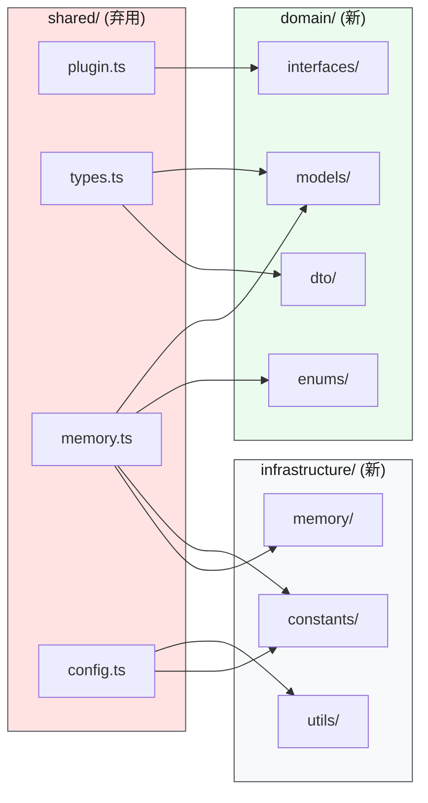

# 共享层 — ⚠️ 已弃用

> ⬆️ [返回项目根目录](../../CLAUDE.md) · 迁移目标: [domain/](../domain/CLAUDE.md) · [infrastructure/](../infrastructure/CLAUDE.md)

## 弃用说明

`shared/` 目录正在被拆分，内容按性质迁移到两个新层：

- **纯类型 → `domain/`** — models, DTO, VO, interfaces, enums
- **运行时 → `infrastructure/`** — errors, utils, constants, memory

当前 `shared/` 中的文件将逐步迁移，迁移期间两套路径共存。

## 目录结构

```
shared/               ← ⚠️ 弃用中
├── plugin.ts         # BusinessPlugin 核心契约 + FieldMeta + ValidationResult
├── types.ts          # LeaveForm, ProcessForm, ChatMessage, FormSubmitResult
├── memory.ts         # MemoryType, MemoryItem, MemoryStore + 运行时函数
└── config.ts         # envInt() + config.maxFormRetries
```

## 迁移数据流



## 迁移映射

| 旧文件 | 旧内容 | 迁移到 |
|--------|--------|--------|
| `plugin.ts` | `BusinessPlugin` 接口 | `domain/interfaces/IBusinessPlugin.ts` |
| `plugin.ts` | `FieldMeta` 模型 | `domain/models/FieldMeta.ts` |
| `plugin.ts` | `ValidationResult` | `domain/models/ValidationResult.ts` |
| `plugin.ts` | `PipelineStep` | `domain/models/PipelineStep.ts` |
| `plugin.ts` | `PluginRegistry` 类型 | `domain/models/PluginRegistry.ts` |
| `types.ts` | `LeaveForm`, `ProcessForm` | `domain/models/LeaveApplication.ts` |
| `types.ts` | `FormSubmitResult`, `ProcessResult` | `domain/dto/SubmitFormResponse.ts` |
| `types.ts` | `ChatMessage` | `domain/models/ChatMessage.ts` |
| `memory.ts` | `MemoryType` 枚举 | `domain/enums/MemoryType.ts` |
| `memory.ts` | `MemoryItem`, `MemoryStore`, `SharedMemories`, `PluginMemories` | `domain/models/MemoryItem.ts` |
| `memory.ts` | `MEMORY_LIMITS`, `MEMORY_STORAGE_KEY` | `infrastructure/constants/memory.ts` |
| `memory.ts` | `createEmptyStore()`, `getPluginMemories()` | `infrastructure/memory/store.ts` |
| `config.ts` | `envInt()` | `infrastructure/utils/env.ts` |
| `config.ts` | `config.maxFormRetries` | `infrastructure/constants/agent.ts` |

## 迁移期间约束

- ✅ 新代码应优先使用 `domain/` 和 `infrastructure/` 路径
- ✅ 旧 `shared/` import 路径暂时保持兼容（re-export 代理）
- ❌ 不再在 `shared/` 中新增文件

---

> ⬆️ [返回项目根目录](../../CLAUDE.md) · 迁移目标: [domain/](../domain/CLAUDE.md) · [infrastructure/](../infrastructure/CLAUDE.md)
