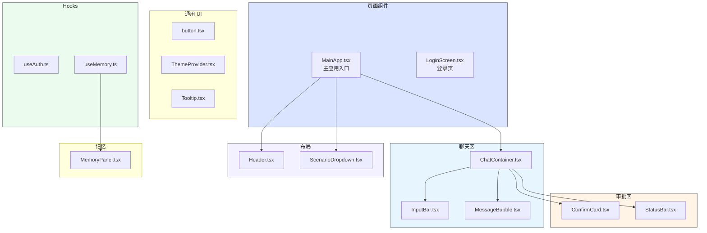
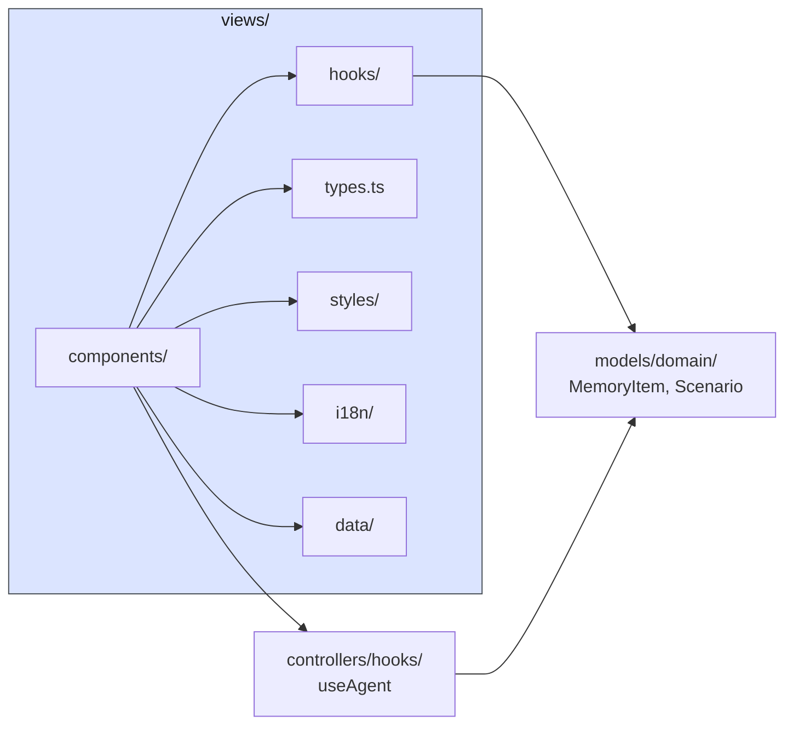
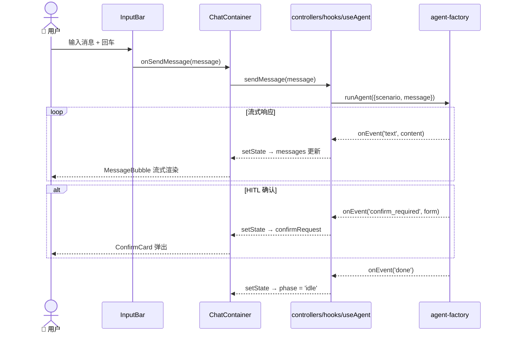

# View 层 — 前端 UI

> ⬆️ [返回 src/](../CLAUDE.md) · 📋 依赖: [models/](../models/CLAUDE.md) · [controllers/](../controllers/CLAUDE.md)

## 职责

View 层是 MVC 的 V，负责全部前端 UI 渲染：React 组件、样式、国际化、前端 hooks 和静态数据。

**核心约束：只负责展示和用户交互，业务逻辑通过 controllers/hooks/ 调用 Agent。**

## 目录结构

```
views/
├── components/                # 🎨 React 组件
│   ├── approval/                  # 审批相关
│   │   ├── ConfirmCard.tsx            # HITL 确认卡片
│   │   └── StatusBar.tsx              # 流水线状态指示器
│   ├── auth/                      # 认证相关
│   │   └── LoginScreen.tsx            # 登录页面
│   ├── chat/                      # 聊天相关
│   │   ├── ChatContainer.tsx          # 聊天主容器
│   │   ├── InputBar.tsx               # 消息输入栏
│   │   └── MessageBubble.tsx          # 消息气泡
│   ├── layout/                    # 布局相关
│   │   ├── Header.tsx                 # 顶部导航栏
│   │   ├── MainApp.tsx                # 主应用组件（场景切换 + Agent 集成）
│   │   ├── ScenarioDropdown.tsx       # 场景下拉选择器
│   │   ├── LanguageSwitcher.tsx       # 语言切换
│   │   └── ThemeToggle.tsx            # 主题切换
│   ├── legal/                     # 法律声明
│   │   ├── LegalNotice.tsx            # 法律声明
│   │   └── PrivacyPolicy.tsx          # 隐私政策
│   ├── memory/                    # 记忆面板
│   │   └── MemoryPanel.tsx            # 记忆查看/编辑面板
│   └── ui/                        # 通用 UI 组件
│       ├── button.tsx                 # 按钮组件
│       ├── ThemeProvider.tsx          # 主题 Provider
│       └── Tooltip.tsx                # 工具提示
├── hooks/                     # 🪝 React Hooks
│   ├── useAuth.ts                 # 用户认证（Mock 登录）
│   └── useMemory.ts               # 记忆读写（localStorage）
├── data/                      # 📊 静态数据
│   └── users.ts                   # Mock 用户列表
├── i18n/                      # 🌐 国际化
│   ├── index.ts                   # i18next 初始化
│   ├── types.ts                   # i18n 类型定义
│   └── locales/
│       ├── en/translation.json        # 英文翻译
│       └── zh-CN/translation.json     # 中文翻译
├── styles/                    # 🎨 样式
│   ├── app.css                    # 墨韵设计系统样式
│   └── index.css                  # 基础样式 + Tailwind 入口
└── types.ts                    # 📋 View 层类型定义（Message, ConfirmRequest, AgentPhase 等）
```

## 架构图



## 数据流



## 时序图 — 用户发送消息



## 关键组件说明

### MainApp.tsx

主应用组件，组装 Header + ScenarioDropdown + ChatContainer + MemoryPanel。通过 `useAgent` Hook 连接 Agent，管理场景切换。

### ChatContainer.tsx

聊天主容器，负责消息列表渲染、流式文本拼接、HITL 确认卡片展示。接收 `useAgent` 返回的状态和操作。

### useAuth.ts / useMemory.ts

前端专用 Hooks（views/hooks/），不依赖 controllers/hooks/：
- `useAuth` — Mock 用户登录/登出，管理 user 状态
- `useMemory` — localStorage 记忆读写，与 `models/memory/store.ts` 配合

## 样式体系

- **墨韵设计系统**: warm paper + ink-dark + vermillion accent
- **CSS Variables token**: 主题色通过 CSS 变量控制
- **字体**: Crimson Pro + Noto Serif SC + IBM Plex Mono + Noto Sans SC
- **主题**: dark / light / system 三模式
- **禁止**: 蓝紫渐变

## 依赖

- [models/domain/](../models/domain/CLAUDE.md) — 类型定义
- [controllers/hooks/](../controllers/CLAUDE.md) — useAgent / useAgentCore
- [infrastructure/utils/cn.ts](../infrastructure/CLAUDE.md) — className 合并

## 约束

- 不包含业务逻辑（Agent 调用、场景管理）
- 不直接 import agent/ 层
- 样式通过 CSS Variables + Tailwind，禁止内联 style
- 组件为 React 函数式组件 + Hooks

---

> ⬆️ [返回 src/](../CLAUDE.md)
